# cliomicplot 

<h1 align="left">
  <b>cliomicplot</b><br/>
  <sub><i>Publication-Ready Clinical &amp; Multi-Omics Visualizations</i></sub>
</h1>

<!-- badges: start -->
<p>
  <a href="https://www.r-project.org/"></a>
  <a href="LICENSE"></a>
  <a href="https://ggplot2.tidyverse.org/"></a>
  <a href="#"></a>
  <a href="#"></a>
  <a href="#"></a>
  
</p>
<!-- badges: end -->

---

## ⚡ 30 Seconds

```r
# install.packages("remotes")
# remotes::install_github("vanhungtrantran/cliomicplot")
library(cliomicplot)

# One line = a publication-ready figure
cliplot(Surv(time, status) ~ sex, data = lung,
        type = "km", theme = "nejm", palette = "jama",
        title = "**Overall Survival** by Sex") +
  cli_markdown()
```

That's it. No `ggplot()` boilerplate, no manual `theme()` tweaking, no `ggsave()` dance.

---

## Why cliomicplot?

**Raw ggplot2** for a grouped boxplot with stats:

```r
library(ggplot2)
library(ggpubr)
ggplot(ToothGrowth, aes(dose, len, fill = factor(dose))) +
  geom_boxplot() +
  stat_compare_means(method = "t.test", label = "p.format") +
  scale_fill_jco() +
  theme_classic() +
  labs(title = "Tooth Length by Dose", x = "Dose (mg)", y = "Length (mm)") +
  theme(legend.position = "none")
```

**cliomicplot:**

```r
cliplot(len ~ dose, data = ToothGrowth,
        type = "boxplot", palette = "jco",
        stat.test = "t.test", title = "Tooth Length by Dose")
```

> **~80% less code.** Formula interface, auto-legends, journal themes, and statistical annotations built in.

| What you get for free | Base ggplot2 | cliomicplot |
|---|---|---|
| Formula interface (`y ~ x \| group`) | — | ✅ |
| Auto-legend + auto-facet | Manual | ✅ |
| Statistical annotations | Needs `ggpubr` | ✅ Built-in |
| Journal themes (Nature, NEJM, etc.) | Manual tweaking | ✅ `theme = "nejm"` |
| 55+ colorblind-safe palettes | Manual selection | ✅ `palette = "jco"` |
| Markdown in titles/labels | Needs `ggtext` | ✅ `cli_markdown()` |
| Save to file | Separate `ggsave()` | ✅ `file = "plot.pdf"` |
| Persistent global theme | `theme_set()` | ✅ `clitheme("nature")` |

---

## 📦 Installation

```r
# From GitHub
remotes::install_github("vanhungtrantran/cliomicplot")

# Dependencies (installed automatically, but pre-install if needed)
install.packages(c("ggplot2", "scales", "survival", "reshape2", "ggrepel", "ggtext"))

# Optional: richer heatmaps (ComplexHeatmap) and extended survival plotting (survminer)
install.packages(c("ComplexHeatmap", "survminer", "ggpubr", "patchwork"))
```

---

## 🧩 The Formula API

cliomicplot uses `y ~ x | group` — the same convention you already know.

| Formula | What it does |
|---|---|
| `y ~ x` | y vs. x (scatter/line) |
| `y ~ x \| group` | Grouped, auto-legend, auto-palette |
| `~ x \| group` | One-sided distributional plot |
| `Surv(time, status) ~ group` | Kaplan-Meier survival |
| `HR ~ Variable \| Subgroup` | Forest plot |

**All arguments in one call:**

| Argument | Purpose | Example |
|---|---|---|
| `type` | Plot type | `"boxplot"`, `type_km(risk_table = TRUE)` |
| `palette` | Color palette | `"jco"`, `"nejm"`, `"cosmic"` |
| `theme` | Theme | `"nature"`, `"dark"`, `"broadsheet"` |
| `facet` | Faceting formula | `facet = ~ dose` |
| `stat.test` | Statistical test | `"wilcox.test"`, `"anova"` |
| `file` | Save to file | `"figure1.pdf"` |
| `width`, `height` | Output dimensions | `width = 8`, `height = 6` |

### Global Defaults: `clipar()`

Set defaults for all plots — like `par()` for base R:

```r
clipar(palette.qualitative = "nejm", stat.test = "wilcox.test",
       file.width = 8, file.height = 6, file.res = 600)

clipar("palette.qualitative")  # query a single parameter
# [1] "nejm"
```

---

## 🖼️ Gallery

Every figure is a single `cliplot()` call. Click any image to enlarge.

### Clinical

| | | |
|:---:|:---:|:---:|
| **Kaplan-Meier** | **Forest Plot** | **Volcano** |
| [](man/figures/km.png) | [](man/figures/forest.png) | [](man/figures/volcano.png) |
| **Waterfall** | **Swimmer** | **MA Plot** |
| [](man/figures/waterfall.png) | [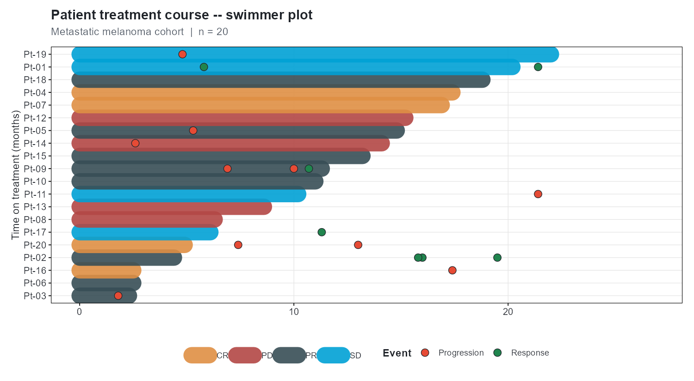](man/figures/swimmer.png) | [](man/figures/ma.png) |

### Omics

| | | |
|:---:|:---:|:---:|
| **Heatmap** | **PCA** | **Correlation** |
| [](man/figures/heatmap.png) | [](man/figures/pca.png) | [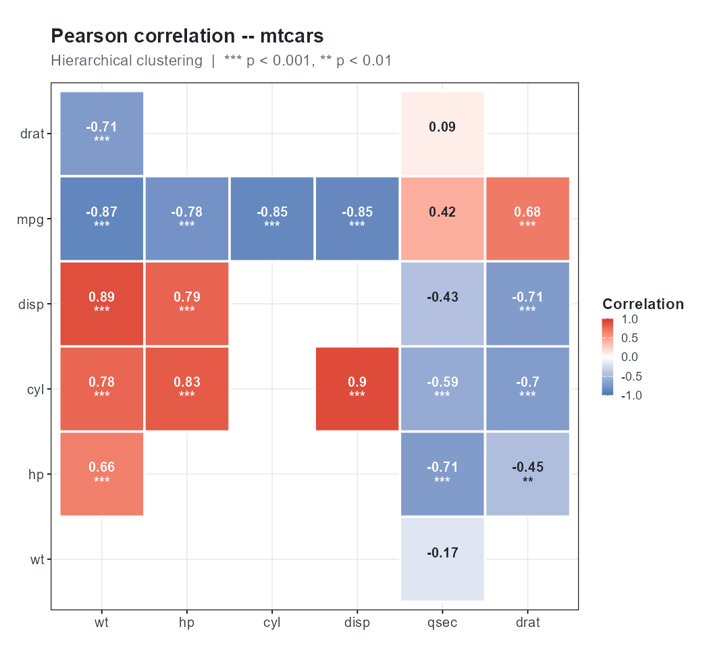](man/figures/correlation.png) |

### Distributions & Statistics

| | | |
|:---:|:---:|:---:|
| **Boxplot** | **Violin** | **Ridge** |
| [](man/figures/boxplot.png) | [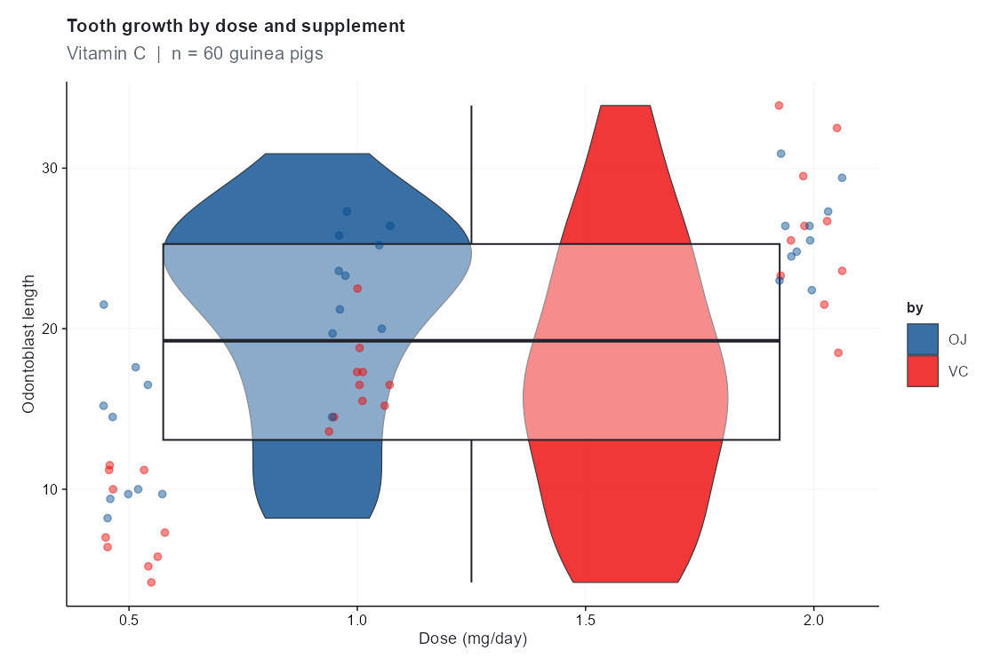](man/figures/violin.png) | [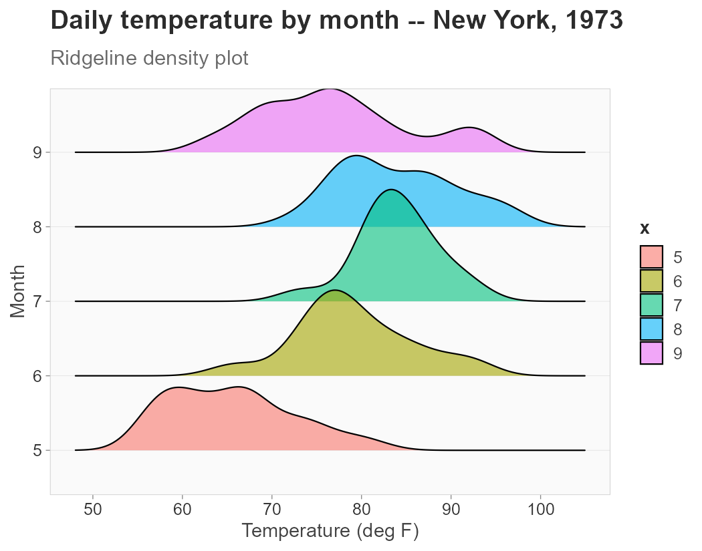](man/figures/ridge.png) |
| **Density** | **Histogram** | **Q-Q Plot** |
| [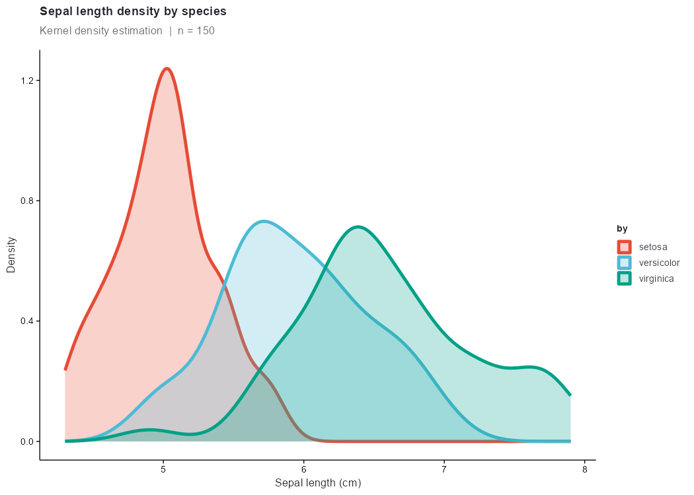](man/figures/density.png) | [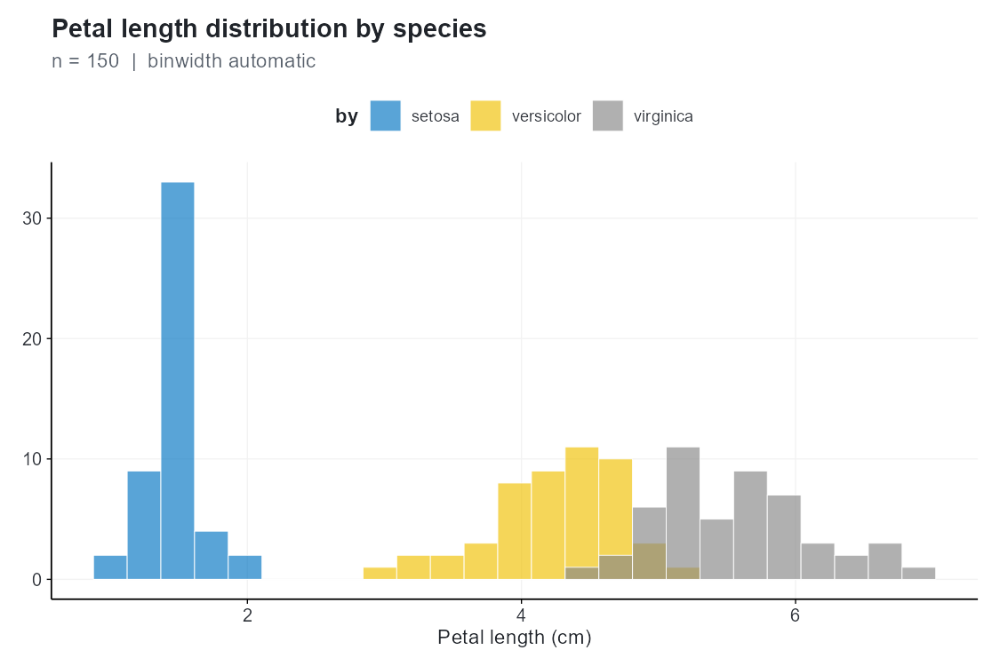](man/figures/histogram.png) | [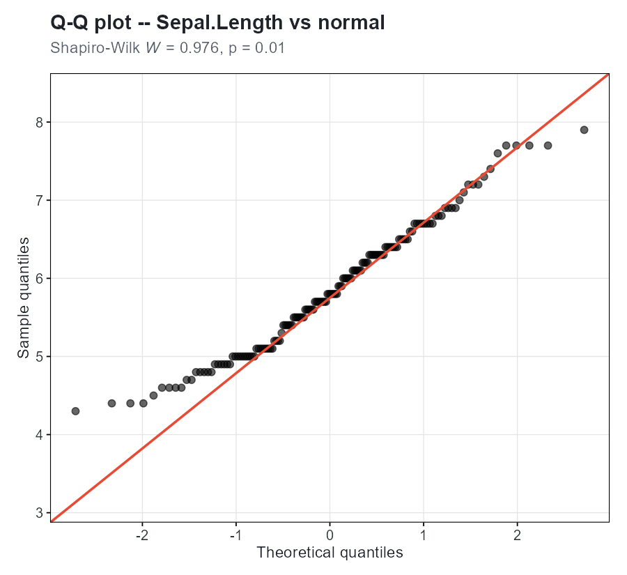](man/figures/qq.png) |
| **Beeswarm** | **Raincloud** | **Jitter** |
| [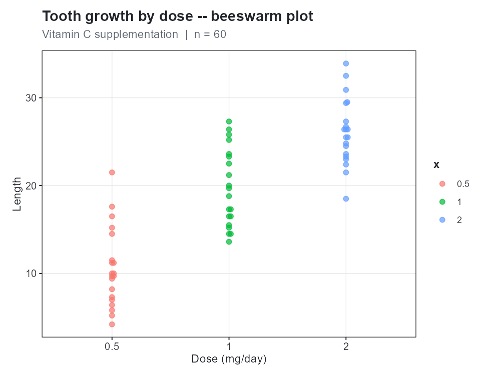](man/figures/beeswarm.png) | [](man/figures/raincloud.png) | [](man/figures/jitter.png) |

### Trend & Comparison

| | | |
|:---:|:---:|:---:|
| **Scatter** | **Lines** | **LM / LOESS** |
| [](man/figures/scatter.png) | [](man/figures/lines.png) | [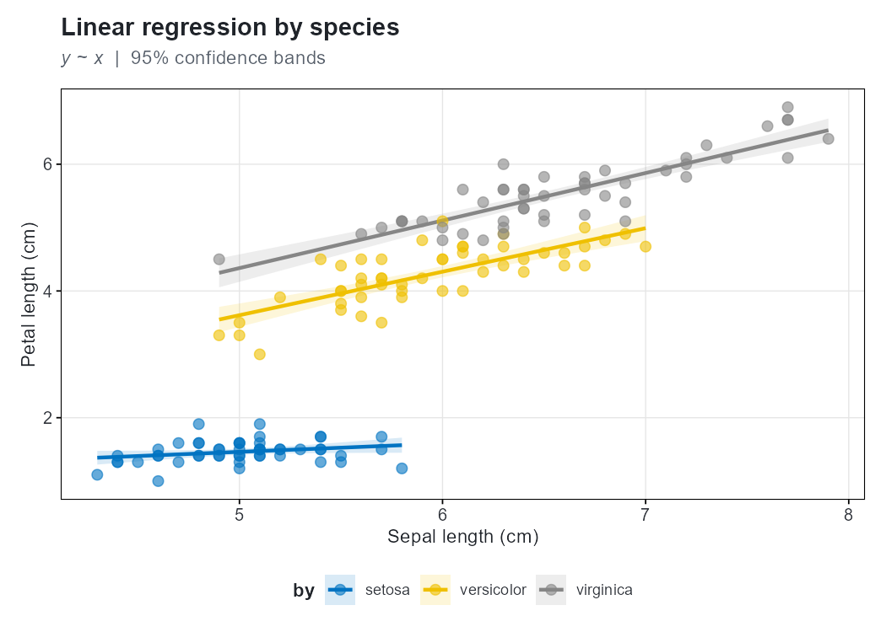](man/figures/lm.png) |
| **Bubble** | **Dumbbell** | **Lollipop** |
| [](man/figures/bubble.png) | [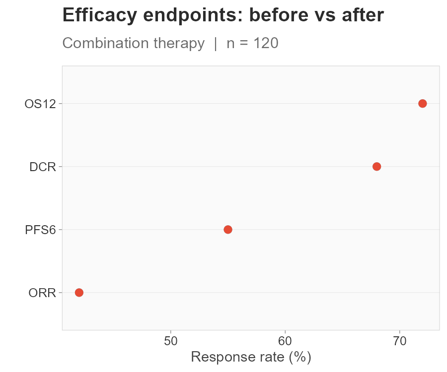](man/figures/dumbbell.png) | [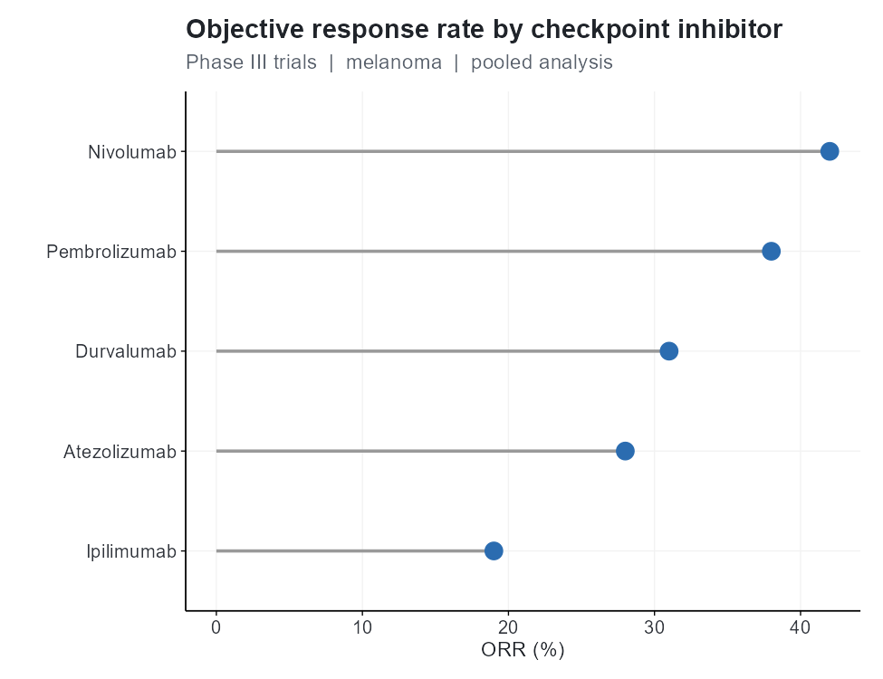](man/figures/lollipop.png) |

### Infographic & Pipeline

| | | |
|:---:|:---:|:---:|
| **Clinical Trials Pipeline** | **Infographic Bar** | |
| [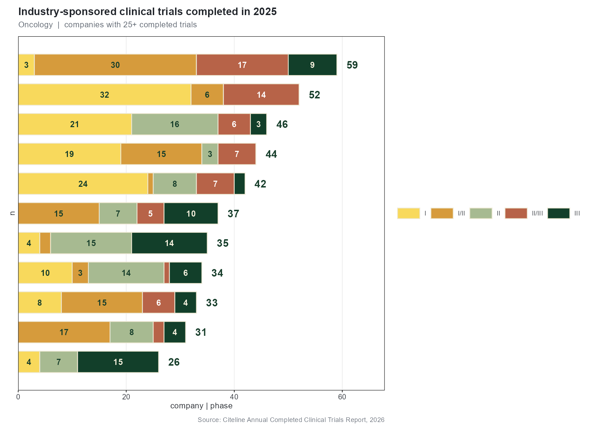](man/figures/trials.png) | [](man/figures/infobar.png) | |

### R Graph Gallery Favorites

| | | |
|:---:|:---:|:---:|
| **Chord** | **Treemap** | **Dendrogram** |
| [](man/figures/chord.png) | [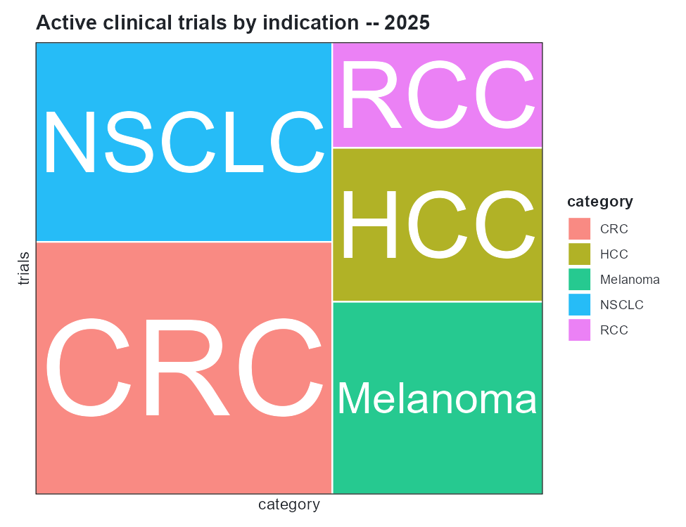](man/figures/treemap.png) | [](man/figures/dendrogram.png) |
| **Circular Bar** | **Connected Scatter** | **2D Density** |
| [](man/figures/circular_bar.png) | [](man/figures/connected.png) | [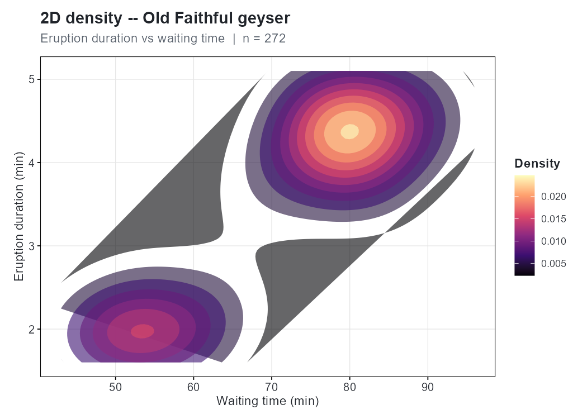](man/figures/density2d.png) |
| **Parallel Coords** | **Spineplot** | **Waffle** |
| [](man/figures/parallel.png) | [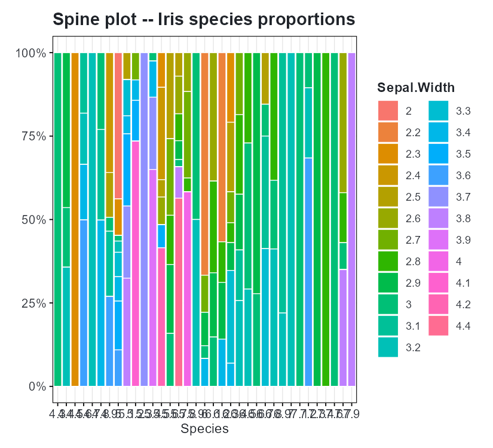](man/figures/spineplot.png) | [](man/figures/waffle.png) |

Full list: `points`, `jitter`, `barplot`, `lines`, `histogram`, `density`, `errorbar`, `ribbon`, `boxplot`, `violin`, `ridge`, `volcano`, `forest`, `km`, `waterfall`, `swimmer`, `heatmap`, `pca`, `ma`, `correlation`, `text`, `bubble`, `lm`, `loess`, `spineplot`, `rug`, `abline`, `qq`, `raincloud`, `dumbbell`, `lollipop`, `beeswarm`, `radar`, `alluvial`, `waffle`, `chord`, `treemap`, `streamgraph`, `connected`, `circular_bar`, `density2d`, `parallel`, `dendrogram`.

---

## 🎨 Themes — Publication Ready

11 built-in themes. One function call.

```r
clitheme("nature")     # persistent theme for all subsequent plots
cliplot(mpg ~ wt, data = mtcars)
clitheme()             # reset to default
```

Or per-plot:

```r
cliplot(mpg ~ wt, data = mtcars, theme = "dark")
```

| Theme | Style | Journal / Use |
|---|---|---|
| `cli_bw` | Clean black-and-white | Default |
| `cli_classic` | Classic with axis lines | Base R aesthetic |
| `cli_minimal` | Minimalist | Modern general use |
| `nature` | Nature Publishing Group | Nature journals |
| `science` | Science / AAAS | *Science* |
| `nejm` | NEJM | *New England Journal of Medicine* |
| `lancet` | The Lancet | *The Lancet* |
| `cell` | Cell Press | *Cell* and family |
| `broadsheet` | Print-optimized with subtle grid | General publication |
| `showcase` | Polished presentation | Slides, posters |
| `dark` | Dark background | Talks, dashboards |

Register custom themes with `clitheme_register("mytheme", base = "cli_bw", ...)`.

---

## 🌈 Color Palettes

55+ built-in palettes. Discrete, sequential, diverging, and journal-specific.

```r
cli_palette_list()               # see all names
cli_palette_show("cosmic")       # preview a palette

# In plots
cliplot(mpg ~ wt | cyl, data = mtcars, palette = "npg")

# Standalone ggplot2 scales
ggplot(iris, aes(Sepal.Length, Petal.Length, color = Species)) +
  geom_point(size = 3) +
  palette_scale("jama", "color")
```

| Category | Palettes |
|---|---|
| Journals | `jco`, `nejm`, `lancet`, `npg`, `jama`, `bmj`, `frontiers` |
| Genomics | `ucscgb`, `igv`, `locuszoom`, `cosmic`, `cosmic_sig`, `gsea`, `volcano` |
| Accessibility | `okabe_ito`, `tableau10`, `tol_muted` |
| D3 / Web | `d3_category10`, `d3_category20`, `flatui`, `material`, `bs5` |
| Sequential | `blues`, `reds`, `greens`, `purples`, `oranges` |
| Diverging | `heatmap_rdbu`, `heatmap_rdylbu`, `heatmap_prgn`, `rd_yl_gn`, `spectral`, `pi_yg` |
| Dark | `neon`, `cyberpunk` |
| Soft | `pastel`, `soft` |
| Sci-fi | `futurama`, `rickandmorty`, `simpsons`, `startrek` |

---

## 📝 Markdown Text

Rich text in titles and labels with `cli_markdown()`:

```r
cliplot(len ~ dose, data = ToothGrowth, type = "boxplot",
        title = "**Tooth Length** by Vitamin C Dose",
        subtitle = "*p* &lt; 0.05 for all pairwise comparisons",
        ylab = "Length (mm)") +
  cli_markdown()
```

---

## 🔧 For Standalone ggplot2 Use

Use `palette_scale()` to drop cliomicplot palettes into any ggplot:

```r
library(ggplot2)
ggplot(iris, aes(Sepal.Length, Petal.Length, color = Species)) +
  geom_point() +
  palette_scale("cosmic", "color")

# Continuous palettes too
ggplot(faithfuld, aes(waiting, eruptions, fill = density)) +
  geom_tile() +
  palette_scale("heatmap_rdbu", "fill", type = "continuous")
```

---

## 📚 Vignettes

- **Getting Started** — `vignette("cliomicplot")`
- **Volcano Plot Guide** — `vignette("volcano-plot")`
- **Oncology Workflows** — `vignette("oncology")`
- **Multi-Omics** — `vignette("multiomics")`
- **Themes & Palettes** — `vignette("themes-palettes")`

---

## 🔗 References

- **tinyplot** — formula-interface inspiration ([github.com/grantmcdermott/tinyplot](https://github.com/grantmcdermott/tinyplot))
- **ggsci** — journal palette inspiration ([nanx.me/ggsci](https://nanx.me/ggsci/))
- **survminer** — survival plotting engine
- **ComplexHeatmap** — heatmap engine for omics data

---

## 📄 License

MIT © 2026 Lucas VHH Tran
