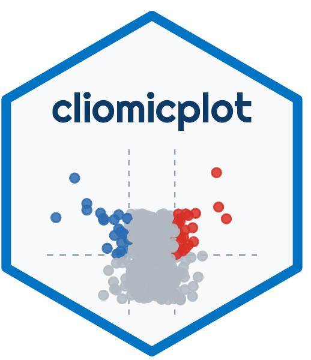
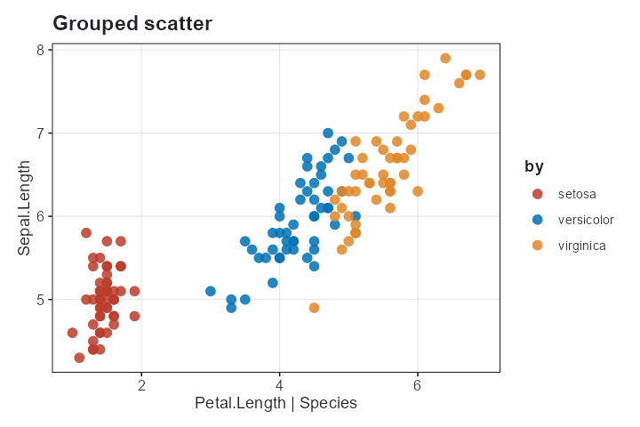
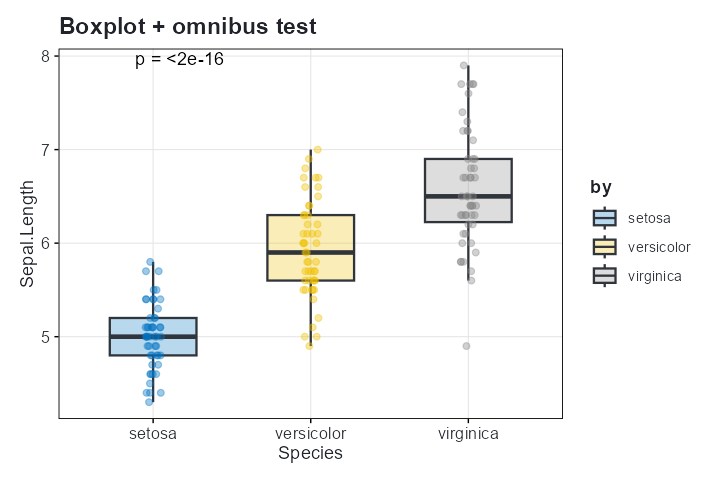
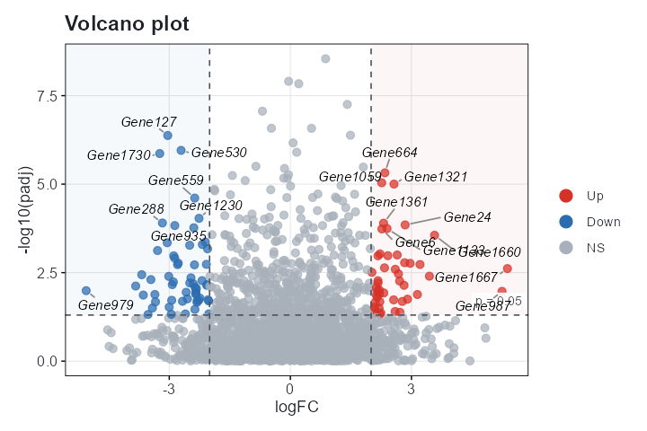
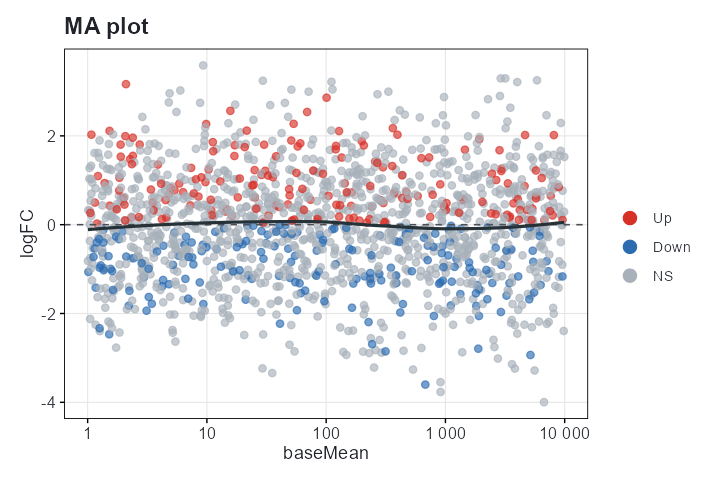
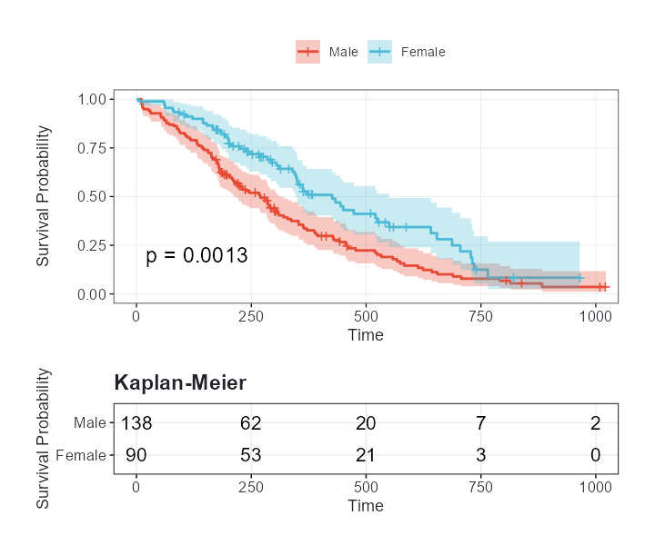
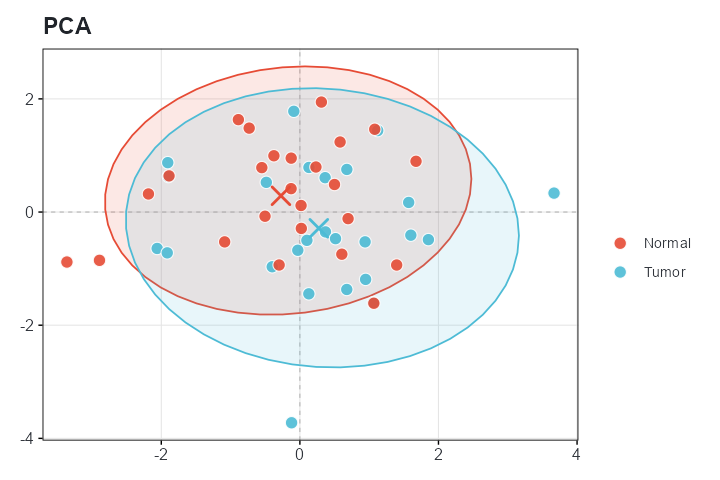
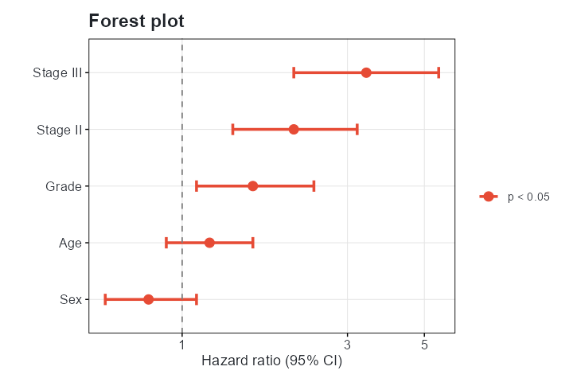
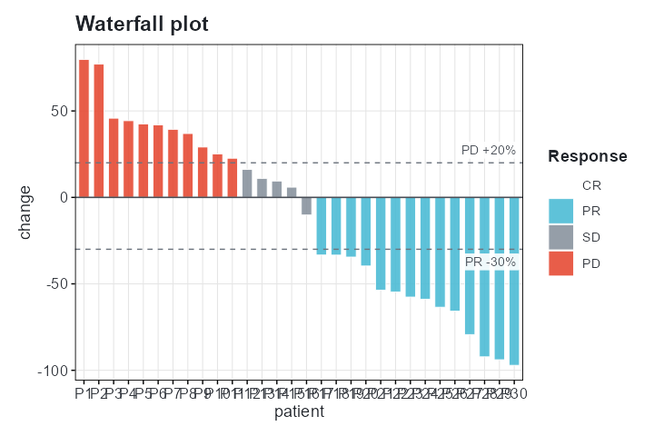

# cliomicplot 

<h1 align="left">
  <b>cliomicplot</b><br/>
  <sub><i>Publication-Ready Clinical &amp; Multi-Omics Visualizations</i></sub>
</h1>

<!-- badges: start -->
<p>
  <a href="https://www.r-project.org/"></a>
  <a href="LICENSE.md"></a>
  <a href="https://ggplot2.tidyverse.org/"></a>
  <a href="#"></a>
  <a href="#"></a>
  <a href="#"></a>
  <a href="#"></a>
  
</p>
<!-- badges: end -->

---

## 📖 Table of Contents

- [Overview](#-overview)
- [Why cliomicplot?](#-why-cliomicplot)
- [Installation](#-installation)
- [Quick Start](#-quick-start)
- [Core API](#-core-api)
  - [The `cliplot()` Engine](#the-cliplot-engine)
  - [Formula Interface](#formula-interface)
  - [Global Parameters: `clipar()`](#global-parameters-clipar)
- [Plot Types — Gallery](#-plot-types--gallery)
  - [Clinical Plots](#clinical-plots)
  - [Omics Plots](#omics-plots)
  - [Basic Plot Types](#basic-plot-types)
- [Themes — Publication Ready](#-themes--publication-ready)
- [Color Palettes](#-color-palettes)
- [Markdown Text Rendering](#-markdown-text-rendering)
- [Vignettes](#-vignettes)
- [API Reference](#-api-reference)
- [References](#-references)
- [License](#-license)

---

## 🧬 Overview

**cliomicplot** is an R package that bridges the gap between exploratory data analysis and publication-grade figure generation for clinical and multi-omics data. Built on **ggplot2**, it delivers 43 specialized plot types, 11 journal-matching themes (plus showcase) (Nature, Science, NEJM, Lancet, Cell, and more), and 55+ carefully curated color palettes — all through a clean, formula-based API inspired by the [`tinyplot`](https://github.com/grantmcdermott/tinyplot) package.

Whether you're generating a Kaplan-Meier survival curve, a volcano plot from DESeq2 results, a waterfall plot for an oncology clinical trial, or a clustered heatmap of transcriptomic data, cliomicplot reduces boilerplate by 80–90% while producing figures that meet the exacting standards of top-tier biomedical journals.

```r
# One line = publication-ready figure
cliplot(Surv(time, status) ~ arm, data = trial, type = "km", theme = "nejm",
        palette = "jama", title = "**Overall Survival** by Treatment Arm") +
  cli_markdown()
```

---

## 🖼️ Gallery

Every figure below is generated by a single `cliplot()` call — no manual ggplot2 layering.

| | | |
|:---:|:---:|:---:|
| **Grouped scatter** | **Boxplot + omnibus test** | **Volcano** |
|  |  |  |
| **MA plot** | **Kaplan-Meier** | **Expression heatmap** |
|  |  |  |
| **PCA** | **Forest** | **Waterfall** |
|  |  |  |

> **Formula orientation.** cliplot follows the standard `y ~ x` convention. A volcano plot puts fold-change on x and significance on y, so write the significance term on the left: `cliplot(-log10(padj) ~ logFC, data = deg, type = "volcano")`. Use an FDR-adjusted p-value (e.g. `padj`) for the y term.

---

## 🎯 Why cliomicplot?

| Feature | Base ggplot2 | cliomicplot |
|---|---|---|
| Formula interface (`y ~ x | group`) | ❌ | ✅ |
| Auto-legend, auto-faceting | Manual | ✅ Automatic |
| Statistical annotations built-in | Requires `ggpubr`/`ggsignif` | ✅ Built-in |
| Journal themes (Nature, NEJM, etc.) | Manual tweaking | ✅ One function call |
| Colorblind-safe palettes | Must choose manually | ✅ 55+ built-in |
| Markdown in titles/labels | Requires `ggtext` | ✅ `cli_markdown()` |
| Save to file in one call | Separate `ggsave()` | ✅ `file = "plot.pdf"` |
| Persistent & ephemeral themes | `theme_set()` only | ✅ `clitheme()` + per-plot |

---

## 📦 Installation

```r
# Install from source (development version)
remotes::install_local("path/to/cliomicplot")

# Required dependencies — install first
install.packages(c(
  "ggplot2", "scales", "survival", "survminer",
  "reshape2", "ggrepel",
  "patchwork", "ggpubr", "ggtext", "circlize"
))

# Optional (for enhanced heatmaps)
install.packages(c("ComplexHeatmap", "pheatmap", "corrplot", "ggalluvial"))
```

---

## 🚀 Quick Start

```r
library(cliomicplot)

# ── Basic scatter with grouping ────────────────────────────────────
cliplot(Sepal.Length ~ Petal.Length | Species, data = iris)

# ── Boxplot with stats + journal palette ───────────────────────────
cliplot(len ~ dose, data = ToothGrowth,
        type   = "boxplot",
        palette = "jco",
        stat.test = "t.test",
        title  = "**Tooth Length** by Vitamin C Dose") +
  cli_markdown()

# ── Set a persistent theme for all plots ───────────────────────────
clitheme("nature")
cliplot(mpg ~ wt | cyl, data = mtcars, type = "points")
clitheme()  # reset

# ── Save directly to file ──────────────────────────────────────────
cliplot(Petal.Length ~ Sepal.Length | Species, data = iris,
        file = "iris_scatter.pdf", width = 6, height = 5)
```

---

## 🧩 Core API

### The `cliplot()` Engine

The workhorse function `cliplot()` accepts data through multiple interfaces:

```r
# 1. Formula interface (recommended)
cliplot(y ~ x | group, data = df)

# 2. Default method (vectors)
cliplot(x = mtcars$wt, y = mtcars$mpg, by = mtcars$cyl)

# 3. Matrix method (auto-detects heatmap/PCA)
cliplot(as.matrix(iris[, 1:4]), type = "heatmap")

# 4. Data frame method (auto-detects type)
cliplot(iris[, 1:4])  # numeric cols → correlation
```

**All arguments in one call:**

| Argument | Description | Example |
|---|---|---|
| `type` | Plot type string or `type_*()` call | `"boxplot"`, `type_km(risk_table = TRUE)` |
| `palette` | Color palette name | `"jco"`, `"nejm"`, `"cosmic"` |
| `theme` | Theme name or `theme()` object | `"nature"`, `"dark"` |
| `by` | Grouping variable (alternative to `\|`) | `by = iris$Species` |
| `facet` | Faceting formula | `facet = ~ dose` |
| `stat.test` | Built-in statistical test | `"wilcox.test"`, `"anova"` |
| `stat.label` | P-value label format | `"p.format"`, `"p.signif"` |
| `title`, `subtitle`, `caption` | Text annotations | Supports markdown |
| `xlab`, `ylab` | Axis labels | Auto-generated from formula |
| `legend` | Legend position | `"top"`, `"bottom"`, `"none"` |
| `file` | Output file path | `"figure1.pdf"` |
| `width`, `height` | Output dimensions (inches) | `width = 8`, `height = 6` |

### Formula Interface

cliomicplot uses an intuitive formula syntax that minimizes typing:

| Formula | Result |
|---|---|
| `y ~ x` | Scatter/line of y vs. x |
| `y ~ x \| group` | Grouped with auto-legend and auto-palette |
| `~ x \| group` | One-sided (distributional) |
| `Surv(time, status) ~ group` | Survival analysis |
| `HR ~ Variable \| Subgroup` | Forest plot |

### Global Parameters: `clipar()`

Set default behaviors globally — analogous to `par()` in base R:

```r
# View all current parameters
clipar()

# Set default palette for all plots
clipar(palette.qualitative = "nejm")

# Set default statistical test
clipar(stat.test = "wilcox.test", stat.label = "p.signif")

# Set default file output dimensions
clipar(file.width = 8, file.height = 6, file.res = 600)

# Query a single parameter
clipar("theme.default")
# [1] "cli_bw"
```

**Full parameter list:**

| Parameter | Default | Description |
|---|---|---|
| `palette.qualitative` | `"jco"` | Default discrete palette |
| `palette.sequential` | `"Blues"` | Default continuous palette |
| `palette.diverging` | `"RdBu"` | Default diverging palette |
| `stat.test` | `"wilcox.test"` | Default statistical test |
| `stat.label` | `"p.format"` | Default p-value format |
| `stat.pcutoff` | `0.05` | Significance cutoff |
| `file.width` | `7` | Default output width (in) |
| `file.height` | `7` | Default output height (in) |
| `file.res` | `300` | Default output DPI |
| `legend.position` | `"right"` | Default legend position |
| `ribbon.alpha` | `0.2` | Ribbon transparency |

---

## 📊 Plot Types — Gallery

### Clinical Plots

#### 🌲 Forest Plot — `type_forest()`

Display hazard ratios, odds ratios, or risk ratios with confidence intervals. Automatically colors significant vs. non-significant results.

```r
# Cox regression results
forest_df <- data.frame(
  Variable = c("Age ≥ 65", "Male sex", "Stage III", "Stage IV",
               "ECOG ≥ 2", "Mutation+", "Prior therapy"),
  HR       = c(1.82, 1.34, 2.51, 4.23, 1.95, 0.62, 1.48),
  CI_low   = c(1.23, 0.91, 1.62, 2.81, 1.28, 0.41, 0.98),
  CI_high  = c(2.69, 1.97, 3.89, 6.37, 2.97, 0.94, 2.24),
  P        = c(0.001, 0.15, 0.0005, 0.0001, 0.008, 0.024, 0.07)
)

cliplot(HR ~ Variable, data = forest_df,
        type = type_forest(ref_line = TRUE, sort = TRUE,
                           point_size = 4, ci_width = 1.2),
        theme = "lancet",
        title = "Overall Survival — Multivariable Cox Regression") +
  cli_markdown()
```

**Customization options:**

| Parameter | Default | Description |
|---|---|---|
| `ref_line` | `TRUE` | Reference line at x = 1 |
| `sort` | `TRUE` | Sort variables by effect size |
| `point_size` | `3` | Point size for estimates |
| `ci_width` | `1` | Confidence interval linewidth |
| `sig_color` | `"#E64B35"` | Color for p < 0.05 |
| `ns_color` | `"#3C5488"` | Color for non-significant |

#### 🌋 Volcano Plot — `type_volcano()`

The essential differential expression visualization — log2 fold-change vs. −log₁₀(p-value) with automatic classification of upregulated, downregulated, and non-significant genes.

```r
# Simulated DE results
set.seed(42)
de_data <- data.frame(
  logFC   = rnorm(5000, 0, 0.8),
  PValue  = 10^-rnorm(5000, 2, 2),
  row.names = paste0("GENE", 1:5000)
)
# "True" DE genes
de_data$logFC[sample(1:5000, 120)]  <- runif(120, 1.2, 4)
de_data$PValue[sample(1:5000, 120)] <- 10^-runif(120, 4, 12)

cliplot(-log10(PValue) ~ logFC, data = de_data,
        type = type_volcano(
          pval_cutoff  = 0.05,
          fc_cutoff    = 1,
          label_genes  = "significant",
          max_overlaps = 20,
          point_alpha  = 0.7
        ),
        palette = "cosmic",
        title   = "**Treatment vs. Control** — Differential Expression",
        subtitle = paste0("FDR < 0.05, |log<sub>2</sub>FC| > 1"),
        caption = paste0(nrow(de_data), " genes tested")) +
  cli_markdown("all")
```

**Customization options:**

| Parameter | Default | Description |
|---|---|---|
| `pval_cutoff` | `0.05` | P-value threshold |
| `fc_cutoff` | `1` | |log₂FC| threshold |
| `label_genes` | `NULL` | `"significant"` or gene vector |
| `max_overlaps` | `15` | Max ggrepel label overlaps |
| `up_color` | `"#E64B35"` | Upregulated color |
| `down_color` | `"#4DBBD5"` | Downregulated color |
| `ns_color` | `"grey70"` | Not significant color |

#### 📈 Kaplan-Meier Survival — `type_km()`

Publication-quality survival curves with risk tables, log-rank p-values, and confidence intervals. Powered by `survminer`.

```r
library(survival)

# Classic KM with risk table
cliplot(Surv(time, status) ~ sex, data = lung,
        type = type_km(
          risk_table  = TRUE,
          pval        = TRUE,
          conf_int    = TRUE,
          median_line = TRUE
        ),
        palette = "nejm",
        theme   = "nejm",
        title   = "**Lung Cancer** — Overall Survival by Sex",
        xlab    = "Time (days)",
        ylab    = "Survival Probability",
        legend  = "top") +
  cli_markdown()

# Multi-group comparison
cliplot(Surv(time, status) ~ rx, data = colon,
        type = type_km(risk_table = TRUE),
        palette = "jco")
```

**Customization options:**

| Parameter | Default | Description |
|---|---|---|
| `risk_table` | `TRUE` | Show at-risk table |
| `pval` | `TRUE` | Show log-rank p-value |
| `conf_int` | `FALSE` | Show confidence bands |
| `median_line` | `FALSE` | Show median survival line |
| `linewidth` | `0.8` | Curve line width |

#### 📉 Waterfall Plot — `type_waterfall()`

Classic oncology visualization showing best tumor response per patient. Bars are sorted by response magnitude and colored by RECIST category (CR/PR/SD/PD).

```r
set.seed(123)
tumor_data <- data.frame(
  Patient  = paste0("Pt-", sprintf("%02d", 1:35)),
  Response = sort(rnorm(35, mean = -18, sd = 28)),
  BestResp = sample(c("CR", "PR", "SD", "PD"), 35,
                    replace = TRUE, prob = c(0.1, 0.3, 0.35, 0.25))
)

cliplot(Response ~ Patient, data = tumor_data,
        type = type_waterfall(
          show_labels = TRUE,
          label_size  = 2.5,
          bar_width   = 0.75
        ),
        palette = "jco",
        theme   = "cell",
        title   = "**Best Tumor Response** — Waterfall Plot",
        ylab    = "Best % Change from Baseline",
        legend  = "bottom") +
  cli_markdown()
```

#### 🏊 Swimmer Plot — `type_swimmer()`

Patient-level timelines showing treatment duration, response, and key clinical events (progression, adverse events, dose modifications).

```r
# Patient timeline data
set.seed(456)
pt_data <- data.frame(
  ID       = paste0("Pt-", sprintf("%02d", 1:20)),
  Duration = round(runif(20, 2, 28), 1),
  Response = sample(c("CR", "PR", "SD", "PD"), 20,
                    replace = TRUE),
  Arm      = sample(c("Experimental", "Control"), 20,
                    replace = TRUE)
)

# Clinical events
events <- data.frame(
  ID    = rep(paste0("Pt-", sprintf("%02d", 1:20)), each = 2),
  Time  = round(runif(40, 0, 28), 1),
  Event = sample(c("Progression", "AE", "Dose Reduction", "Response"),
                 40, replace = TRUE)
)

cliplot(Duration ~ ID, data = pt_data,
        type = type_swimmer(
          bar_fill    = "Response",
          event_times = events
        ),
        theme = "broadsheet",
        title = "**Patient Treatment Course** — Swimmer Plot",
        ylab  = "Time on Treatment (months)") +
  cli_markdown()
```

---

### Omics Plots

#### 🔥 Heatmap — `type_heatmap()`

Clustered expression/abundance matrices with annotation tracks. Uses `ComplexHeatmap` when available, with a `pheatmap` fallback.

```r
# Generate expression-like data
set.seed(789)
expr_mat <- matrix(rnorm(500), nrow = 50)
rownames(expr_mat) <- paste0("GENE", 1:50)
colnames(expr_mat) <- paste0("Sample", 1:10)

# Column annotations
ann_col <- data.frame(
  Group    = rep(c("Control", "Treatment"), each = 5),
  Batch    = rep(c("A", "B"), 5),
  row.names = colnames(expr_mat)
)

# Color mapping for annotations
ann_colors <- list(
  Group = c(Control = "#4DBBD5", Treatment = "#E64B35"),
  Batch = c(A = "#E18727", B = "#3C5488")
)

cliplot(expr_mat, type = type_heatmap(
  scale            = "row",
  cluster_rows     = TRUE,
  cluster_cols     = TRUE,
  annotation_col   = ann_col,
  annotation_colors = ann_colors,
  color_low        = "#4575B4",
  color_mid        = "white",
  color_high       = "#D73027",
  fontsize         = 9
))
```

**Customization options:**

| Parameter | Default | Description |
|---|---|---|
| `scale` | `"row"` | `"none"`, `"row"`, or `"column"` |
| `cluster_rows` | `TRUE` | Hierarchical clustering of rows |
| `cluster_cols` | `TRUE` | Hierarchical clustering of columns |
| `annotation_col` | `NULL` | Column annotation data frame |
| `annotation_row` | `NULL` | Row annotation data frame |
| `color_low/mid/high` | Blue/White/Red | Color gradient triple |
| `show_rownames` | auto | Show row names (<50 rows) |

#### 🎯 PCA / MDS Plot — `type_pca()`

Dimensionality reduction visualization with confidence ellipses, variance explained labels, and optional scree plots.

```r
# PCA of iris data with ellipses
cliplot(iris[, 1:4],
        type = type_pca(
          pc_x          = 1,
          pc_y          = 2,
          center        = TRUE,
          scale.        = TRUE,
          add_ellipse   = TRUE,
          ellipse_level = 0.95,
          label_samples = TRUE,
          point_size    = 3
        ),
        by      = iris$Species,
        palette = "npg",
        theme   = "nature",
        title   = "**Iris Dataset** — PCA (PC1 vs PC2)",
        subtitle = "95% confidence ellipses") +
  cli_markdown()

# Using pre-computed PCA
pca_res  <- prcomp(iris[, 1:4], scale. = TRUE)
scores   <- as.data.frame(pca_res$x)
scores$Cluster <- kmeans(scores[, 1:2], 3)$cluster

cliplot(PC2 ~ PC1, data = scores, by = Cluster,
        type = "points", palette = "d3_category10")
```

#### 📊 MA Plot — `type_ma()`

Mean-Average plot showing log₂ fold-change vs. mean expression. Standard in differential expression workflows (DESeq2, edgeR, limma). Includes optional LOESS smoothing.

```r
# Simulated DESeq2-style results
set.seed(101)
ma_data <- data.frame(
  baseMean       = 10^runif(3000, 0, 5),
  log2FoldChange = rnorm(3000, 0, 0.6),
  padj           = runif(3000)
)
# Add some "real" DE
ma_data$log2FoldChange[sample(1:3000, 150)] <- rnorm(150, 2, 0.5)

cliplot(log2FoldChange ~ baseMean, data = ma_data,
        type = type_ma(
          pval_cutoff = 0.05,
          add_loess   = TRUE,
          sig_color   = "#E64B35",
          ns_color    = "grey70"
        ),
        theme = "science",
        title = "**DE Analysis** — MA Plot") +
  cli_markdown()
```

#### 🔗 Correlation Matrix — `type_correlation()`

Correlation heatmap with optional significance stars, clustering, and upper/lower triangle display.

```r
# Full correlation matrix
cliplot(mtcars[, 1:7],
        type = type_correlation(
          method    = "spearman",
          type      = "lower",
          add_coef  = TRUE,
          cluster   = TRUE,
          sig_level = 0.01
        ),
        title = "**mtcars** — Spearman Correlation Matrix") +
  cli_markdown()

# Upper triangle only
cliplot(mtcars, type = type_correlation(type = "upper", add_coef = FALSE))
```

#### 📦 Boxplot — `type_boxplot()`

Boxplots with jittered points, violin overlays, and statistical annotations built in.

```r
# Boxplot with violin overlay + statistics
cliplot(len ~ dose | supp, data = ToothGrowth,
        type = type_boxplot(
          add_jitter   = TRUE,
          add_violin   = TRUE,
          violin_alpha = 0.15
        ),
        stat.test = "t.test",
        stat.label = "p.signif",
        palette = "jco",
        theme   = "broadsheet",
        title   = "**Tooth Growth** by Dose and Supplement",
        ylab    = "Odontoblast Length") +
  cli_markdown()
```

#### 🎻 Violin Plot — `type_violin()`

Violin plots with boxplot overlay and jittered points for distribution visualization.

```r
cliplot(Sepal.Length ~ Species, data = iris,
        type = type_violin(
          add_boxplot = TRUE,
          add_jitter  = TRUE,
          box_width   = 0.15,
          jitter_width = 0.1
        ),
        palette = "lancet",
        theme   = "lancet",
        title   = "**Iris** — Sepal Length Distribution") +
  cli_markdown()
```

---

### Gallery-Inspired Types

Beyond clinical/omics, cliomicplot includes creative visualization types inspired by the best in data science:

| Type | Description | Key Feature |
|---|---|---|
| `"ridge"` / `type_ridge()` | Ridgeline (joy) plots | Gradient fill, quantile lines |
| `"lm"` / `type_lm()` | Linear regression with CI band | Auto-grouped lines |
| `"loess"` / `type_loess()` | LOESS smoothing curves | Configurable span |
| `"spineplot"` / `type_spineplot()` | Spine plots / spinograms | Weighted proportions |
| `"rug"` / `type_rug()` | Rug density marks | Axis density hints |
| `"abline"` / `type_abline()` | Reference lines (h/v/diagonal) | Threshold markers |
| `"qq"` / `type_qq()` | Q-Q normality plots | Auto reference line |

```r
# Ridgeline plot
cliplot(Temp ~ factor(Month), data = airquality, type = "ridge",
        theme = "broadsheet")

# LOESS trend with grouping
cliplot(Sepal.Length ~ Petal.Width, data = iris,
        by = iris$Species, type = "loess")
```

---

### ✨ Premier Types — Beyond Standard Visualization

cliomicplot includes stunning visualization types not found in most R plotting packages:

| Type | Description | Standout Feature |
|---|---|---|
| `"raincloud"` / `type_raincloud()` | Violin + boxplot + jitter | Transparent data presentation |
| `"dumbbell"` / `type_dumbbell()` | Before-after comparison | Connected change points |
| `"lollipop"` / `type_lollipop()` | Stylish bar alternative | Circle-on-stem elegance |
| `"beeswarm"` / `type_beeswarm()` | Non-overlapping points | Full distribution shape |
| `"radar"` / `type_radar()` | Spider/radar charts | Multivariate profiles |
| `"alluvial"` / `type_alluvial()` | Sankey flow diagrams | Patient/customer journeys |
| `"waffle"` / `type_waffle()` | Square pie charts | Intuitive proportions |

```r
# Raincloud — stunning data transparency
cliplot(Sepal.Length ~ Species, data = iris, type = "raincloud")

# Dumbbell — elegant change visualization
db <- data.frame(country = c("USA","China","Japan"), before = c(80,70,78), after = c(85,75,80))
cliplot(after ~ country, data = db, type = "dumbbell")

# Interactive mode — hover, zoom, pan
p <- cliplot(mpg ~ wt, data = mtcars, type = "points")
cliplot_interactive(p)
```

---

---

### 🎨 R Graph Gallery Collection

Inspired by the [R Graph Gallery](https://r-graph-gallery.com/), these stunning types bring creative data visualization to cliomicplot:

| Type | Description | Visual Impact |
|---|---|---|
| `"chord"` / `type_chord()` | Chord diagram | Circular flow ribbons (circlize) |
| `"treemap"` / `type_treemap()` | Treemap | Nested proportional rectangles |
| `"streamgraph"` / `type_streamgraph()` | Streamgraph | Flowing stacked area curves |
| `"connected"` / `type_connected()` | Connected scatter | Path-connected trajectory points |
| `"circular_bar"` / `type_circular_bar()` | Circular barplot | Radiating bars from center |
| `"density2d"` / `type_density2d()` | 2D Density contour | Smooth filled joint distribution |
| `"parallel"` / `type_parallel()` | Parallel coordinates | Multivariate line profiles |
| `"dendrogram"` / `type_dendrogram()` | Dendrogram | Hierarchical clustering tree |

```r
# Chord diagram — stunning flow visualization
chord_mat <- matrix(sample(10:100, 25), 5)
cliplot(chord_mat, type = "chord", palette = "jco")

# Streamgraph — flowing time series
cliplot(value ~ time, data = stream_data, by = category, type = "streamgraph")

# 2D Density contour — elegant alternative to scatter
cliplot(y ~ x, data = big_data, type = "density2d", bins = 12)
```

---

### Basic Plot Types

cliomicplot also supports standard visualization types through the same formula interface:

| Type | Description | Key Parameters |
|---|---|---|
| `"points"` / `type_points()` | Scatter plot | `alpha`, `size` |
| `"lines"` / `type_lines()` | Line plot | `linewidth`, `alpha` |
| `"barplot"` / `type_barplot()` | Bar plot | `stat`, `position`, `alpha` |
| `"histogram"` | Histogram (auto-detect) | — |
| `"density"` | Density plot (auto-detect) | — |

```r
# Grouped barplot
cliplot(Species ~ Sepal.Length | Species, data = iris,
        type = type_barplot(stat = "summary", position = "dodge"))

# Line plot with grouping
cliplot(value ~ time | group, data = longitudinal_data, type = type_lines())
```

---

## 🎨 Themes — Publication Ready

cliomicplot ships with 10 themes that match the typographic and layout conventions of major biomedical journals and presentation styles.

### Setting Themes

```r
# ── Persistent: applied to ALL subsequent plots ─────────────────────
clitheme("nature")
cliplot(mpg ~ wt, data = mtcars)
cliplot(Sepal.Length ~ Species, data = iris, type = "boxplot")
clitheme()  # reset to default

# ── Ephemeral: applied to ONE plot only ─────────────────────────────
cliplot(mpg ~ wt, data = mtcars, theme = "nature")
cliplot(Sepal.Length ~ Species, data = iris, theme = "dark")  # different!
```

### Theme Gallery

| Theme | Inspired By | Key Characteristics |
|---|---|---|
| `cli_bw` | ggplot2 `theme_bw` | Clean B&W, grey grid, panel border _(default)_ |
| `cli_classic` | ggplot2 `theme_classic` | Axis lines only, no panel border |
| `cli_minimal` | ggplot2 `theme_minimal` | Ultra-clean, minimal ink |
| `nature` | Nature Publishing Group | Compact 8pt text, no grid, thin axis lines |
| `science` | Science / AAAS | Even more compact, 7pt text |
| `nejm` | New England Journal of Medicine | Centered title, subtle horizontal grid |
| `lancet` | The Lancet | Left-aligned title, thin grid |
| `cell` | Cell Press | 7pt text, no grid, compact legends |
| `broadsheet` | Newspaper print | Large base text (14pt), subtle horizontal grid |
| `dark` | Presentation slides | Dark background, light text |

### Advanced Theme Features

```r
# ── Register a custom theme ─────────────────────────────────────────
clitheme_register("my_journal",
  base = "cli_bw",
  axis.text     = ggplot2::element_text(size = 12, face = "bold"),
  plot.title    = ggplot2::element_text(size = 16, hjust = 0.5),
  legend.position = "bottom"
)

# Use it anywhere
clitheme("my_journal")
cliplot(mpg ~ wt, data = mtcars)

# ── List all registered themes ──────────────────────────────────────
clitheme_list()

# ── Unregister ──────────────────────────────────────────────────────
clitheme_unregister("my_journal")

# ── Override specific theme elements inline ─────────────────────────
clitheme("nature", axis.text = ggplot2::element_text(size = 12))
```

---

## 🎨 Color Palettes

cliomicplot provides 55+ palettes in a unified system. All palettes work as drop-in replacements via `palette = "name"` in `cliplot()`, or as standalone ggplot2 scales.

### Quick Selection

```r
# List all palettes
cli_palette_list()

# Preview a palette
cli_palette_show("jco")
cli_palette_show("cosmic_sig")
cli_palette_show("neon")
```

### Palette Categories

#### 📰 Journal Palettes
Match the color conventions of major journals.

| Palette | Source | Colors | Best For |
|---|---|---|---|
| `npg` | Nature Reviews Cancer | 10 | Multi-group clinical |
| `nejm` | NEJM | 8 | Survival curves |
| `lancet` | The Lancet | 9 | Clinical trials |
| `jama` | JAMA | 7 | Forest plots |
| `jco` | J. Clinical Oncology | 10 | General purpose _(default)_ |
| `bmj` | BMJ | 9 | Epidemiology |
| `frontiers` | Frontiers journals | 9 | Open-access figures |

#### 🧬 Genomics / Bioinformatics

| Palette | Source | Best For |
|---|---|---|
| `ucscgb` | UCSC Genome Browser | Chromosome/cytoband |
| `igv` | IGV browser | 24-color track coloring |
| `locuszoom` | LocusZoom | GWAS regional plots |
| `cosmic` | COSMIC Hallmarks | Cancer genomics |
| `cosmic_sig` | COSMIC Signatures | Mutational signatures |
| `gsea` | GSEA GenePattern | Enrichment heatmaps |

#### ♿ Accessibility

Colorblind-safe palettes tested for deuteranopia, protanopia, and tritanopia.

| Palette | Colors | Reference |
|---|---|---|
| `okabe_ito` | 8 | Okabe & Ito (2008) |
| `tableau10` | 10 | Tableau Software |
| `tol_muted` | 10 | Paul Tol's muted scheme |

#### 🔥 Heatmap & Omics (Sequential / Diverging)

| Palette | Type | Use |
|---|---|---|
| `heatmap_rdbu` | Diverging | Expression (blue–white–red) |
| `heatmap_rdylbu` | Diverging | Expression (red–yellow–blue) |
| `heatmap_prgn` | Diverging | Methylation (purple–green) |
| `volcano` | Diverging | Volcano plot coloring |
| `blues`, `reds`, `greens`, `purples`, `oranges` | Sequential | Continuous intensity |
| `rd_yl_gn`, `spectral`, `pi_yg` | Diverging | Ratio/change data |

#### 🎭 Pop Culture & Sci-fi

| Palette | Theme |
|---|---|
| `futurama` | Futurama TV series |
| `rickandmorty` | Rick and Morty |
| `simpsons` | The Simpsons |
| `startrek` | Star Trek uniform colors |

#### 🌃 Dark / Presentation

| Palette | Vibe |
|---|---|
| `neon` | Bright neon on dark backgrounds |
| `cyberpunk` | Cyberpunk aesthetic |
| `pastel` | Soft, presentation-friendly |
| `soft` | Gentle, muted tones |

#### 🎨 Design Frameworks

| Palette | Source |
|---|---|
| `d3_category10`, `d3_category20` | D3.js |
| `material` | Material Design |
| `flatui` | Flat UI |
| `bs5` | Bootstrap 5 |
| `uchicago` | UChicago brand |
| `tron` | Tron legacy style |

### Using Palettes

```r
# ── Via cliplot ─────────────────────────────────────────────────────
cliplot(Sepal.Length ~ Petal.Length | Species, data = iris,
        palette = "jama")

# ── Standalone ggplot2 scales ───────────────────────────────────────
library(ggplot2)

# Discrete colour
ggplot(iris, aes(Sepal.Length, Petal.Length, colour = Species)) +
  geom_point(size = 3) +
  palette_scale("cosmic", "color")

# Discrete fill
ggplot(mpg, aes(class, fill = class)) +
  geom_bar() +
  palette_scale("uchicago", "fill")

# Continuous fill
ggplot(faithfuld, aes(waiting, eruptions, fill = density)) +
  geom_tile() +
  palette_scale("heatmap_rdbu", "fill", type = "continuous")

# ── Convenience wrappers ────────────────────────────────────────────
ggplot(iris, aes(Sepal.Length, Petal.Length, color = Species)) +
  geom_point() +
  scale_color_cli("jco")          # discrete color

ggplot(data, aes(x, y, fill = z)) +
  geom_tile() +
  scale_fill_cli_c("blues")       # continuous fill
```

---

## ✍️ Markdown Text Rendering

Add rich formatting to plot titles, subtitles, captions, and axis labels using `cli_markdown()` (powered by `ggtext`):

```r
# ── Selective markdown ──────────────────────────────────────────────
cliplot(mpg ~ wt, data = mtcars,
        title    = "**Mileage** vs *Weight* in mtcars",
        subtitle = "n = 32 vehicles, <span style='color:#E64B35'>1974 Motor Trend</span>",
        caption  = "Source: *Motor Trend* (1974)") +
  cli_markdown()  # enables title + subtitle + caption by default

# ── All text elements ───────────────────────────────────────────────
cliplot(mpg ~ wt, data = mtcars,
        title = "**Fuel Efficiency** Analysis",
        xlab  = "Weight (1000 <sub>lbs</sub>)",
        ylab  = "Miles / <sup>Gallon</sup>") +
  cli_markdown("all")

# ── Global markdown mode ────────────────────────────────────────────
clitheme_md()     # enable globally
cliplot(mpg ~ wt, data = mtcars,
        title = "**Bold** and *italic* everywhere")
clitheme_md_reset()  # disable globally
```

**Supported syntax:**

| Syntax | Result |
|---|---|
| `**text**` | **Bold** |
| `*text*` | *Italic* |
| `***text***` | ***Bold italic*** |
| `<span style='color:red'>text</span>` | Colored text |
| `<br>` | Line break |
| `<sub>text</sub>` | Subscript |
| `<sup>text</sup>` | Superscript |
| `` `code` `` | Monospace |

---

## 📚 Vignettes

### Vignette 1: End-to-End Oncology Analysis

```r
library(cliomicplot)
library(survival)

# ── Step 1: Set global defaults ─────────────────────────────────────
clipar(palette.qualitative = "nejm", stat.test = "wilcox.test",
       file.res = 600)

# ── Step 2: Kaplan-Meier Survival ───────────────────────────────────
clitheme("nejm")
cliplot(Surv(time, status) ~ sex, data = lung,
        type = type_km(risk_table = TRUE, pval = TRUE, conf_int = TRUE),
        title   = "**Figure 1** — Overall Survival by Sex",
        xlab    = "Time (days)",
        file    = "fig1_km_survival.pdf", width = 8, height = 6)

# ── Step 3: Forest Plot ─────────────────────────────────────────────
cox_fit <- coxph(Surv(time, status) ~ age + sex + ph.ecog, data = lung)
cox_sum <- summary(cox_fit)

forest_df <- data.frame(
  Variable = c("Age (per year)", "Male vs. Female", "ECOG PS (per point)"),
  HR       = cox_sum$conf.int[, "exp(coef)"],
  CI_low   = cox_sum$conf.int[, "lower .95"],
  CI_high  = cox_sum$conf.int[, "upper .95"],
  P        = cox_sum$coefficients[, "Pr(>|z|)"]
)

cliplot(HR ~ Variable, data = forest_df,
        type  = type_forest(point_size = 4),
        title = "**Figure 2** — Multivariable Cox Regression",
        file  = "fig2_forest.pdf", width = 7, height = 4)

# ── Step 4: Waterfall + Swimmer for immunotherapy trial ──────────────
set.seed(42)
n_pts <- 30
imtrial <- data.frame(
  Patient   = paste0("IM-", sprintf("%03d", 1:n_pts)),
  BestChange = sort(rnorm(n_pts, mean = -22, sd = 32)),
  BestResp  = sample(c("CR", "PR", "SD", "PD"), n_pts,
                     replace = TRUE, prob = c(0.07, 0.30, 0.36, 0.27)),
  Duration  = pmax(1, rnorm(n_pts, mean = 14, sd = 7)),
  Arm       = sample(c("Anti-PD1", "Chemo"), n_pts, replace = TRUE)
)
events_df <- data.frame(
  ID    = rep(imtrial$Patient, each = 2),
  Time  = runif(n_pts * 2, 0, 28),
  Event = sample(c("Progression", "AE Gr≥3", "Response"), n_pts * 2,
                 replace = TRUE)
)

# Waterfall
cliplot(BestChange ~ Patient, data = imtrial,
        type  = type_waterfall(show_labels = TRUE),
        theme = "broadsheet",
        title = "**Figure 3A** — Best Tumor Response (Waterfall)",
        file  = "fig3a_waterfall.pdf", width = 10, height = 5)

# Swimmer
cliplot(Duration ~ Patient, data = imtrial,
        type = type_swimmer(bar_fill = "BestResp", event_times = events_df),
        theme = "broadsheet",
        title = "**Figure 3B** — Patient Treatment Course (Swimmer)",
        file  = "fig3b_swimmer.pdf", width = 10, height = 5)

# Reset
clitheme()
```

### Vignette 2: Multi-Omics Exploratory Analysis

```r
library(cliomicplot)

# ── Step 1: PCA with custom styling ─────────────────────────────────
clitheme("nature")
cliplot(iris[, 1:4],
        type = type_pca(
          pc_x          = 1,
          pc_y          = 2,
          add_ellipse   = TRUE,
          ellipse_level = 0.95,
          point_size    = 2.5,
          label_samples = FALSE
        ),
        by      = iris$Species,
        palette = "npg",
        title   = "**Figure 1** — PCA of Iris Morphometric Data",
        subtitle = "PC1 (72.9%) vs. PC2 (22.9%), 95% CI ellipses") +
  cli_markdown()

# ── Step 2: Correlation heatmap ─────────────────────────────────────
cliplot(mtcars[, 1:7],
        type = type_correlation(
          method   = "pearson",
          type     = "lower",
          add_coef = TRUE,
          cluster  = TRUE,
          sig_level = 0.001
        ),
        title = "**Figure 2** — Pearson Correlation (mtcars)") +
  cli_markdown()

# ── Step 3: Volcano plot for omics ──────────────────────────────────
set.seed(123)
omics_res <- data.frame(
  logFC   = rnorm(8000, 0, 0.7),
  PValue  = 10^-rnorm(8000, 2.5, 1.8),
  row.names = paste0("PROBE", 1:8000)
)
# Inject "real" DE signals
sig_idx <- sample(1:8000, 200)
omics_res$logFC[sig_idx]  <- rnorm(200, ifelse(runif(200) > 0.5, 1.8, -1.8), 0.5)
omics_res$PValue[sig_idx] <- 10^-runif(200, 5, 15)

cliplot(-log10(PValue) ~ logFC, data = omics_res,
        type = type_volcano(
          pval_cutoff  = 0.01,
          fc_cutoff    = 1,
          label_genes  = "significant",
          max_overlaps = 25,
          point_alpha  = 0.5
        ),
        palette = "volcano",
        title   = "**Figure 3** — Volcano Plot of Differential Expression",
        subtitle = "FDR < 0.01, |log<sub>2</sub>FC| > 1",
        caption = paste0("Top labeled genes, n = 8,000 probes")) +
  cli_markdown()

# ── Step 4: Multi-panel with cliplot + patchwork ────────────────────
p1 <- cliplot(Petal.Length ~ Sepal.Length | Species, data = iris,
              palette = "jco", title = "**A** — Petal vs. Sepal Length",
              theme = "cli_minimal") + cli_markdown()
p2 <- cliplot(Petal.Width ~ Sepal.Width | Species, data = iris,
              palette = "jco", title = "**B** — Petal vs. Sepal Width",
              theme = "cli_minimal") + cli_markdown()

library(patchwork)
combined <- p1 + p2 +
  plot_annotation(
    title   = "**Iris Morphometrics** by Species",
    caption = "Fisher (1936)",
    theme   = clitheme("cli_bw")
  ) &
  cli_markdown()

ggplot2::ggsave("fig4_multi_panel.pdf", combined, width = 12, height = 5)
```

### Vignette 3: Zero to Publication in 5 Minutes

```r
# ── A complete figure-ready workflow ─────────────────────────────────

# 1. Load and set global style
library(cliomicplot)
clipar(palette.qualitative = "jco", stat.test = "kruskal.test",
       file.width = 6, file.height = 5, file.res = 600)
clitheme("nature")

# 2. Generate all figures in one pipeline
cliplot(Sepal.Length ~ Species, data = iris,
        type = "boxplot", add_violin = TRUE,
        title = "**Fig 1** — Sepal Length by Species",
        file = "fig1_boxplot.pdf")

cliplot(Petal.Length ~ Petal.Width | Species, data = iris,
        title = "**Fig 2** — Petal Dimensions",
        file = "fig2_scatter.pdf")

cliplot(iris[, 1:4], type = "correlation",
        title = "**Fig S1** — Correlation Matrix",
        file = "figS1_cor.pdf")

# 3. Reset for next project
clitheme()
clipar(palette.qualitative = "jco", stat.test = "wilcox.test")

# 4. Done — 3 publication-ready figures in < 10 lines of code!
```

---

## 📋 API Reference

### Main Functions

| Function | Description |
|---|---|
| `cliplot()` | Main plotting engine — formula, default, data.frame, and matrix methods |
| `cliplot_add()` | Add layers to last cliplot (WIP) |

### Theme System

| Function | Description |
|---|---|
| `clitheme(name)` | Set persistent theme (`"nature"`, `"nejm"`, etc.) |
| `clitheme()` | Reset to default theme |
| `clitheme_list()` | List all available themes |
| `clitheme_register(name, ...)` | Register custom theme |
| `clitheme_unregister(name)` | Remove custom theme |
| `clitheme_md()` | Enable markdown globally |
| `clitheme_md_reset()` | Disable global markdown |

### Parameters

| Function | Description |
|---|---|
| `clipar()` | List all global parameters |
| `clipar(key = value)` | Set parameter(s) |
| `clipar("key")` | Query single parameter |

### Palette System

| Function | Description |
|---|---|
| `cli_palette_list()` | List all 55+ palettes |
| `cli_palette_show(name)` | Preview a palette |
| `palette_scale(name, aes)` | Create ggplot2 scale from palette |
| `scale_color_cli(name)` | Discrete color scale shorthand |
| `scale_fill_cli(name)` | Discrete fill scale shorthand |
| `scale_color_cli_c(name)` | Continuous color scale shorthand |
| `scale_fill_cli_c(name)` | Continuous fill scale shorthand |

### Markdown

| Function | Description |
|---|---|
| `cli_markdown(...)` | Enable markdown on specific text elements |

### Plot Type Constructors

| Function | Plot |
|---|---|
| `type_forest()` | Forest plot (HR/OR/RR) |
| `type_volcano()` | Volcano plot |
| `type_km()` | Kaplan-Meier survival |
| `type_waterfall()` | Waterfall plot |
| `type_swimmer()` | Swimmer plot |
| `type_heatmap()` | Heatmap |
| `type_pca()` | PCA / MDS |
| `type_ma()` | MA plot |
| `type_correlation()` | Correlation matrix |
| `type_boxplot()` | Boxplot |
| `type_violin()` | Violin plot |
| `type_points()` | Scatter plot |
| `type_lines()` | Line plot |
| `type_barplot()` | Bar plot |

---

## 📖 References

- **tinyplot**: McDermott G (2024). *tinyplot: Lightweight extension of the base R graphics system*. https://github.com/grantmcdermott/tinyplot
- **ggplot2**: Wickham H (2016). *ggplot2: Elegant Graphics for Data Analysis*. Springer-Verlag NY.
- **ggsci**: Xiao N (2024). *ggsci: Scientific Journal and Sci-Fi Themed Color Palettes for ggplot2*. https://nanx.me/ggsci/
- **survminer**: Kassambara A et al. (2021). *survminer: Drawing Survival Curves using ggplot2*.
- **ggtext**: Wilke CO (2024). *ggtext: Improved Text Rendering Support for ggplot2*.
- **ComplexHeatmap**: Gu Z et al. (2016). Complex heatmaps reveal patterns and correlations in multidimensional genomic data. *Bioinformatics*.

---

## 📄 License

MIT © 2026 VHH Tran. See [LICENSE.md](LICENSE.md) for details.

---

<p align="center">
  <sub>Built with ❤️ for the clinical and bioinformatics community</sub><br/>
  <sub>Questions? Open an issue at <a href="https://github.com/hieutran/cliomicplot/issues">github.com/hieutran/cliomicplot</a></sub>
</p>
