# Getting Started with cliomicplot

\+

−

⊙

×

‹

›


100 %

Scroll to zoom · Drag to pan · ← → to navigate

## Overview

**cliomicplot** is an R package for creating high-quality,
publication-ready visualizations for clinical and multi-omics data
analysis. Built on **ggplot2**, it provides 16 specialized plot types,
10 journal-specific themes, and 55+ color palettes — all through a
clean, formula-based API.

This vignette walks you through the core concepts and basic usage.

## Installation

``` r

# From source
remotes::install_local("path/to/cliomicplot")

# Dependencies
install.packages(c(
  "ggplot2", "scales", "survival", "survminer",
  "RColorBrewer", "reshape2", "ggrepel",
  "patchwork", "ggpubr", "ggtext", "circlize"
))
```

``` r

library(cliomicplot)
#> cliomicplot 0.1.0 - Publication-ready clinical & omics plots
#> Main function: cliplot() | Themes: clitheme() | Params: clipar()
```

------------------------------------------------------------------------

## The Formula Interface

cliomicplot uses a formula-based API: `y ~ x | group`.

``` r

# Basic scatter with grouping
cliplot(Sepal.Length ~ Petal.Length | Species, data = iris)
```

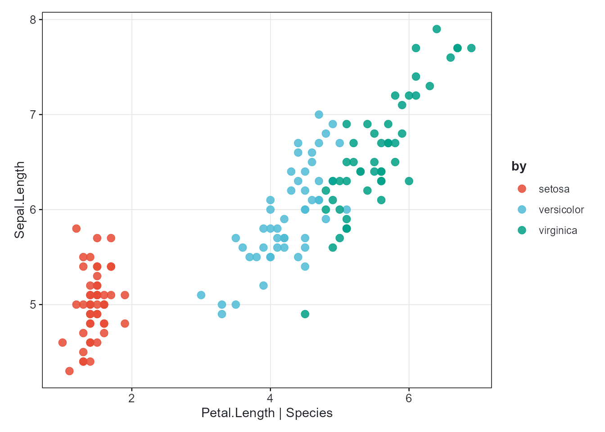

The `| group` part is optional. Every plot automatically gets:

- Proper axis labels derived from variable names
- A legend when grouping is present
- A color palette applied to groups

------------------------------------------------------------------------

## Choosing a Plot Type

Pass `type = "..."` or a `type_*()` function:

``` r

# Boxplot with built-in statistical test
cliplot(Sepal.Length ~ Species, data = iris,
        type = "boxplot",
        stat.test = "kruskal.test",
        stat.label = "p.signif",
        palette = "jco")
```

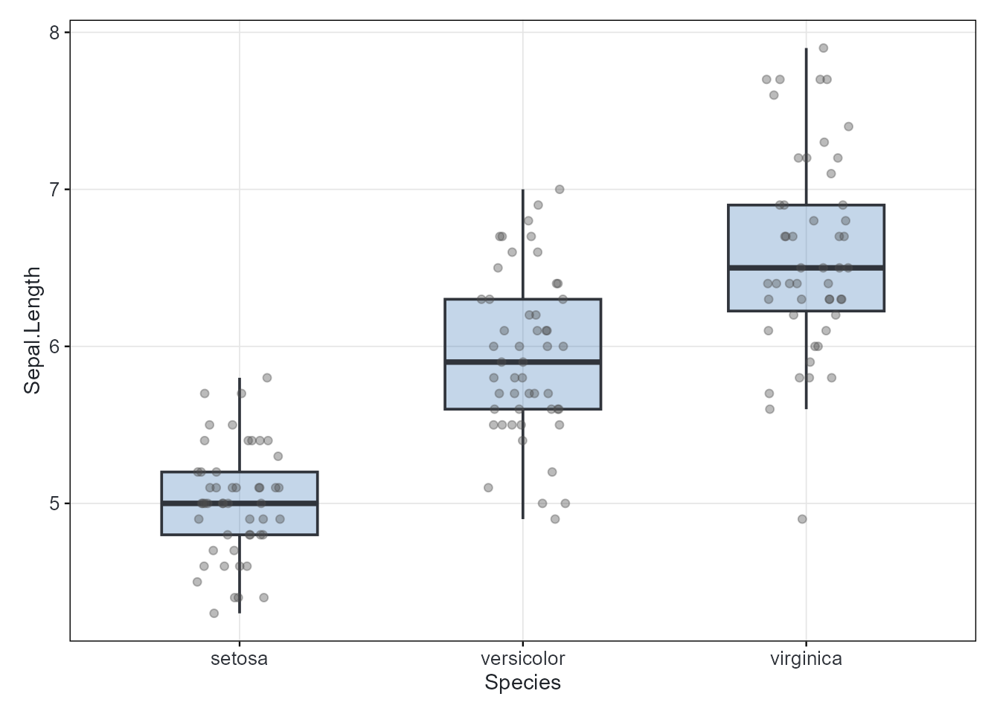

When `type` is omitted, cliomicplot guesses based on data types:

| x variable       | y variable | Auto-detected type   |
|------------------|------------|----------------------|
| numeric          | numeric    | `"points"` (scatter) |
| factor/character | numeric    | `"boxplot"`          |
| factor/character | *(none)*   | `"barplot"`          |
| numeric          | *(none)*   | `"histogram"`        |

------------------------------------------------------------------------

## Statistical Annotations

Built-in statistical test support — no extra packages needed:

``` r

# t-test with p-value formatting
cliplot(len ~ dose, data = ToothGrowth,
        type = "boxplot",
        stat.test = "t.test",
        stat.label = "p.format",
        palette = "jco")
#> Warning: Orientation is not uniquely specified when both the x and y aesthetics are
#> continuous. Picking default orientation 'x'.
#> Warning: Continuous x aesthetic
#> ℹ did you forget `aes(group = ...)`?
```

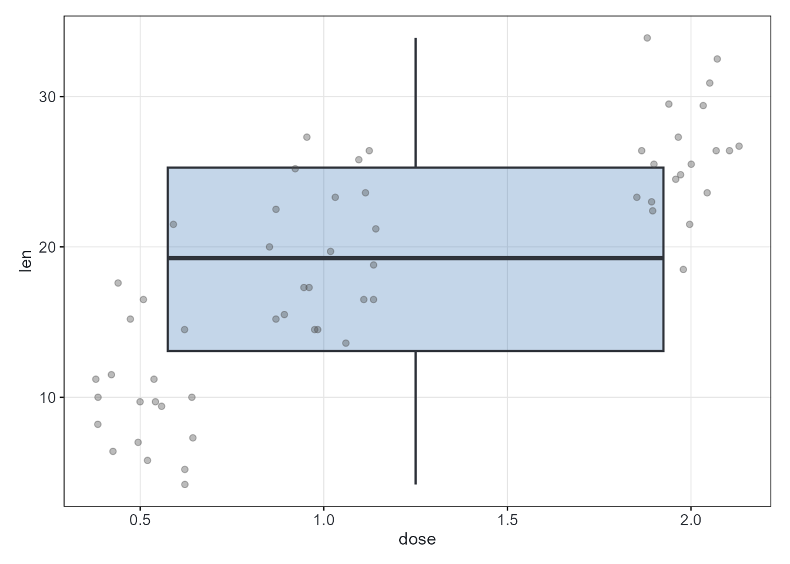

Supported tests: `"t.test"`, `"wilcox.test"`, `"anova"`,
`"kruskal.test"`.

Supported label formats: `"p.format"` (e.g., `p = 0.023`), `"p.signif"`
(e.g., `*`, `**`), `"p.adj"`.

------------------------------------------------------------------------

## Theming

### Persistent themes

Set a theme that applies to **all** subsequent plots:

``` r

clitheme("nature")
#> Theme set to: nature
cliplot(mpg ~ wt, data = mtcars)
```

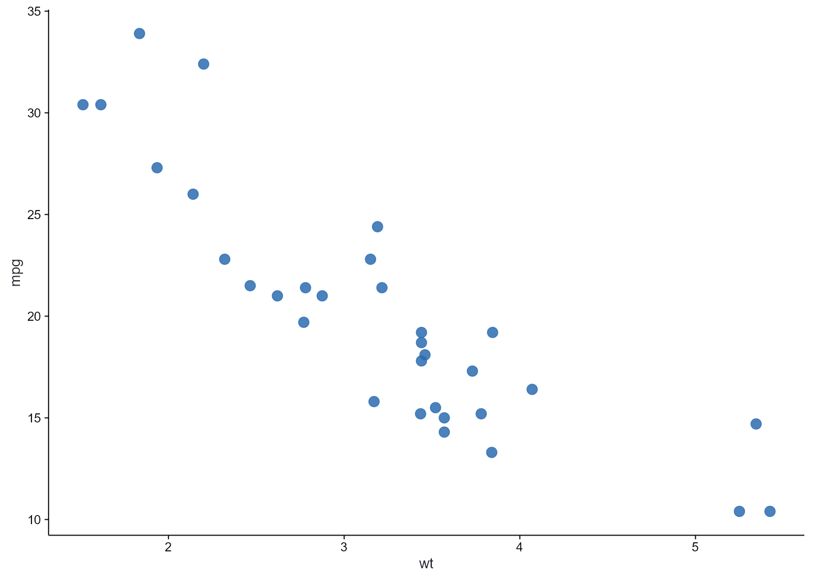

``` r

# The theme persists
cliplot(len ~ dose, data = ToothGrowth, type = "boxplot")
#> Warning: Orientation is not uniquely specified when both the x and y aesthetics are
#> continuous. Picking default orientation 'x'.
#> Warning: Continuous x aesthetic
#> ℹ did you forget `aes(group = ...)`?
```

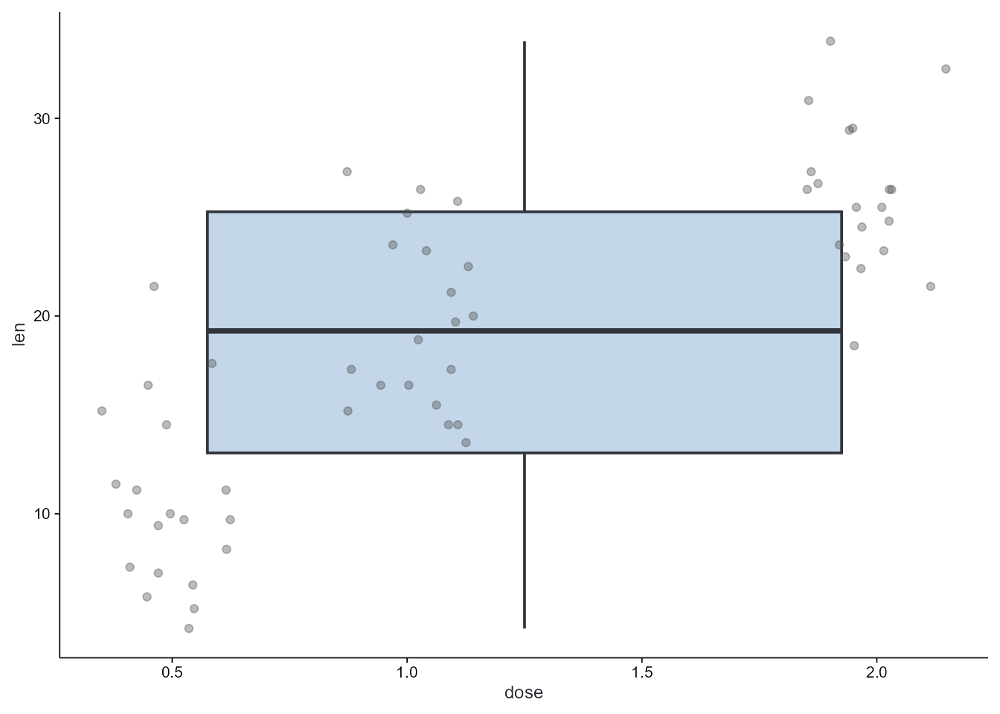

``` r

clitheme()  # reset to default
```

### Ephemeral (per-plot) themes

Apply a theme to **one plot only**:

``` r

cliplot(mpg ~ wt, data = mtcars, theme = "nature")
```


``` r

cliplot(Sepal.Length ~ Species, data = iris, type = "boxplot", theme = "dark")
```

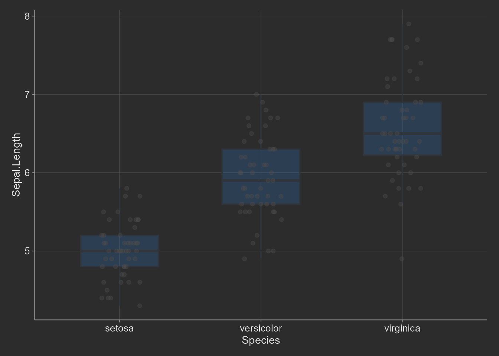

### Available themes

| Theme         | Style                           |
|---------------|---------------------------------|
| `cli_bw`      | Clean black-and-white (default) |
| `cli_classic` | Classic with axis lines         |
| `cli_minimal` | Minimal and modern              |
| `nature`      | Nature Publishing Group         |
| `science`     | Science / AAAS                  |
| `nejm`        | New England Journal of Medicine |
| `lancet`      | The Lancet                      |
| `cell`        | Cell Press                      |
| `broadsheet`  | Publication print style         |
| `dark`        | Dark background (presentations) |

------------------------------------------------------------------------

## Color Palettes

cliomicplot ships with 55+ palettes in a unified system:

``` r

# List all palettes (first 20 shown)
head(cli_palette_list(), 20)
#>  [1] "jco"            "nejm"           "lancet"         "nature"        
#>  [5] "science"        "okabe_ito"      "tableau10"      "tol_muted"     
#>  [9] "heatmap_rdbu"   "heatmap_rdylbu" "heatmap_prgn"   "volcano"       
#> [13] "pastel"         "soft"           "neon"           "cyberpunk"     
#> [17] "blues"          "reds"           "greens"         "purples"
```

``` r

# Use any palette by name
cliplot(Sepal.Length ~ Petal.Length | Species, data = iris,
        palette = "jama")
```

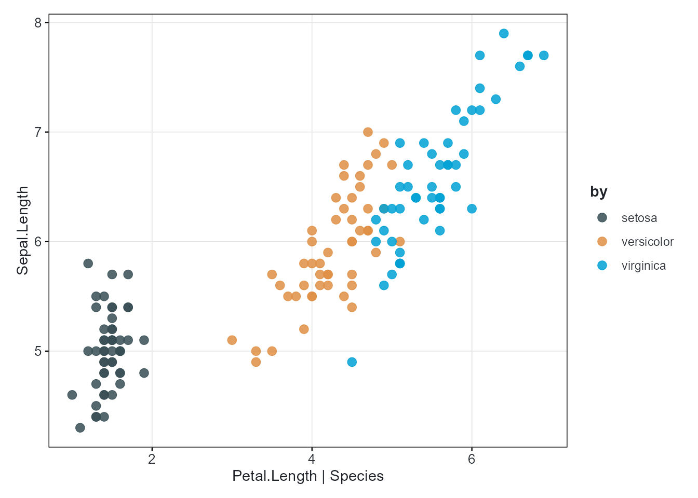

``` r


cliplot(Sepal.Length ~ Petal.Length | Species, data = iris,
        palette = "cosmic")
```

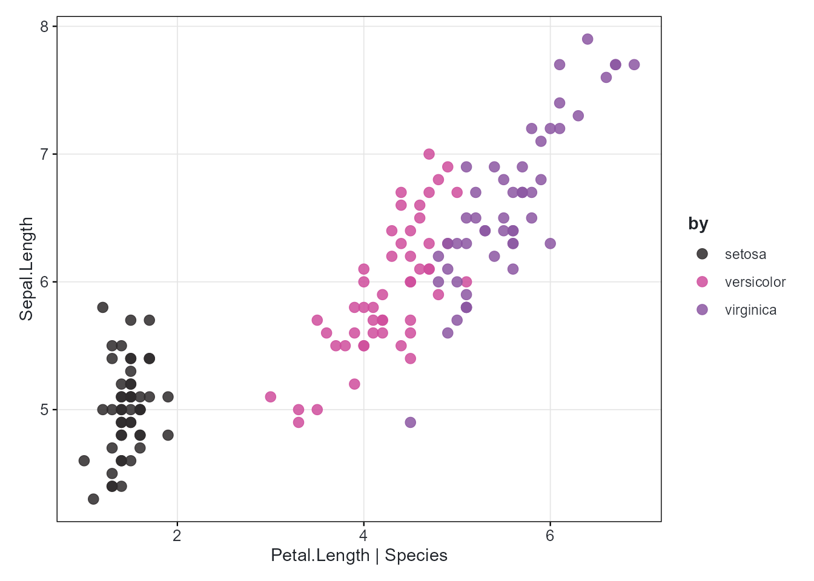

### Standalone ggplot2 scale usage

All palettes work as standalone scales for any ggplot:

``` r

library(ggplot2)
#> Warning: package 'ggplot2' was built under R version 4.5.3

ggplot(iris, aes(Sepal.Length, Petal.Length, color = Species)) +
  geom_point(size = 3) +
  palette_scale("npg", "color") +
  theme_bw()
```

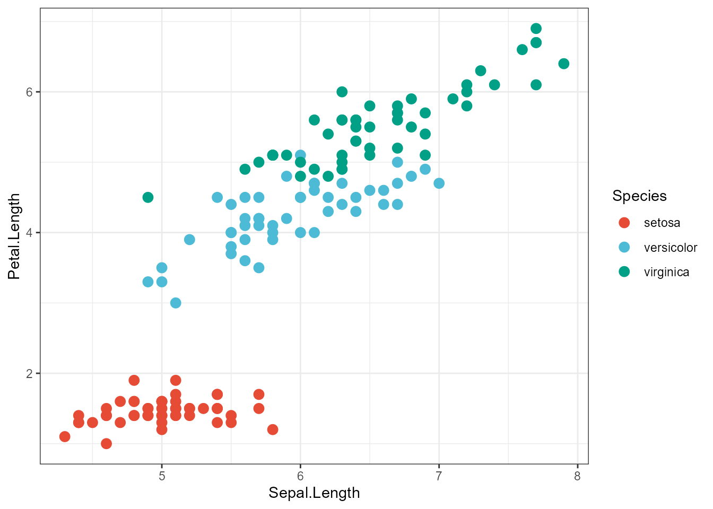

------------------------------------------------------------------------

## Markdown Text Rendering

Add **bold**, *italic*, colored, subscript/superscript text to labels:

``` r

cliplot(mpg ~ wt, data = mtcars,
        title    = "**Mileage** vs *Weight* in mtcars",
        subtitle = "n = 32 vehicles, <span style='color:#E64B35'>1974 Motor Trend</span>",
        caption  = "*Motor Trend* (1974)") +
  cli_markdown()
```

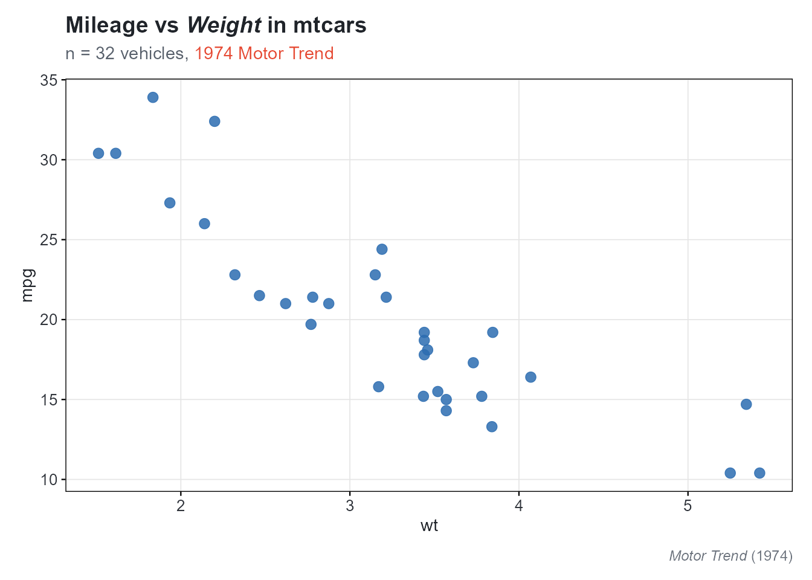

### Selective markdown

``` r

# Only the title renders markdown
cliplot(mpg ~ wt, data = mtcars,
        title = "**Bold Title**",
        xlab  = "Weight (1000 lbs)",    # plain text
        ylab  = "Miles / Gallon") +      # plain text
  cli_markdown("title")
```

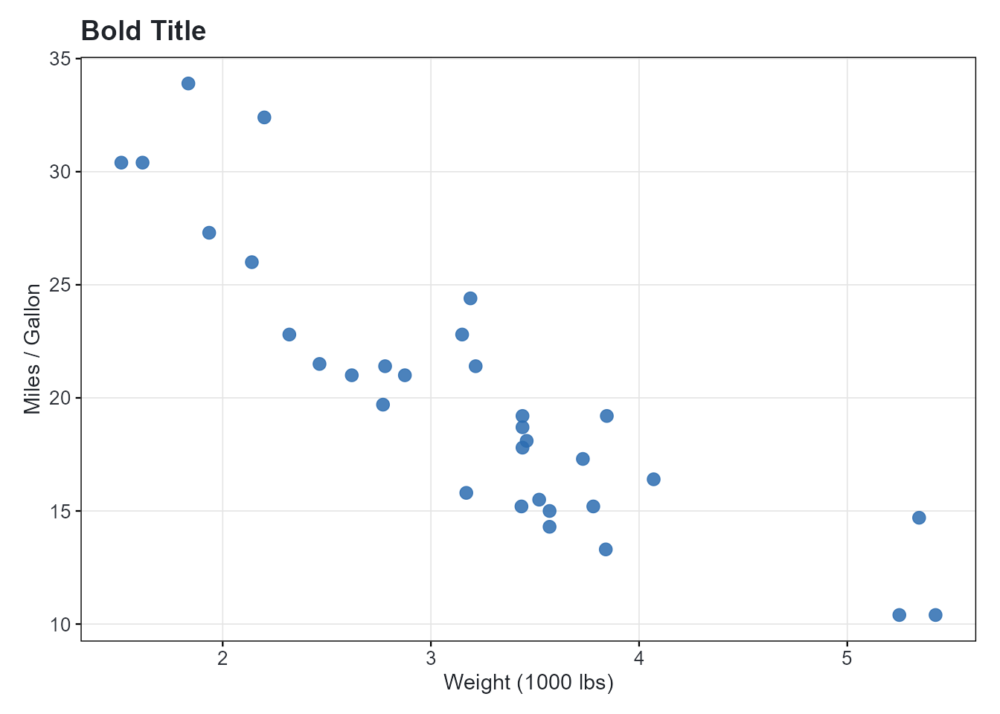

------------------------------------------------------------------------

## Global Parameters with `clipar()`

Set defaults that apply to all subsequent plots:

``` r

# View current parameters (first 10)
names(clipar())[1:10]
#>  [1] "facet.font"        "font.cap"          "stat.test"        
#>  [4] "facet.border"      "facet.cex"         "palette.diverging"
#>  [7] "file.width"        "theme.default"     "legend.direction" 
#> [10] "cex.sub"
```

``` r

# Set defaults
clipar(palette.qualitative = "nejm")
clipar(stat.test = "wilcox.test")
clipar(file.width = 8, file.height = 6, file.res = 600)

# Query
clipar("palette.qualitative")
#> [1] "nejm"
```

------------------------------------------------------------------------

## Saving to File

Save plots directly from
[`cliplot()`](https://vanhungtran.github.io/cliomicplot/reference/cliplot.md)
in one call. Supports pdf, png, jpg, svg, and tiff:

``` r

cliplot(Sepal.Length ~ Petal.Length | Species, data = iris,
        file   = "iris_scatter.pdf",
        width  = 6,
        height = 5)

# PNG with high DPI
cliplot(mpg ~ wt, data = mtcars,
        file = "mpg_wt.png", width = 8, height = 6)
```

Set global defaults for file output:

``` r

clipar(file.width = 8, file.height = 6, file.res = 600)
cliplot(Sepal.Length ~ Petal.Length | Species, data = iris,
        file = "fig1_highres.pdf")
```

------------------------------------------------------------------------

## Next Steps

- **[`vignette("oncology", package = "cliomicplot")`](https://vanhungtran.github.io/cliomicplot/articles/oncology.md)**
  — End-to-end oncology analysis
- **[`vignette("multiomics", package = "cliomicplot")`](https://vanhungtran.github.io/cliomicplot/articles/multiomics.md)**
  — Multi-omics exploratory analysis
- **[`vignette("themes-palettes", package = "cliomicplot")`](https://vanhungtran.github.io/cliomicplot/articles/themes-palettes.md)**
  — Deep dive into themes & palettes
