# Multi-Omics Exploratory Analysis with cliomicplot

\+

−

⊙

×

‹

›


100 %

Scroll to zoom · Drag to pan · ← → to navigate

## Overview

This vignette demonstrates a multi-omics exploratory analysis workflow
using **cliomicplot**. We’ll generate four figures commonly found in
omics publications:

1.  **Figure 1** — PCA with confidence ellipses
2.  **Figure 2** — Correlation heatmap with clustering and significance
3.  **Figure 3** — Volcano plot for differential expression
4.  **Figure 4** — MA plot for DE quality assessment

``` r

library(cliomicplot)
#> cliomicplot 0.1.0 - Publication-ready clinical & omics plots
#> Main function: cliplot() | Themes: clitheme() | Params: clipar()
clipar(stat.test = NULL)  # disable auto stat annotations
```

------------------------------------------------------------------------

## Figure 1: PCA with Confidence Ellipses

Principal Component Analysis (PCA) is the workhorse of omics data
exploration. cliomicplot can compute PCA from raw data or accept
pre-computed results:

### From raw data

``` r

clitheme("nature")
#> Theme set to: nature

cliplot(iris[, 1:4],
        type = type_pca(
          pc_x          = 1,
          pc_y          = 2,
          center        = TRUE,
          scale.        = TRUE,
          add_ellipse   = TRUE,
          ellipse_level = 0.95,
          point_size    = 2.5,
          label_samples = FALSE
        ),
        by       = iris$Species,
        palette  = "npg",
        stat.test = NULL,
        title    = "**Figure 1** — PCA of Iris Morphometric Data",
        subtitle = "PC1 (72.9%) vs. PC2 (22.9%), 95% CI ellipses") +
  cli_markdown()
```

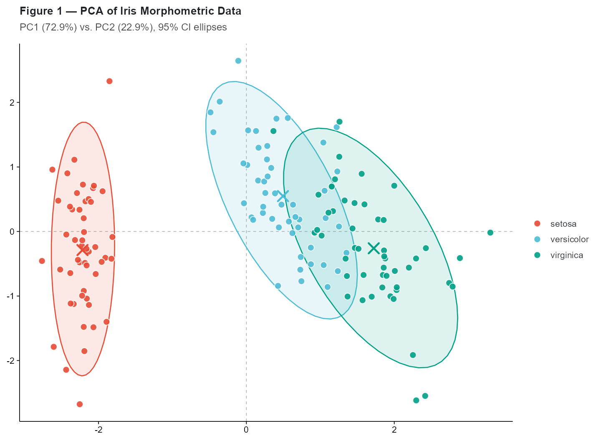

The axis labels automatically include variance explained percentages,
and confidence ellipses are drawn around each group.

### From pre-computed PCA

When you already have PCA results (e.g., from
[`prcomp()`](https://rdrr.io/r/stats/prcomp.html), `DESeq2`, or another
pipeline), cliomicplot accepts the scores directly:

``` r

pca_res <- prcomp(iris[, 1:4], center = TRUE, scale. = TRUE)
scores  <- as.data.frame(pca_res$x)
scores$Species <- iris$Species

cliplot(PC2 ~ PC1, data = scores, by = scores$Species,
        type      = "points",
        stat.test = NULL,
        palette   = "d3_category10",
        title     = "**PCA Scores** — Pre-computed by prcomp()",
        theme     = "science") +
  cli_markdown()
```

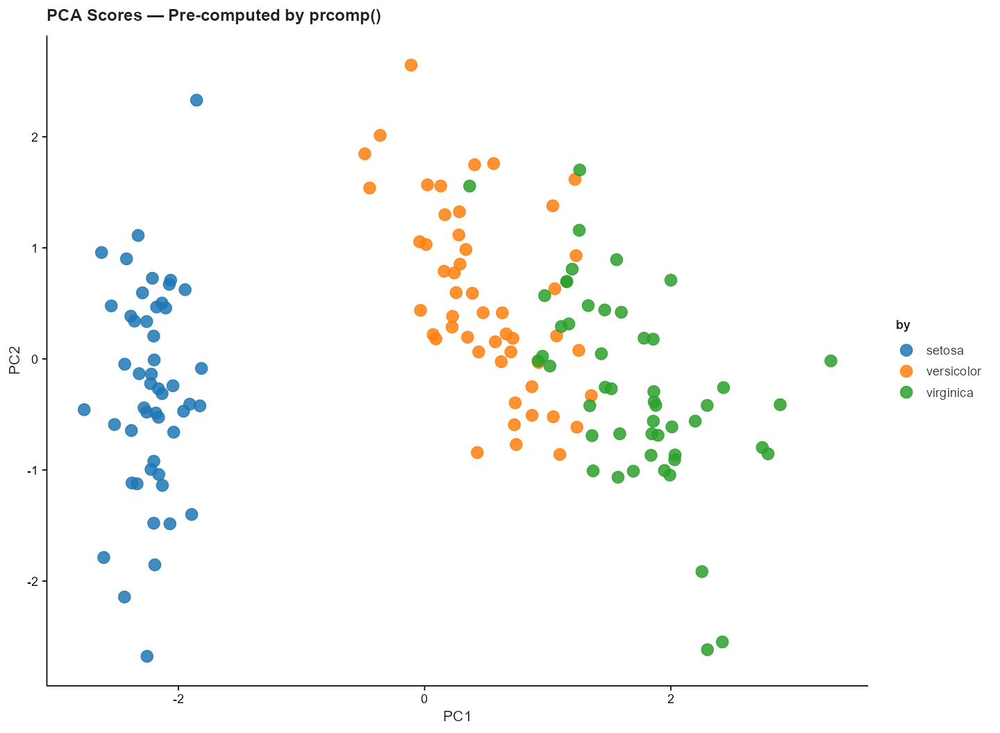

### PCA with sample labels

``` r

cliplot(iris[, 1:4],
        type = type_pca(
          add_ellipse   = FALSE,
          label_samples = TRUE,
          label_size    = 2.5,
          point_size    = 2
        ),
        by      = iris$Species,
        palette = "jco",
        stat.test = NULL,
        title   = "**PCA with Sample Labels**") +
  cli_markdown()
```

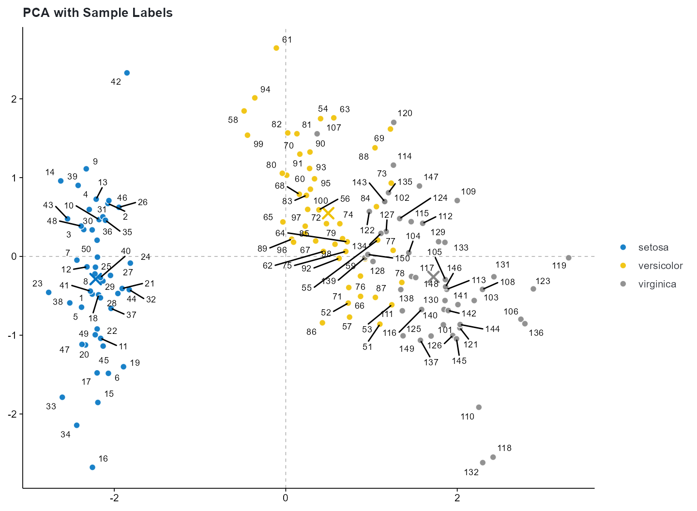

------------------------------------------------------------------------

## Figure 2: Correlation Matrix

Correlation analysis with significance stars and hierarchical
clustering:

``` r

clitheme("cli_minimal")
#> Theme set to: cli_minimal

cliplot(mtcars[, 1:7],
        type = type_correlation(
          method    = "pearson",
          type      = "lower",
          add_coef  = TRUE,
          coef_size = 3.5,
          cluster   = TRUE,
          sig_level = 0.001
        ),
        stat.test = NULL,
        title = "**Figure 2** — Pearson Correlation Matrix (mtcars)",
        subtitle = "Lower triangle | *** p < 0.001") +
  cli_markdown()
```

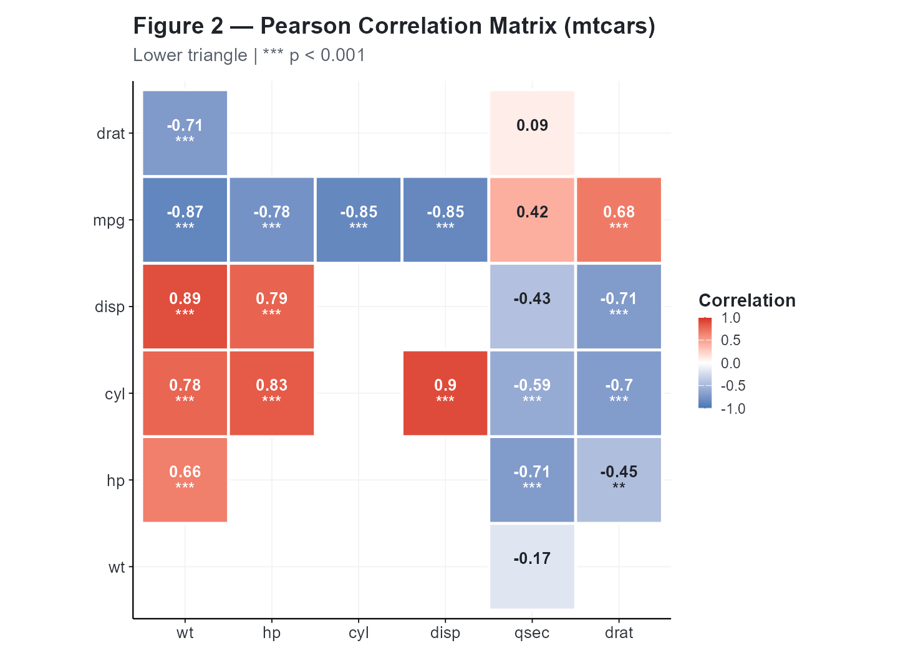

### Correlation options

``` r

# Spearman correlation, upper triangle, no coefficients
cliplot(mtcars[, 1:5],
        type = type_correlation(
          method   = "spearman",
          type     = "upper",
          add_coef = FALSE,
          cluster  = FALSE
        ),
        title = "**Spearman Correlation** — Upper Triangle") +
  cli_markdown()
#> Warning in cor.test.default(mat[, i], mat[, j], method = method): Cannot
#> compute exact p-value with ties
#> Warning in cor.test.default(mat[, i], mat[, j], method = method): Cannot
#> compute exact p-value with ties
#> Warning in cor.test.default(mat[, i], mat[, j], method = method): Cannot
#> compute exact p-value with ties
#> Warning in cor.test.default(mat[, i], mat[, j], method = method): Cannot
#> compute exact p-value with ties
#> Warning in cor.test.default(mat[, i], mat[, j], method = method): Cannot
#> compute exact p-value with ties
#> Warning in cor.test.default(mat[, i], mat[, j], method = method): Cannot
#> compute exact p-value with ties
#> Warning in cor.test.default(mat[, i], mat[, j], method = method): Cannot
#> compute exact p-value with ties
#> Warning in cor.test.default(mat[, i], mat[, j], method = method): Cannot
#> compute exact p-value with ties
#> Warning in cor.test.default(mat[, i], mat[, j], method = method): Cannot
#> compute exact p-value with ties
#> Warning in cor.test.default(mat[, i], mat[, j], method = method): Cannot
#> compute exact p-value with ties
#> Warning in cor.test.default(mat[, i], mat[, j], method = method): Cannot
#> compute exact p-value with ties
#> Warning in cor.test.default(mat[, i], mat[, j], method = method): Cannot
#> compute exact p-value with ties
#> Warning in cor.test.default(mat[, i], mat[, j], method = method): Cannot
#> compute exact p-value with ties
#> Warning in cor.test.default(mat[, i], mat[, j], method = method): Cannot
#> compute exact p-value with ties
#> Warning in cor.test.default(mat[, i], mat[, j], method = method): Cannot
#> compute exact p-value with ties
#> Warning in cor.test.default(mat[, i], mat[, j], method = method): Cannot
#> compute exact p-value with ties
#> Warning in cor.test.default(mat[, i], mat[, j], method = method): Cannot
#> compute exact p-value with ties
#> Warning in cor.test.default(mat[, i], mat[, j], method = method): Cannot
#> compute exact p-value with ties
#> Warning in cor.test.default(mat[, i], mat[, j], method = method): Cannot
#> compute exact p-value with ties
#> Warning in cor.test.default(mat[, i], mat[, j], method = method): Cannot
#> compute exact p-value with ties
#> Warning in cor.test.default(mat[, i], mat[, j], method = method): Cannot
#> compute exact p-value with ties
#> Warning in cor.test.default(mat[, i], mat[, j], method = method): Cannot
#> compute exact p-value with ties
#> Warning in cor.test.default(mat[, i], mat[, j], method = method): Cannot
#> compute exact p-value with ties
#> Warning in cor.test.default(mat[, i], mat[, j], method = method): Cannot
#> compute exact p-value with ties
#> Warning in cor.test.default(mat[, i], mat[, j], method = method): Cannot
#> compute exact p-value with ties
```

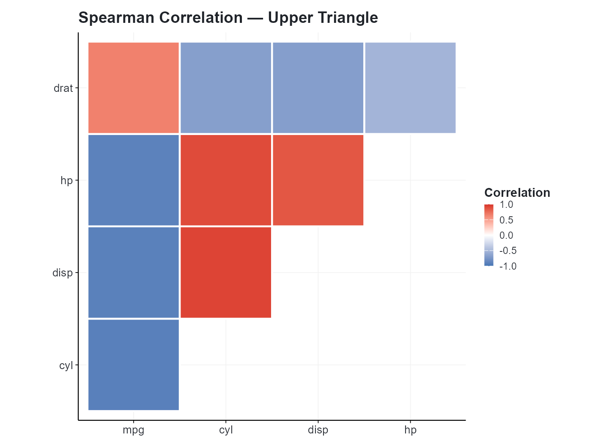

``` r

# Full matrix with all significance levels
cliplot(mtcars[, 1:6],
        type = type_correlation(
          method    = "pearson",
          type      = "full",
          add_coef  = TRUE,
          cluster   = TRUE,
          sig_level = 0.05
        ),
        title = "**Full Correlation Matrix** with Significance Stars") +
  cli_markdown()
```

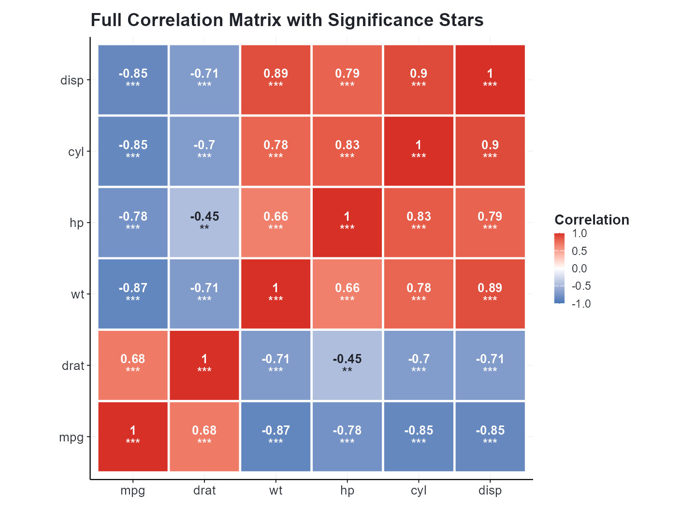

------------------------------------------------------------------------

## Figure 3: Volcano Plot — Differential Expression

The volcano plot is the canonical visualization for differential
expression analysis. We’ll generate realistic simulated data:

``` r

set.seed(42)

# Generate 8000 "genes" — most are null
n_genes <- 8000
de_data <- data.frame(
  logFC   = rnorm(n_genes, 0, 0.7),
  PValue  = 10^-rnorm(n_genes, 2.5, 1.8),
  row.names = paste0("GENE", 1:n_genes)
)

# Inject 200 "true" DE genes
sig_idx <- sample(1:n_genes, 200)
de_data$logFC[sig_idx]  <- rnorm(200, ifelse(runif(200) > 0.5, 2.0, -2.0), 0.5)
de_data$PValue[sig_idx] <- 10^-runif(200, 5, 15)

cat(sprintf("Genes tested: %d\n", n_genes))
#> Genes tested: 8000
cat(sprintf("DE genes (|log2FC| > 1, p < 0.05): %d\n",
            sum(abs(de_data$logFC) > 1 & de_data$PValue < 0.05)))
#> DE genes (|log2FC| > 1, p < 0.05): 1081
```

``` r

clitheme("cell")
#> Theme set to: cell

cliplot(-log10(PValue) ~ logFC, data = de_data,
        type = type_volcano(
          pval_cutoff  = 0.01,
          fc_cutoff    = 1,
          label_genes  = "significant",
          max_overlaps = 25,
          point_alpha  = 0.5
        ),
        title    = "**Figure 3** — Volcano Plot of Differential Expression",
        subtitle = "FDR < 0.01, |log<sub>2</sub>FC| > 1",
        caption  = paste0("Top labeled genes; ", n_genes, " probes tested")) +
  cli_markdown()
```

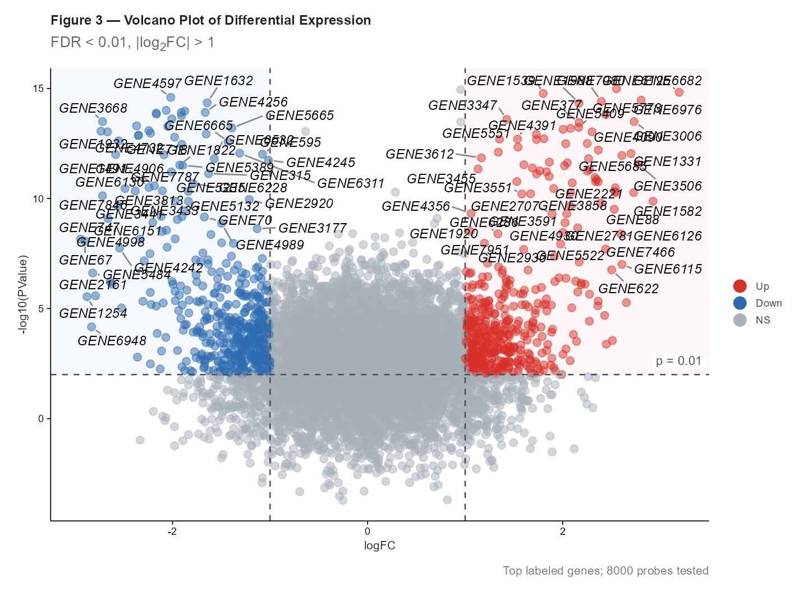

### Volcano plot color scheme

| Category | Condition | Default Color |
|----|----|----|
| **Up** (red) | $`p < p_\text{cutoff}`$ and $`\log_2(\text{FC}) > \text{fc\_cutoff}`$ | `#E64B35` |
| **Down** (blue) | $`p < p_\text{cutoff}`$ and $`\log_2(\text{FC}) < -\text{fc\_cutoff}`$ | `#4DBBD5` |
| **NS** (grey) | All other genes | `grey70` |

### Customizing the volcano

``` r

# Tighter thresholds, different colors
cliplot(-log10(PValue) ~ logFC, data = de_data,
        type = type_volcano(
          pval_cutoff  = 0.001,
          fc_cutoff    = 1.5,
          label_genes  = NULL,       # no labels
          up_color     = "#BC3C29",  # NEJM red
          down_color   = "#0072B5",  # NEJM blue
          ns_color     = "grey85",
          point_size   = 1.5,
          point_alpha  = 0.4
        ),
        palette = "volcano",
        title   = "**Volcano Plot** — Stringent Thresholds",
        subtitle = "p < 0.001, |log<sub>2</sub>FC| > 1.5") +
  cli_markdown()
```

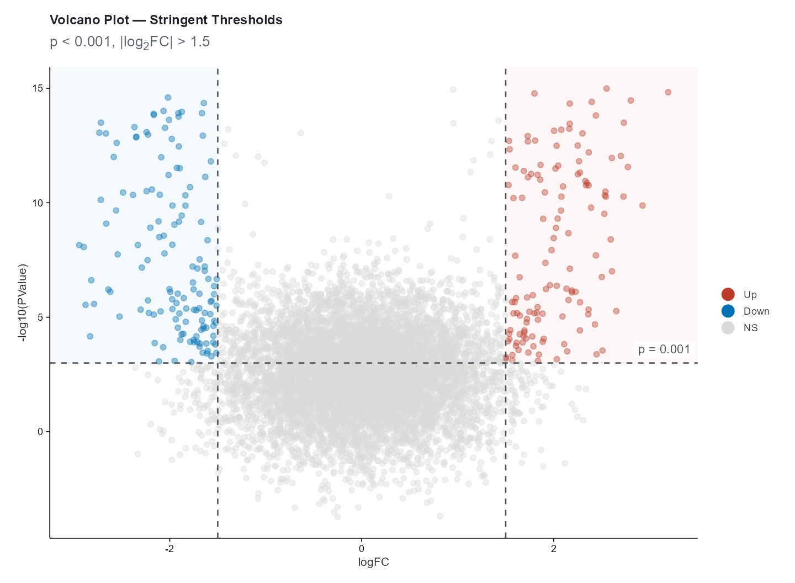

------------------------------------------------------------------------

## Figure 4: MA Plot — DE Quality Check

The MA (Mean-Average) plot complements the volcano by showing the
relationship between fold-change and mean expression level:

``` r

set.seed(123)
ma_data <- data.frame(
  baseMean       = 10^runif(3000, 0, 5),
  log2FoldChange = rnorm(3000, 0, 0.6),
  padj           = runif(3000)
)
# Add "real" DE genes
ma_data$log2FoldChange[sample(1:3000, 150)] <- rnorm(150, 2, 0.5)
ma_data$log2FoldChange[sample(1:3000, 150)] <- rnorm(150, -2, 0.5)

clitheme("science")
#> Theme set to: science

cliplot(log2FoldChange ~ baseMean, data = ma_data,
        type = type_ma(
          pval_cutoff = 0.05,
          add_loess   = TRUE,
          loess_color = "#3C5488",
          sig_color   = "#E64B35",
          ns_color    = "grey70",
          point_size  = 1.2,
          point_alpha = 0.4
        ),
        title    = "**Figure 4** — MA Plot",
        subtitle = "DE genes highlighted (padj < 0.05), LOESS trend") +
  cli_markdown()
#> `geom_smooth()` using formula = 'y ~ x'
```

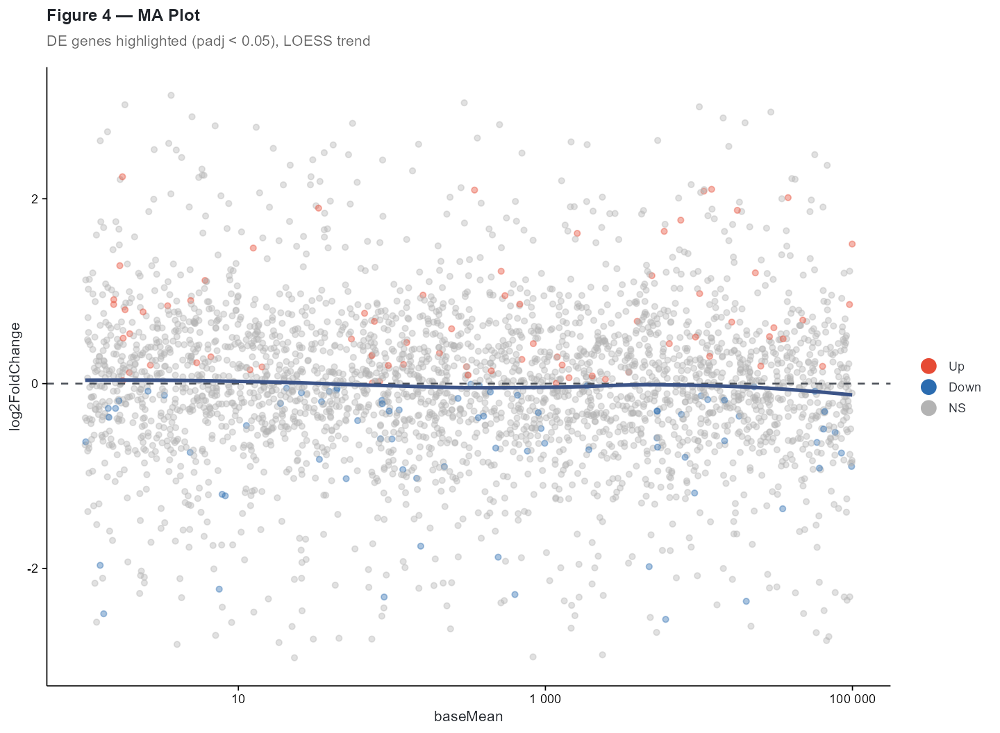

The MA plot shows: - **y-axis**: $`\log_2`$ fold change (biological
effect size) - **x-axis**: Mean normalized counts (expression level,
log₁₀ scale) - **Red points**: Significant DE genes - **Blue curve**:
LOESS trend line (checks for intensity-dependent bias) - **Horizontal
dashed line**: $`\log_2\text{FC} = 0`$ (no change)

------------------------------------------------------------------------

## Heatmap: Clustered Expression Matrix

For completeness, here’s a clustered heatmap workflow:

``` r

set.seed(789)
expr_mat <- matrix(rnorm(500), nrow = 50)
rownames(expr_mat) <- paste0("Gene_", 1:50)
colnames(expr_mat) <- paste0("Sample_", sprintf("%02d", 1:10))

# Column annotations
ann_col <- data.frame(
  Condition = rep(c("Control", "Treatment"), each = 5),
  Batch     = rep(c("A", "B"), 5),
  row.names = colnames(expr_mat)
)

# Annotation color mapping
ann_colors <- list(
  Condition = c(Control = "#4DBBD5", Treatment = "#E64B35"),
  Batch     = c(A = "#E18727", B = "#3C5488")
)
```

``` r

cliplot(expr_mat,
        type = type_heatmap(
          scale             = "row",
          cluster_rows      = TRUE,
          cluster_cols      = TRUE,
          annotation_col    = ann_col,
          annotation_colors = ann_colors,
          color_low         = "#4575B4",
          color_mid         = "white",
          color_high        = "#D73027",
          fontsize          = 9
        ))
```

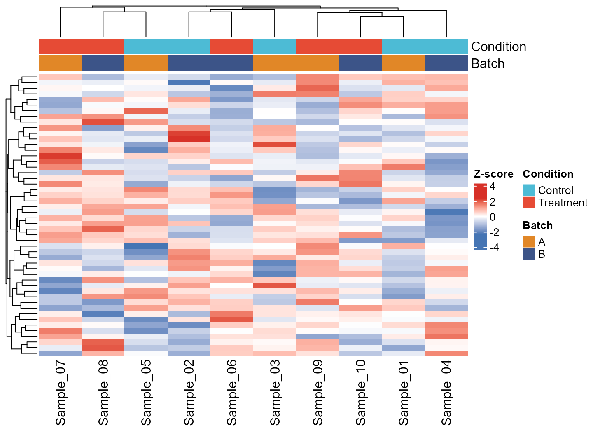

> **Note:** The heatmap uses `ComplexHeatmap` when available, falling
> back to `pheatmap`. Install with `install.packages("ComplexHeatmap")`
> for the best experience.

------------------------------------------------------------------------

## Figure 5: Infographic Bar Chart — Results Comparison

The
[`type_infobar()`](https://vanhungtran.github.io/cliomicplot/reference/type_infobar.md)
creates media-ready bar charts with per-category custom colours, footer
boxes, and reference lines. Use it for polling, survey results, or any
side-by-side comparison where each category carries semantic colouring:

``` r

infobar_data <- data.frame(
  endpoint  = c("ORR", "DCR", "PFS6", "OS12", "AE3"),
  value     = c(42, 68, 55, 72, 12),
  bar_color = c("#0073C2", "#4DBBD5", "#00A087", "#3C5488", "#E64B35"),
  box_color = c("#005A9E", "#3AA8C2", "#00806A", "#2A3E6E", "#C9302C"),
  group     = c("Efficacy", "Efficacy", "Efficacy", "Efficacy", "Safety"),
  change    = c("(+3)", "(+5)", "(-1)", "(+2)", "(-4)"),
  stringsAsFactors = FALSE
)

cliplot(value ~ endpoint, data = infobar_data,
        type = type_infobar(
          bar_colors      = setNames(infobar_data$bar_color,
                                     infobar_data$endpoint),
          box_colors      = setNames(infobar_data$box_color,
                                     infobar_data$endpoint),
          box_labels      = infobar_data$endpoint,
          box_sub_labels  = infobar_data$group,
          change_labels   = infobar_data$change,
          reference_line  = 40,
          reference_label = "40%",
          value_suffix    = "%",
          bar_width       = 0.82
        ),
        title    = "**Figure 5** — Efficacy & Safety Endpoint Comparison",
        subtitle = "Clinical trial results by endpoint category")
```

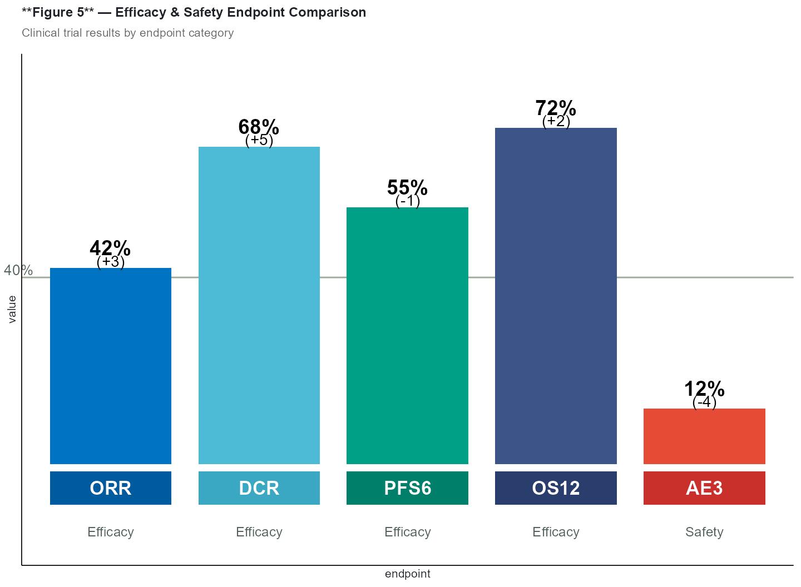

### Customization

| Parameter | Default | Description |
|----|----|----|
| `bar_colors` | `NULL` (jco palette) | Named vector of per-bar fill colours |
| `box_colors` | `NULL` (no boxes) | Named vector of footer box fill colours |
| `box_labels` | `NULL` | Labels inside footer boxes (vector, one per bar) |
| `box_sub_labels` | `NULL` | Sub-labels below footer boxes |
| `change_labels` | `NULL` | Change annotations below value labels |
| `reference_line` | `NULL` | y-axis value for a horizontal reference line |
| `reference_label` | `NULL` | Label text next to the reference line |
| `value_suffix` | `""` | Suffix appended to value labels (e.g. `"%"`) |

------------------------------------------------------------------------

## Summary

In this vignette we produced five publication-ready omics figures:

1.  **PCA** — Dimensionality reduction with confidence ellipses
2.  **Correlation Matrix** — Pairwise correlations with hierarchical
    clustering
3.  **Volcano Plot** — Differential expression significance
    vs. fold-change
4.  **MA Plot** — Fold-change vs. mean expression with LOESS trend
5.  **Infobar** — Per-category infographic comparison with custom
    styling

Reset global settings:

``` r

clitheme()
```
