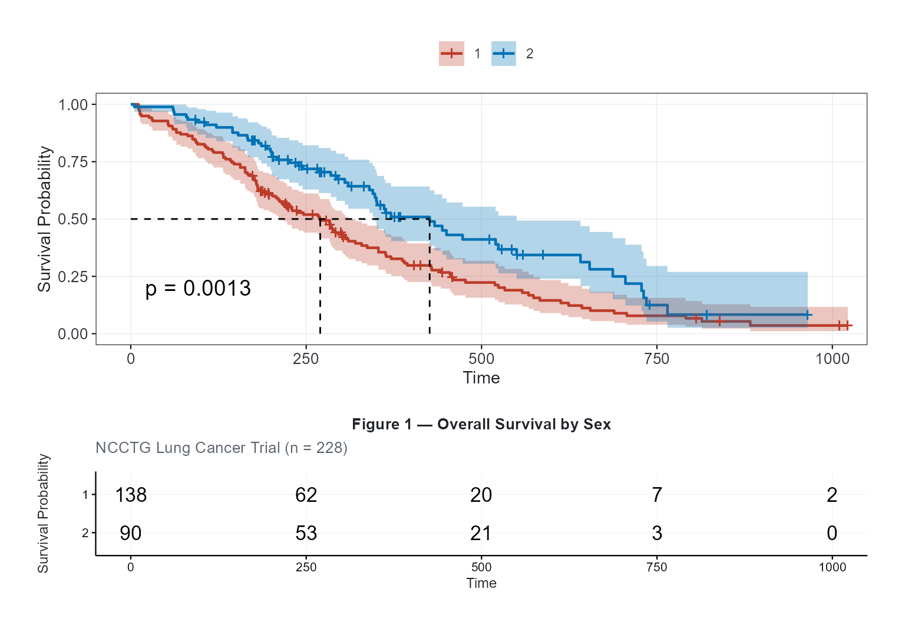
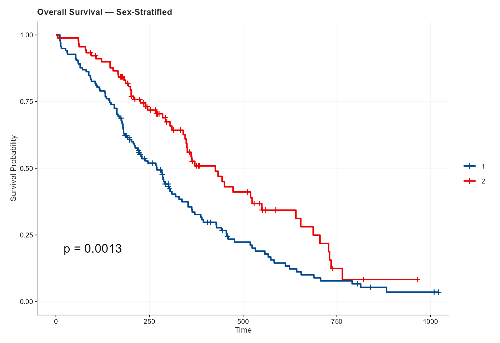
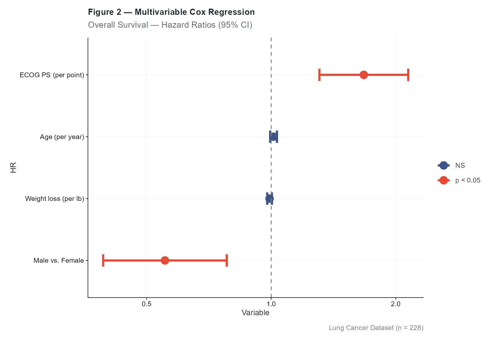
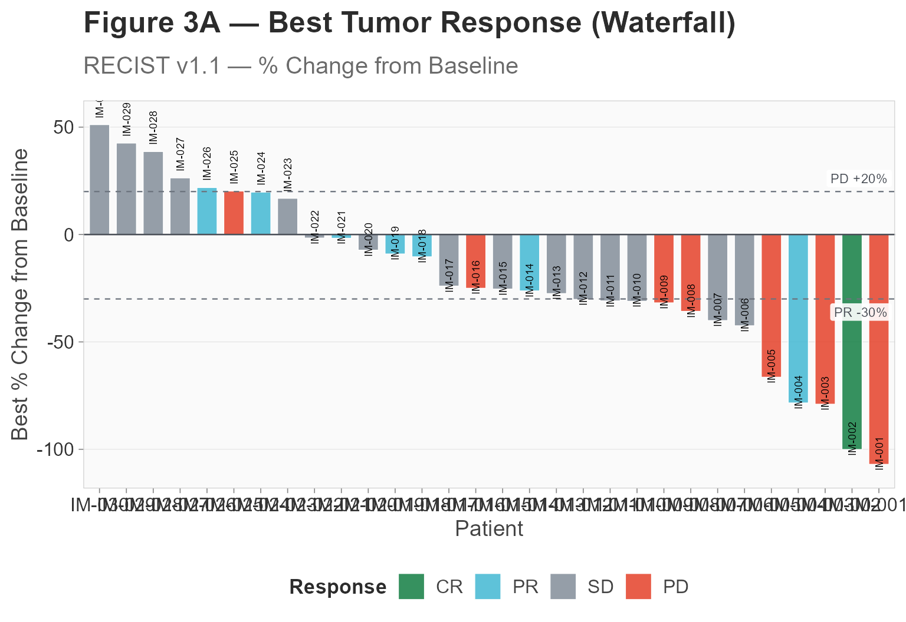
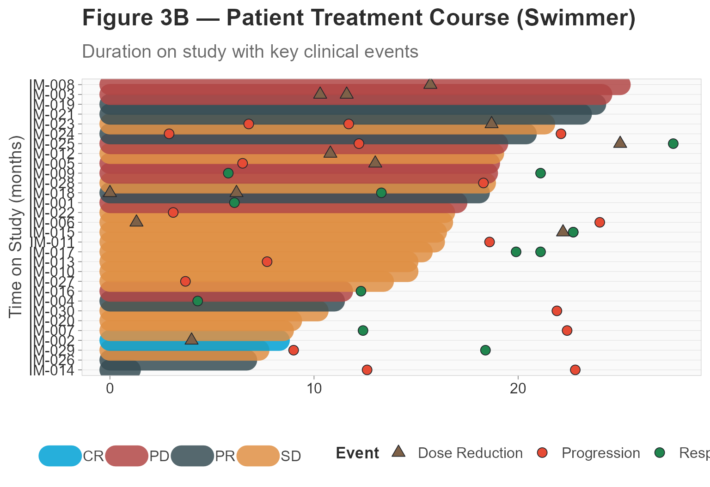
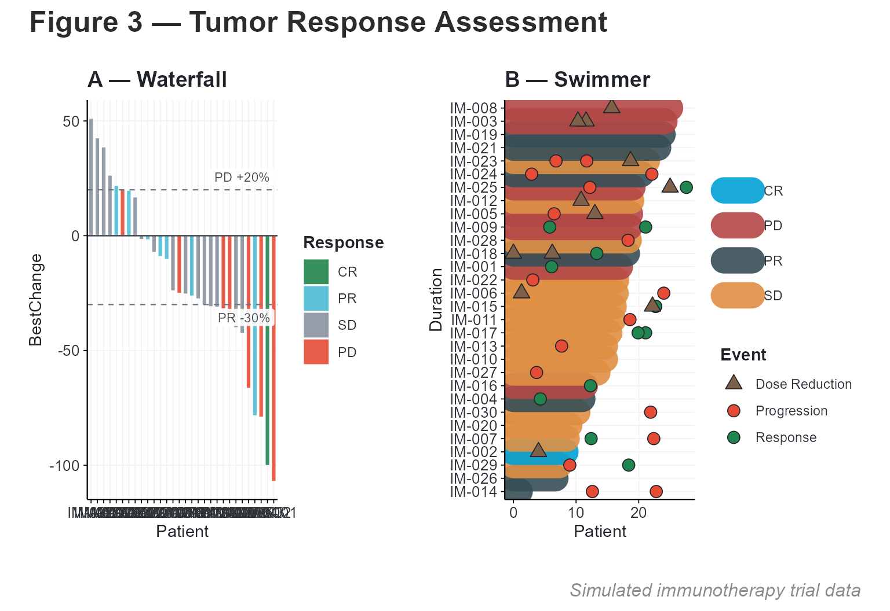
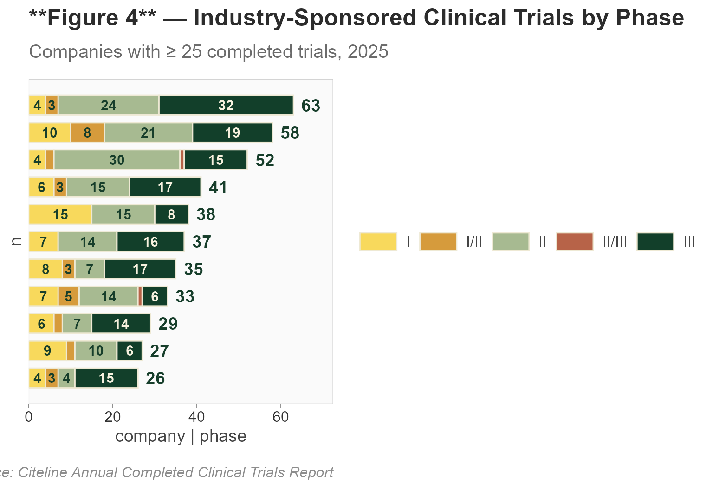

# End-to-End Oncology Analysis with cliomicplot

\+

−

⊙

×

‹

›


100 %

Scroll to zoom · Drag to pan · ← → to navigate

## Overview

This vignette demonstrates a complete oncology clinical data analysis
workflow using **cliomicplot**. We’ll generate four publication-quality
figures commonly found in oncology manuscripts:

1.  **Figure 1** — Kaplan-Meier overall survival curves
2.  **Figure 2** — Forest plot from multivariable Cox regression
3.  **Figure 3A** — Waterfall plot of best tumor response
4.  **Figure 3B** — Swimmer plot of patient treatment courses

``` r

library(cliomicplot)
#> cliomicplot 0.1.0 - Publication-ready clinical & omics plots
#> Main function: cliplot() | Themes: clitheme() | Params: clipar()
library(survival)

# Set global defaults for this analysis
clipar(
  palette.qualitative = "nejm",
  stat.test           = NULL,
  file.res            = 600
)
```

------------------------------------------------------------------------

## Figure 1: Kaplan-Meier Survival Curves

We use the `lung` dataset from the **survival** package to visualize
overall survival stratified by sex.

``` r

clitheme("nejm")
#> Theme set to: nejm

cliplot(Surv(time, status) ~ sex, data = lung,
        type = type_km(
          risk_table  = TRUE,
          pval        = TRUE,
          conf_int    = TRUE,
          median_line = TRUE
        ),
        palette  = "nejm",
        title    = "**Figure 1** — Overall Survival by Sex",
        subtitle = "NCCTG Lung Cancer Trial (n = 228)",
        xlab     = "Time (days)",
        ylab     = "Survival Probability",
        legend   = "top") +
  cli_markdown()
#> Warning: Using `size` aesthetic for lines was deprecated in ggplot2 3.4.0.
#> ℹ Please use `linewidth` instead.
#> ℹ The deprecated feature was likely used in the ggpubr package.
#>   Please report the issue at <https://github.com/kassambara/ggpubr/issues>.
#> This warning is displayed once per session.
#> Call `lifecycle::last_lifecycle_warnings()` to see where this warning was
#> generated.
#> Scale for colour is already present.
#> Adding another scale for colour, which will replace the existing scale.
#> Scale for fill is already present.
#> Adding another scale for fill, which will replace the existing scale.
#> Ignoring unknown labels:
#> • colour : ""
```



### Key features demonstrated:

- [`type_km()`](https://vanhungtran.github.io/cliomicplot/reference/type_km.md)
  with risk table, p-value, confidence intervals, and median survival
  line
- `clitheme("nejm")` for NEJM-style typography
- [`cli_markdown()`](https://vanhungtran.github.io/cliomicplot/reference/cli_markdown.md)
  for bold formatting in the title

### Customizing KM plots

``` r

# Without risk table, cleaner look
cliplot(Surv(time, status) ~ sex, data = lung,
        type = type_km(risk_table = FALSE, conf_int = FALSE),
        palette = "lancet",
        theme   = "lancet",
        title   = "**Overall Survival** — Sex-Stratified") +
  cli_markdown()
#> Scale for colour is already present.
#> Adding another scale for colour, which will replace the existing scale.
#> Scale for fill is already present.
#> Adding another scale for fill, which will replace the existing scale.
```



------------------------------------------------------------------------

## Figure 2: Forest Plot — Multivariable Cox Regression

Fit a Cox proportional hazards model and visualize the hazard ratios:

``` r

# Fit Cox model
cox_fit <- coxph(Surv(time, status) ~ age + sex + ph.ecog + wt.loss, data = lung)
cox_sum <- summary(cox_fit)

# Extract results into a forest-plot-ready data frame
forest_df <- data.frame(
  Variable = c("Age (per year)", "Male vs. Female",
               "ECOG PS (per point)", "Weight loss (per lb)"),
  HR       = cox_sum$conf.int[, "exp(coef)"],
  CI_low   = cox_sum$conf.int[, "lower .95"],
  CI_high  = cox_sum$conf.int[, "upper .95"],
  P        = cox_sum$coefficients[, "Pr(>|z|)"]
)

forest_df
#>                     Variable        HR    CI_low   CI_high            P
#> age           Age (per year) 1.0134589 0.9945143 1.0327643 1.649509e-01
#> sex          Male vs. Female 0.5538981 0.3928084 0.7810504 7.535384e-04
#> ph.ecog  ECOG PS (per point) 1.6738244 1.3075807 2.1426504 4.340524e-05
#> wt.loss Weight loss (per lb) 0.9910344 0.9781867 1.0040508 1.761353e-01
```

``` r

clitheme("lancet")
#> Theme set to: lancet

cliplot(HR ~ Variable, data = forest_df,
        type = type_forest(
          ref_line   = TRUE,
          sort       = TRUE,
          point_size = 4,
          ci_width   = 1.2,
          sig_color  = "#E64B35",
          ns_color   = "#3C5488"
        ),
        title    = "**Figure 2** — Multivariable Cox Regression",
        subtitle = "Overall Survival — Hazard Ratios (95% CI)",
        caption  = "Lung Cancer Dataset (n = 228)") +
  cli_markdown()
#> `height` was translated to `width`.
```



### Interpreting the forest plot

- **Red points** = p \< 0.05 (statistically significant)
- **Blue points** = p \>= 0.05 (not significant)
- **Vertical dashed line** at HR = 1 (null effect)
- HR \> 1 = increased risk; HR \< 1 = protective effect

------------------------------------------------------------------------

## Figure 3A: Waterfall Plot — Tumor Response

Generate a simulated immunotherapy trial dataset and visualize best
tumor response:

``` r

set.seed(42)
n_pts <- 30

imtrial <- data.frame(
  Patient    = paste0("IM-", sprintf("%03d", 1:n_pts)),
  BestChange = sort(rnorm(n_pts, mean = -22, sd = 32)),
  BestResp   = sample(c("CR", "PR", "SD", "PD"), n_pts,
                      replace = TRUE,
                      prob = c(0.07, 0.30, 0.36, 0.27)),
  Duration   = pmax(1, round(rnorm(n_pts, mean = 14, sd = 7), 1)),
  Arm        = sample(c("Anti-PD1", "Chemotherapy"), n_pts, replace = TRUE)
)

# Show first few rows
head(imtrial)
#>   Patient BestChange BestResp Duration          Arm
#> 1  IM-001 -107.00657       PD     17.0 Chemotherapy
#> 2  IM-002 -100.09494       CR      8.3 Chemotherapy
#> 3  IM-003  -79.00187       PD     24.1     Anti-PD1
#> 4  IM-004  -78.42122       PR     11.0     Anti-PD1
#> 5  IM-005  -66.44354       PD     18.6     Anti-PD1
#> 6  IM-006  -42.47984       SD     16.3     Anti-PD1
```

``` r

clitheme("broadsheet")
#> Theme set to: broadsheet

cliplot(BestChange ~ Patient, data = imtrial,
        type = type_waterfall(
          show_labels = TRUE,
          label_size  = 2.5,
          bar_width   = 0.75,
          response_thresholds = c("PD" = 20, "SD" = -30)
        ),
        title    = "**Figure 3A** — Best Tumor Response (Waterfall)",
        subtitle = "RECIST v1.1 — % Change from Baseline",
        ylab     = "Best % Change from Baseline",
        legend   = "bottom") +
  cli_markdown()
```



### Response categories

| Category                 | Threshold                    | Color     |
|--------------------------|------------------------------|-----------|
| CR (Complete Response)   | Disappearance of all lesions | 🟢 Green  |
| PR (Partial Response)    | ≥ 30% decrease               | 🔵 Blue   |
| SD (Stable Disease)      | Between +20% and −30%        | 🟠 Orange |
| PD (Progressive Disease) | ≥ 20% increase               | 🔴 Red    |

------------------------------------------------------------------------

## Figure 3B: Swimmer Plot — Patient Timelines

Add clinical event markers to the patient timeline:

``` r

set.seed(123)
n_events_per_pt <- sample(1:3, n_pts, replace = TRUE)
n_total_events  <- sum(n_events_per_pt)

events_df <- data.frame(
  ID    = rep(imtrial$Patient, times = n_events_per_pt),
  Time  = round(runif(n_total_events, 0, 28), 1),
  Event = sample(c("Progression", "AE Gr≥3", "Dose Reduction", "Response"),
                 n_total_events,
                 replace = TRUE, prob = c(0.3, 0.25, 0.2, 0.25))
)

head(events_df)
#>       ID Time          Event
#> 1 IM-001 13.4        AE Gr≥3
#> 2 IM-001 21.2        AE Gr≥3
#> 3 IM-001  6.1       Response
#> 4 IM-002  8.9        AE Gr≥3
#> 5 IM-002  6.5        AE Gr≥3
#> 6 IM-002  4.0 Dose Reduction
```

``` r

cliplot(Duration ~ Patient, data = imtrial,
        type = type_swimmer(
          bar_fill    = "BestResp",
          event_times = events_df,
          bar_alpha   = 0.85
        ),
        palette = "jco",
        title   = "**Figure 3B** — Patient Treatment Course (Swimmer)",
        subtitle = "Duration on study with key clinical events",
        xlab    = "",
        ylab    = "Time on Study (months)",
        legend  = "bottom") +
  cli_markdown()
#> Warning: Removed 21 rows containing missing values or values outside the scale range
#> (`geom_point()`).
```



### Event shape legend

| Event          | Shape            | Color     |
|----------------|------------------|-----------|
| Progression    | ✳ (asterisk, 8)  | 🔴 Red    |
| AE Gr≥3        | ● (circle, 16)   | 🟠 Orange |
| Dose Reduction | ▲ (triangle, 17) | 🟤 Brown  |
| Response       | ◆ (diamond, 18)  | 🟢 Green  |
| Death          | ✖ (cross, 4)     | ⚫ Black  |

------------------------------------------------------------------------

## Combined Multi-Panel Figure

Use **patchwork** to combine the waterfall and swimmer plots:

``` r

library(patchwork)
#> Warning: package 'patchwork' was built under R version 4.5.1

# Regenerate with consistent theme
p1 <- cliplot(BestChange ~ Patient, data = imtrial,
              type = type_waterfall(show_labels = FALSE, bar_width = 0.7),
              theme = "cli_minimal",
              title = "**A** — Waterfall") + cli_markdown()

p2 <- cliplot(Duration ~ Patient, data = imtrial,
              type = type_swimmer(bar_fill = "BestResp", event_times = events_df),
              theme = "cli_minimal",
              title = "**B** — Swimmer") + cli_markdown()

p1 + p2 +
  plot_annotation(
    title   = "**Figure 3** — Tumor Response Assessment",
    caption = "Simulated immunotherapy trial data",
    theme   = ggplot2::theme(plot.title = ggtext::element_markdown())
  )
#> Warning: Removed 21 rows containing missing values or values outside the scale range
#> (`geom_point()`).
```



------------------------------------------------------------------------

## Saving Figures for Publication

``` r

# Save individual figures as high-resolution files
cliplot(Surv(time, status) ~ sex, data = lung,
        type = type_km(risk_table = TRUE),
        theme = "nejm", palette = "nejm",
        file = "fig1_km.pdf", width = 8, height = 6)

cliplot(HR ~ Variable, data = forest_df,
        type = type_forest(),
        theme = "lancet",
        file = "fig2_forest.pdf", width = 7, height = 4.5)

cliplot(BestChange ~ Patient, data = imtrial,
        type = type_waterfall(),
        theme = "broadsheet",
        file = "fig3_waterfall.pdf", width = 10, height = 5.5)
```

------------------------------------------------------------------------

## Figure 4: Clinical Trials Pipeline — Stacked Bar Chart

The new
[`type_trials()`](https://vanhungtran.github.io/cliomicplot/reference/type_trials.md)
creates a horizontal stacked bar chart ideal for showing trial
pipelines, project portfolios, or any categorical breakdown within
groups:

``` r

# Simulated trial pipeline data
pipeline <- data.frame(
  company = rep(c("AstraZeneca", "Roche", "MSD", "Lilly", "Hengrui",
                  "Sanofi", "Novartis", "BMS", "J&J", "Pfizer", "AbbVie"),
                each = 5),
  phase   = rep(c("I", "I/II", "II", "II/III", "III"), 11),
  n       = c(4,3,24,0,32, 10,8,21,0,19, 4,2,30,1,15, 6,3,15,0,17,
              15,0,15,0,8, 7,0,14,0,16, 8,3,7,0,17, 7,5,14,1,6,
              6,2,7,0,14, 9,2,10,0,6, 4,3,4,0,15)
)

phase_colors <- c(
  "I"      = "#F8D95C", "I/II"   = "#D69B3C", "II"     = "#A7BA91",
  "II/III" = "#B76348", "III"    = "#123F2A"
)
phase_text <- c(
  "I"      = "#173E2B", "I/II"   = "#173E2B", "II"     = "#173E2B",
  "II/III" = "white",   "III"    = "#F6F1DE"
)

cliplot(n ~ company | phase, data = pipeline,
        type = type_trials(
          segment_colors      = phase_colors,
          segment_text_colors = phase_text,
          label_threshold     = 3
        ),
        title    = "**Figure 4** — Industry-Sponsored Clinical Trials by Phase",
        subtitle = "Companies with ≥ 25 completed trials, 2025",
        caption  = "Source: Citeline Annual Completed Clinical Trials Report")
```



### Customization

| Parameter | Default | Description |
|----|----|----|
| `segment_colors` | `NULL` (jco palette) | Named vector mapping segments to fill colours |
| `segment_text_colors` | `NULL` (auto dark) | Named vector mapping segments to label text colours |
| `bar_height` | `0.72` | Bar height as fraction of row spacing |
| `label_threshold` | `3` | Minimum segment width to show internal label |
| `show_totals` | `TRUE` | Show total count label to the right |

------------------------------------------------------------------------

## Summary

In this vignette we produced four publication-ready oncology figures
using cliomicplot’s specialized plot types. The key takeaways:

1.  **[`type_km()`](https://vanhungtran.github.io/cliomicplot/reference/type_km.md)**
    for survival curves with risk tables
2.  **[`type_forest()`](https://vanhungtran.github.io/cliomicplot/reference/type_forest.md)**
    for Cox regression hazard ratios
3.  **[`type_waterfall()`](https://vanhungtran.github.io/cliomicplot/reference/type_waterfall.md)**
    for tumor response visualization
4.  **[`type_swimmer()`](https://vanhungtran.github.io/cliomicplot/reference/type_swimmer.md)**
    for patient-level timelines
5.  **[`type_trials()`](https://vanhungtran.github.io/cliomicplot/reference/type_trials.md)**
    for clinical trial pipeline stacked bar charts
6.  **[`clitheme()`](https://vanhungtran.github.io/cliomicplot/reference/clitheme.md)**
    for journal-specific styling
7.  **[`cli_markdown()`](https://vanhungtran.github.io/cliomicplot/reference/cli_markdown.md)**
    for rich text formatting

Reset global settings when done:

``` r

clitheme()
clipar(palette.qualitative = "jco", stat.test = NULL)
```
