# Themes and Palettes in cliomicplot

\+

−

⊙

×

‹

›


100 %

Scroll to zoom · Drag to pan · ← → to navigate

## Overview

cliomicplot ships with 10 publication-quality themes and 55+ color
palettes. This vignette covers both systems in depth — how to select,
customize, register, and combine them for maximum impact.

``` r

library(cliomicplot)
#> cliomicplot 0.1.0 - Publication-ready clinical & omics plots
#> Main function: cliplot() | Themes: clitheme() | Params: clipar()
```

------------------------------------------------------------------------

## Part 1: Themes

### Theme Catalog

| Theme         | Base Size | Grid       | Panel Border | Best For                  |
|---------------|-----------|------------|--------------|---------------------------|
| `cli_bw`      | 11        | Yes        | Yes          | General purpose (default) |
| `cli_classic` | 11        | Yes        | No           | Traditional R look        |
| `cli_minimal` | 11        | Faint      | No           | Modern, clean             |
| `nature`      | 10        | No         | No           | Nature submissions        |
| `science`     | 10        | No         | No           | Science / AAAS            |
| `nejm`        | 10        | Subtle     | No           | NEJM style                |
| `lancet`      | 10        | Subtle     | No           | The Lancet                |
| `cell`        | 10        | No         | No           | Cell Press                |
| `broadsheet`  | 14        | Horizontal | Yes          | Print / Newspaper         |
| `dark`        | 11        | Subtle     | No           | Presentations / Slides    |

### Side-by-side theme comparison

``` r

# Generate the same plot with different themes
data(iris)
p <- function(thm) {
  cliplot(Sepal.Length ~ Petal.Length | Species, data = iris,
          palette = "jco", theme = thm,
          stat.test = NULL,
          title = thm)
}
```

``` r

library(patchwork)
#> Warning: package 'patchwork' was built under R version 4.5.1

(p("cli_bw") + p("cli_minimal")) /
(p("nature") + p("nejm")) /
(p("lancet") + p("cell")) +
  plot_annotation(title = "Theme Comparison Across Journals")
```

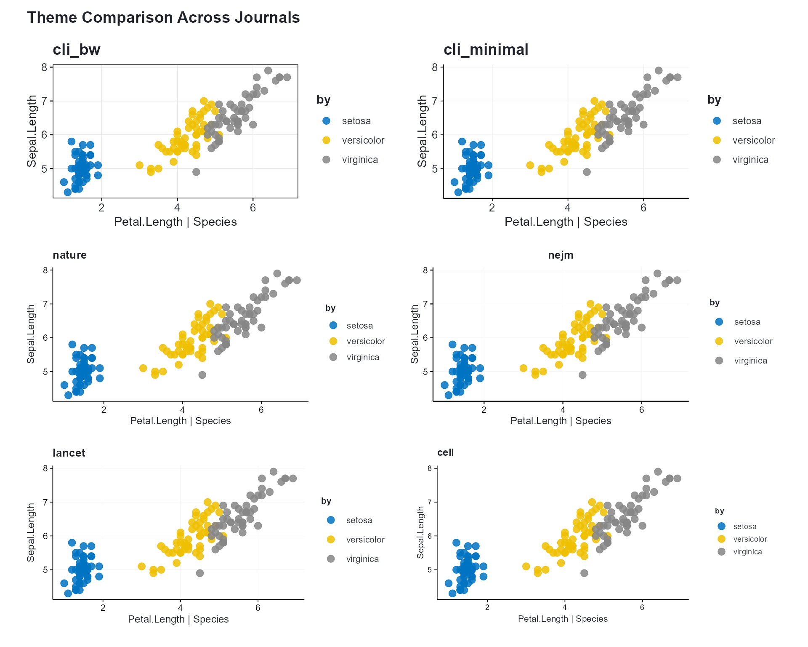

### Persistent vs. Ephemeral Themes

``` r

# ── Persistent: applies to ALL subsequent plots ────────────────────
clitheme("nature")
#> Theme set to: nature

cliplot(mpg ~ wt, data = mtcars,
        title = "Plot 1 — Nature theme persists")
```

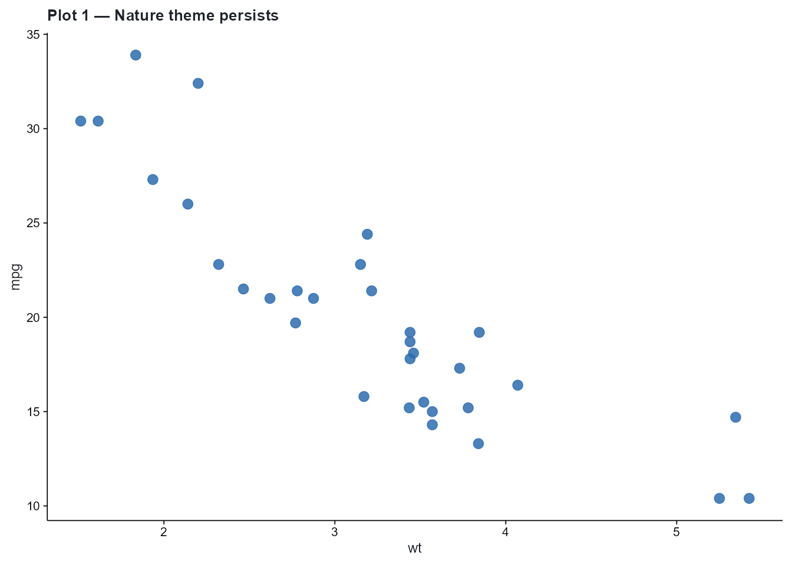

``` r


cliplot(len ~ dose, data = ToothGrowth, type = "boxplot",
        title = "Plot 2 — Still Nature theme")
#> Warning: Orientation is not uniquely specified when both the x and y aesthetics are
#> continuous. Picking default orientation 'x'.
#> Warning: Continuous x aesthetic
#> ℹ did you forget `aes(group = ...)`?
```

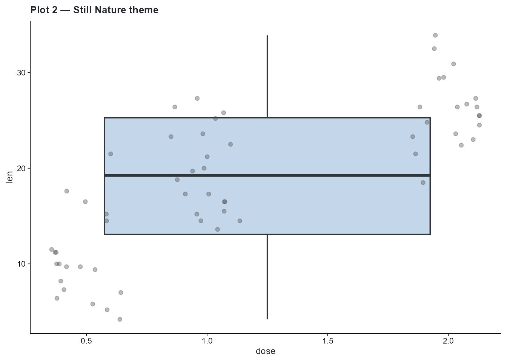

``` r


clitheme()  # ← reset to default
```

``` r

# ── Ephemeral: applies to ONE plot only ────────────────────────────
cliplot(mpg ~ wt, data = mtcars, theme = "nature",
        title = "This plot: Nature")
```

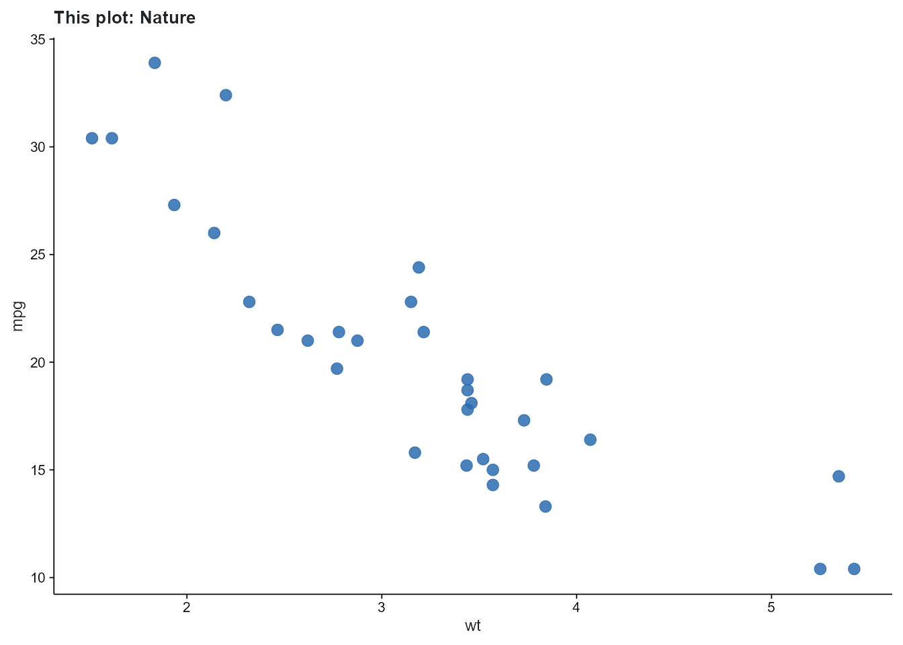

``` r


cliplot(Sepal.Length ~ Species, data = iris, type = "boxplot",
        theme = "dark",
        title = "This plot: Dark")
```

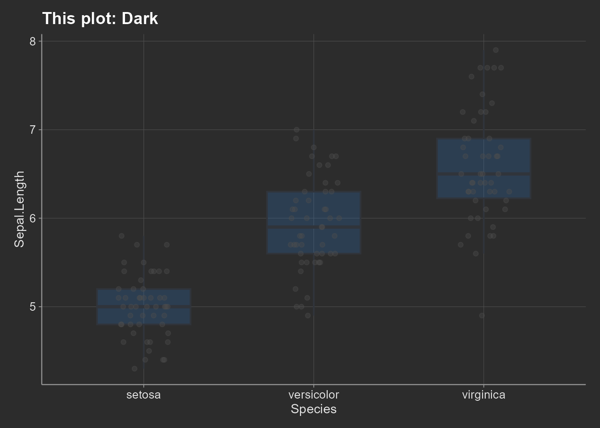

``` r


cliplot(mpg ~ wt, data = mtcars,
        title = "Back to default — cli_bw")
```

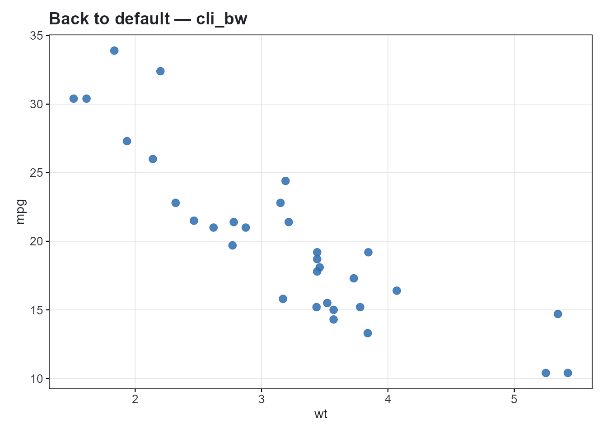

### Custom Theme Registration

Register your own themes for reuse across projects:

``` r

# Register a custom theme
clitheme_register("my_submission",
  base = "cli_bw",
  axis.text     = ggplot2::element_text(size = 12, face = "bold"),
  plot.title    = ggplot2::element_text(size = 16, hjust = 0.5, face = "bold"),
  plot.subtitle = ggplot2::element_text(size = 11, hjust = 0.5, color = "grey40"),
  legend.position   = "bottom",
  legend.background = ggplot2::element_rect(color = "grey80")
)
#> Theme registered: my_submission

# Use it
clitheme("my_submission")
#> Theme set to registered theme: my_submission
cliplot(mpg ~ wt, data = mtcars,
        title = "Custom 'my_submission' Theme",
        subtitle = "12pt bold text, centered")
```

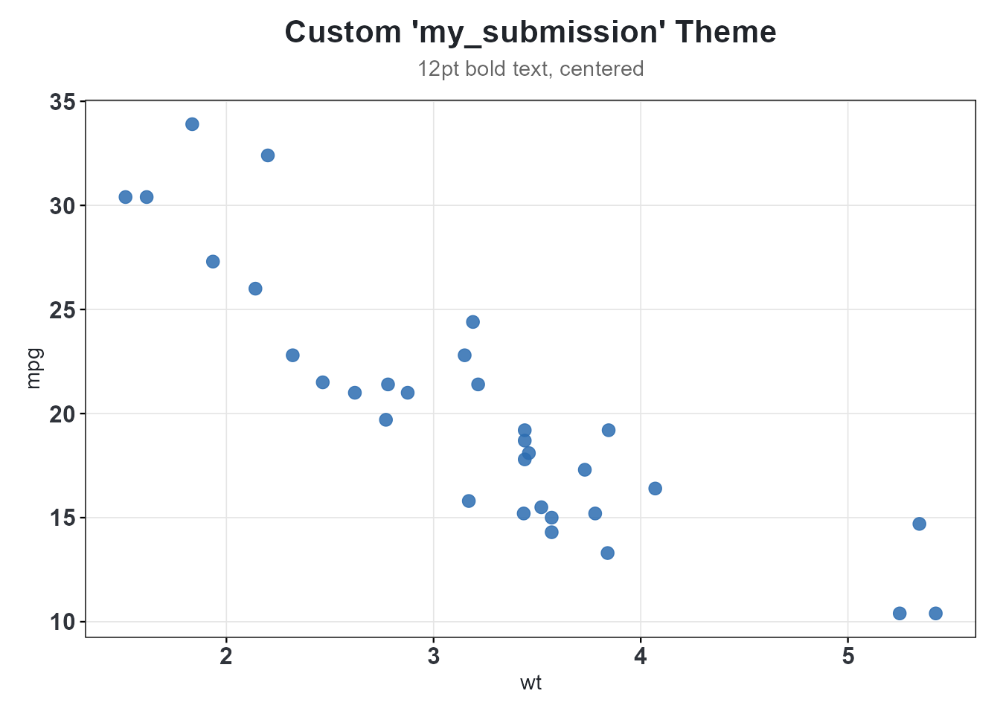

``` r

clitheme()
```

``` r

# List all themes (including custom ones)
clitheme_list()
#>  [1] "cli_bw"        "cli_classic"   "cli_minimal"   "nature"       
#>  [5] "science"       "nejm"          "lancet"        "cell"         
#>  [9] "dark"          "showcase"      "broadsheet"    "my_submission"

# Remove a custom theme
clitheme_unregister("my_submission")
#> Theme unregistered: my_submission
```

### Theme Overrides

Pass inline overrides to tweak any theme element:

``` r

# Start with nature, but override axis text size
clitheme("nature", axis.text = ggplot2::element_text(size = 14))
#> Theme set to: nature
cliplot(mpg ~ wt, data = mtcars,
        title = "Nature theme with larger axis text")
```


``` r

clitheme()
```

------------------------------------------------------------------------

## Part 2: Color Palettes

cliomicplot’s 55+ palettes are organized into logical categories:

### Quick Lookup

``` r

# List all palettes
all_pals <- cli_palette_list()
cat(sprintf("Total palettes: %d\n", length(all_pals)))
#> Total palettes: 44
cat("First 25:\n")
#> First 25:
cat(paste(head(all_pals, 25), collapse = ", "))
#> jco, nejm, lancet, nature, science, okabe_ito, tableau10, tol_muted, heatmap_rdbu, heatmap_rdylbu, heatmap_prgn, volcano, pastel, soft, neon, cyberpunk, blues, reds, greens, purples, oranges, rd_yl_gn, spectral, pi_yg, npg
```

### Preview a Palette

``` r

cli_palette_show("jco")
```

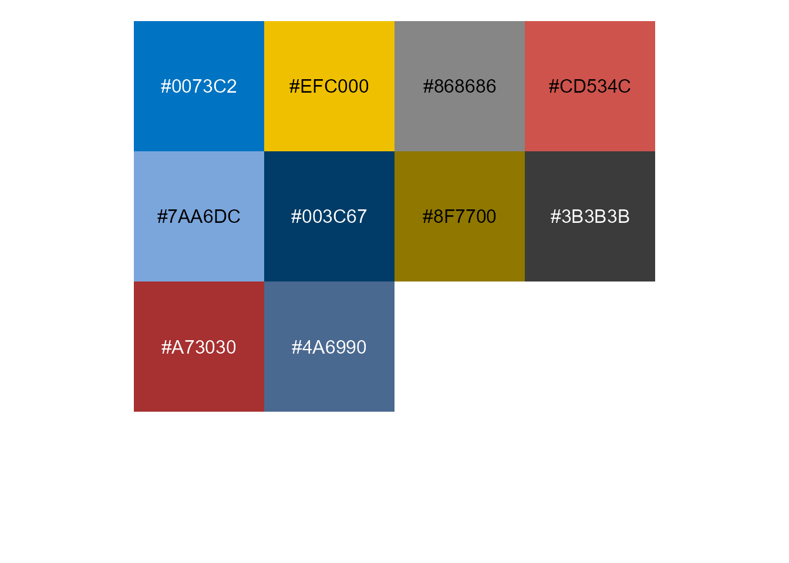

``` r

# Show all journal palettes side by side
journal_pals <- c("npg", "nejm", "lancet", "jama", "jco", "bmj", "frontiers")

par(mfrow = c(4, 2), mar = c(1, 3, 2, 1))
for (pal_name in journal_pals) {
  cols <- cliomicplot:::get_cli_palette(pal_name, 10)
  barplot(rep(1, length(cols)), col = cols, border = NA,
          main = pal_name, axes = FALSE, space = 0)
}
par(mfrow = c(1, 1))
```

### Palette Categories

#### 📰 Journal Palettes

``` r

cliplot(Sepal.Length ~ Petal.Length | Species, data = iris,
        palette = "npg",
        title = "NPG (Nature Reviews Cancer)")
```

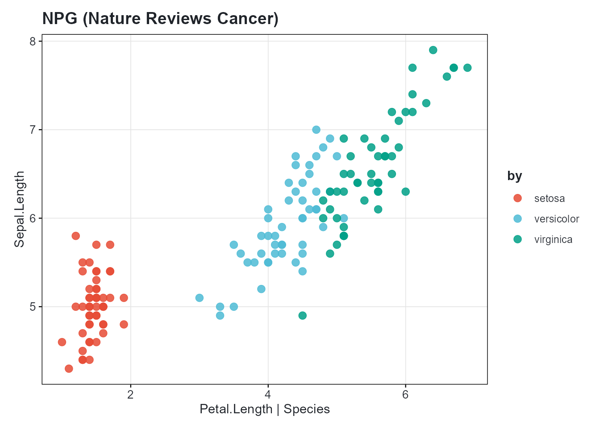

``` r


cliplot(Sepal.Length ~ Petal.Length | Species, data = iris,
        palette = "lancet",
        title = "The Lancet")
```

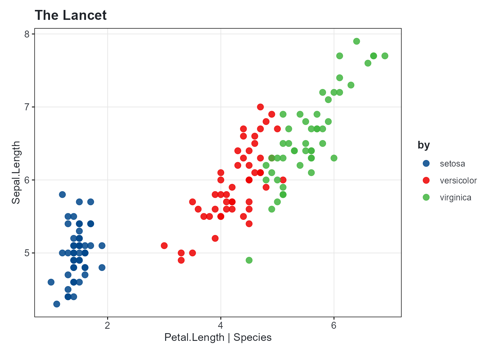

#### 🧬 Genomics & Bioinformatics

``` r

# UCSC Genome Browser chromosome colors
cliplot(Sepal.Length ~ Petal.Length | Species, data = iris,
        palette = "ucscgb",
        title = "UCSC Genome Browser")
```

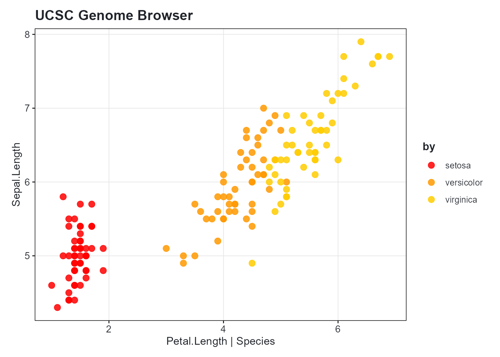

``` r


# COSMIC Cancer Hallmarks
cliplot(Sepal.Length ~ Petal.Length | Species, data = iris,
        palette = "cosmic",
        title = "COSMIC Hallmarks")
```

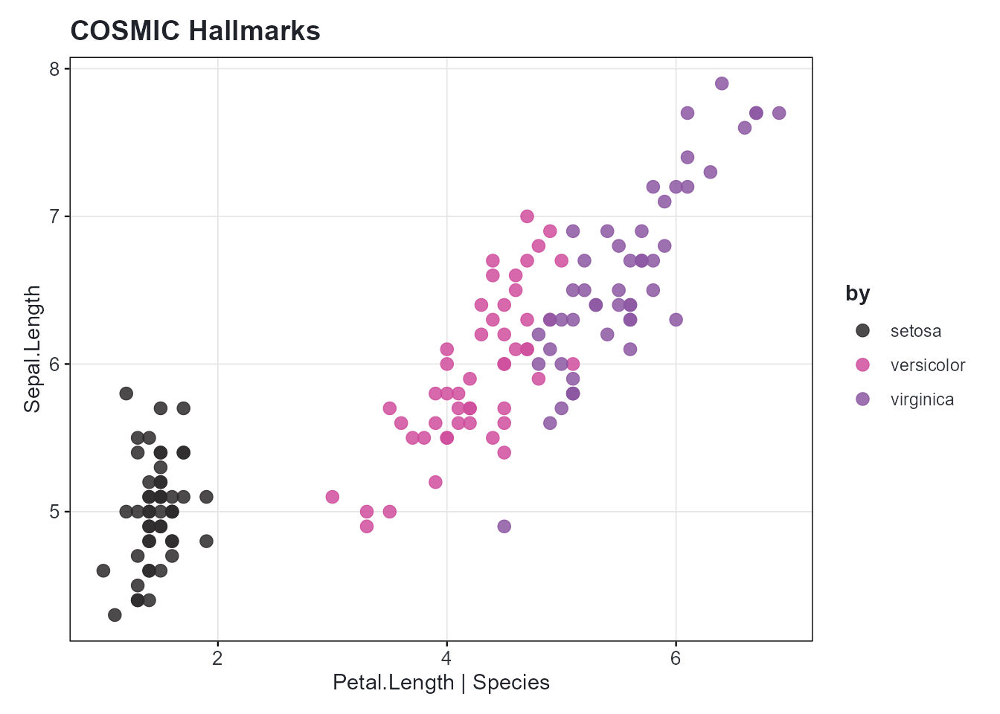

#### ♿ Accessibility (Colorblind-Safe)

These palettes are designed to be distinguishable under common forms of
color vision deficiency (deuteranopia, protanopia, tritanopia):

``` r

cliplot(Sepal.Length ~ Petal.Length | Species, data = iris,
        palette = "okabe_ito",
        title = "Okabe & Ito (2008) — Colorblind-safe")
```

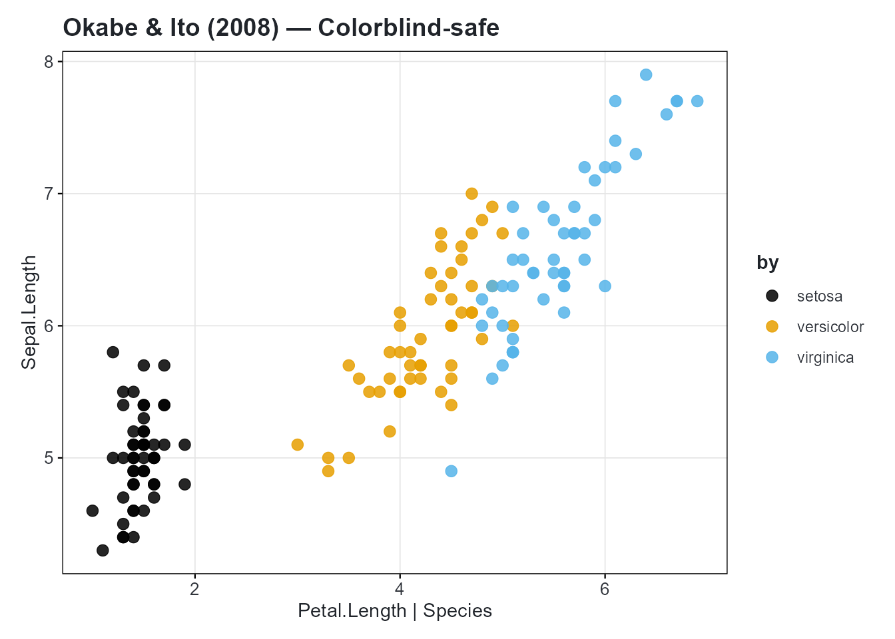

``` r


cliplot(Sepal.Length ~ Petal.Length | Species, data = iris,
        palette = "tol_muted",
        title = "Paul Tol — Muted, Colorblind-safe")
```

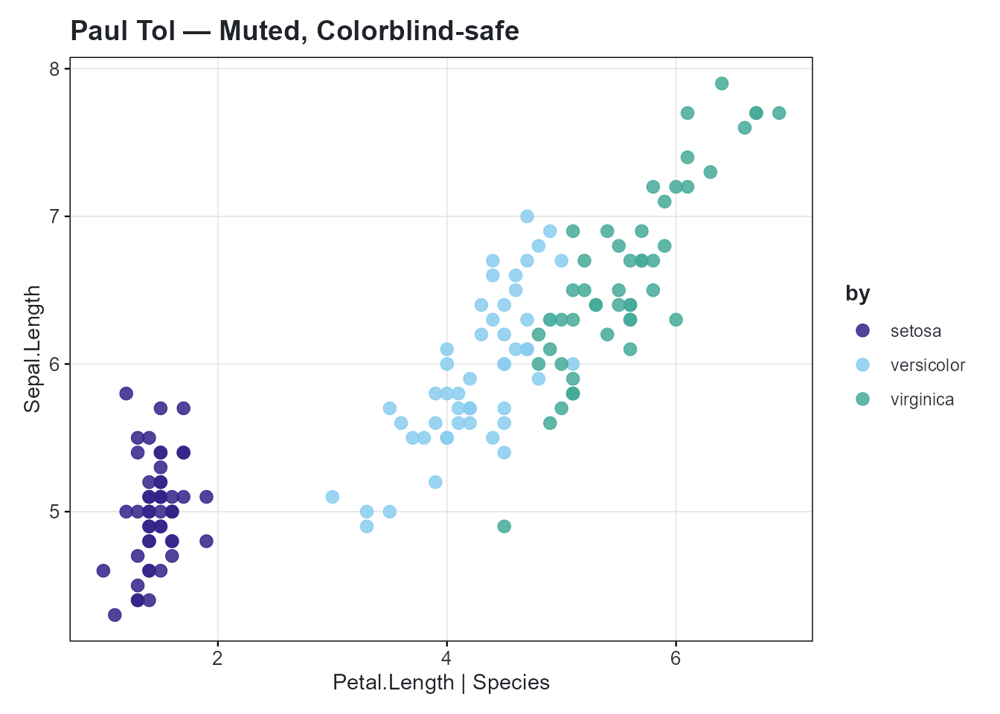

#### 🔥 Heatmap & Diverging

Use `type = "continuous"` with
[`palette_scale()`](https://vanhungtran.github.io/cliomicplot/reference/palette_scale.md)
for gradient data:

``` r

library(ggplot2)
#> Warning: package 'ggplot2' was built under R version 4.5.3

p1 <- ggplot(faithfuld, aes(waiting, eruptions, fill = density)) +
  geom_tile() +
  palette_scale("heatmap_rdbu", "fill", type = "continuous") +
  labs(title = "heatmap_rdbu") +
  theme_minimal() +
  theme(legend.position = "none")

p2 <- ggplot(faithfuld, aes(waiting, eruptions, fill = density)) +
  geom_tile() +
  palette_scale("heatmap_prgn", "fill", type = "continuous") +
  labs(title = "heatmap_prgn") +
  theme_minimal() +
  theme(legend.position = "none")

p1 + p2
```

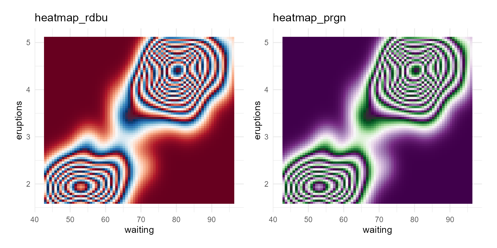

#### 🌃 Dark / Presentation Palettes

``` r

clitheme("dark")
#> Theme set to: dark

cliplot(mpg ~ wt | factor(cyl), data = mtcars,
        palette = "neon",
        title = "Neon Palette on Dark Theme")
```

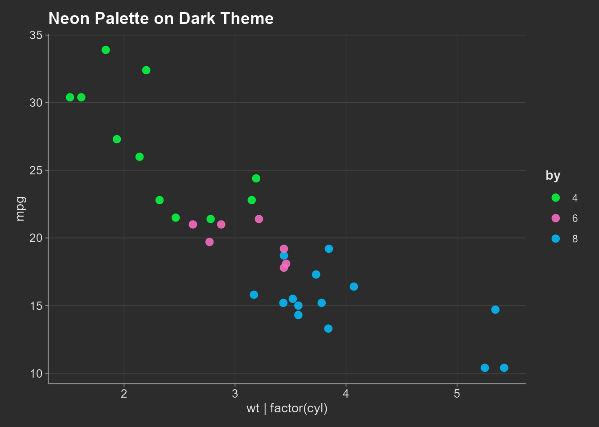

``` r


cliplot(Sepal.Length ~ Petal.Length | Species, data = iris,
        palette = "cyberpunk",
        title = "Cyberpunk Palette on Dark Theme")
```

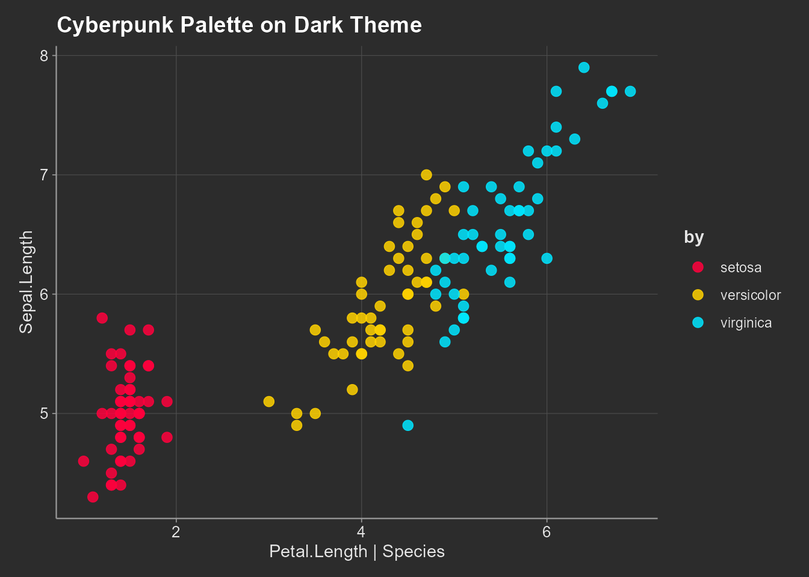

``` r


clitheme()
```

### Using Palettes as Standalone Scales

All palettes work with **any ggplot2 plot** — not just cliomicplot:

``` r

# Discrete colour scale
ggplot(iris, aes(Sepal.Length, Petal.Length, colour = Species)) +
  geom_point(size = 3) +
  palette_scale("jama", "color") +
  theme_bw() +
  labs(title = "JAMA palette via palette_scale()")
```

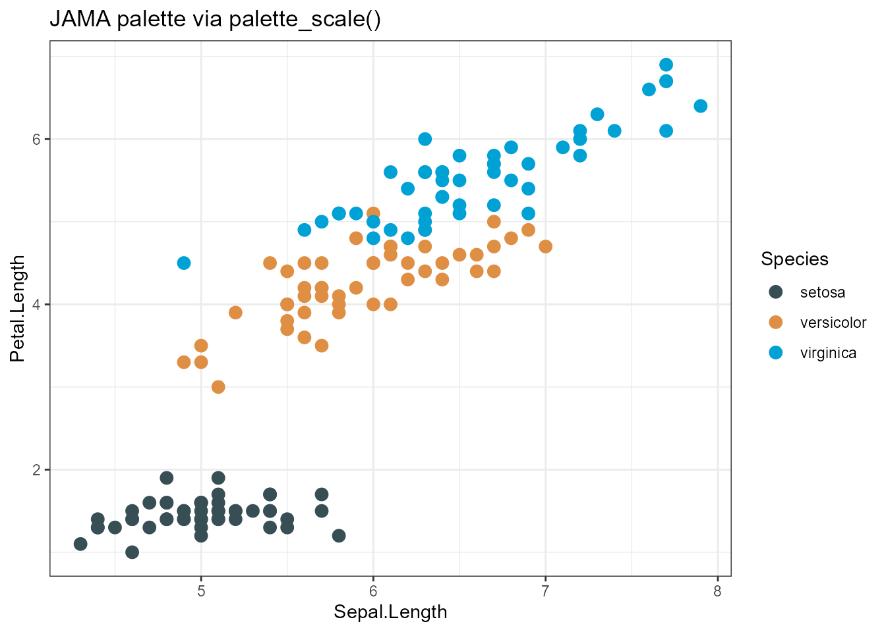

``` r


# Discrete fill scale
ggplot(mpg, aes(class, fill = class)) +
  geom_bar() +
  palette_scale("uchicago", "fill") +
  theme_classic() +
  labs(title = "UChicago palette via palette_scale()",
       subtitle = "Works on any ggplot2 plot!")
```

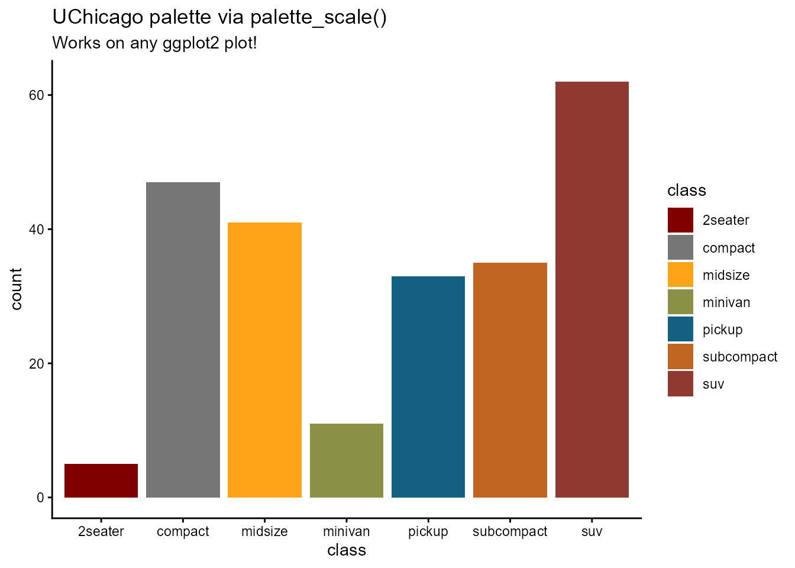

### Convenience Scale Wrappers

``` r

# scale_color_cli() — discrete colour
ggplot(iris, aes(Sepal.Length, Petal.Length, color = Species)) +
  geom_point(size = 3) +
  scale_color_cli("jco") +
  theme_bw()
```

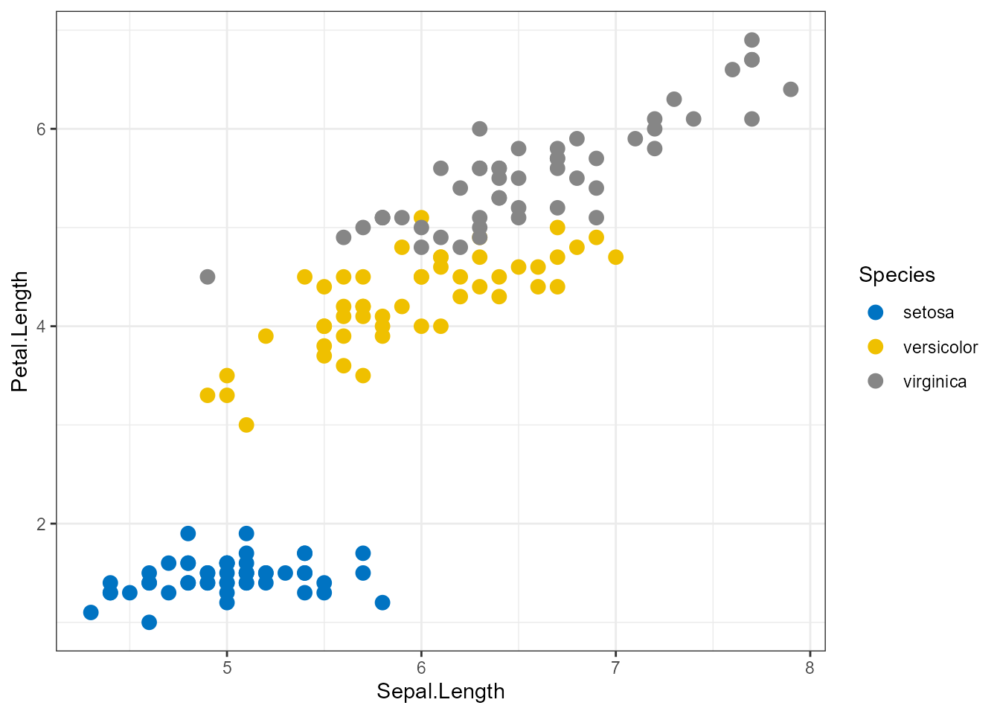

``` r


# scale_fill_cli_c() — continuous fill
ggplot(faithfuld, aes(waiting, eruptions, fill = density)) +
  geom_tile() +
  scale_fill_cli_c("blues") +
  theme_minimal()
```

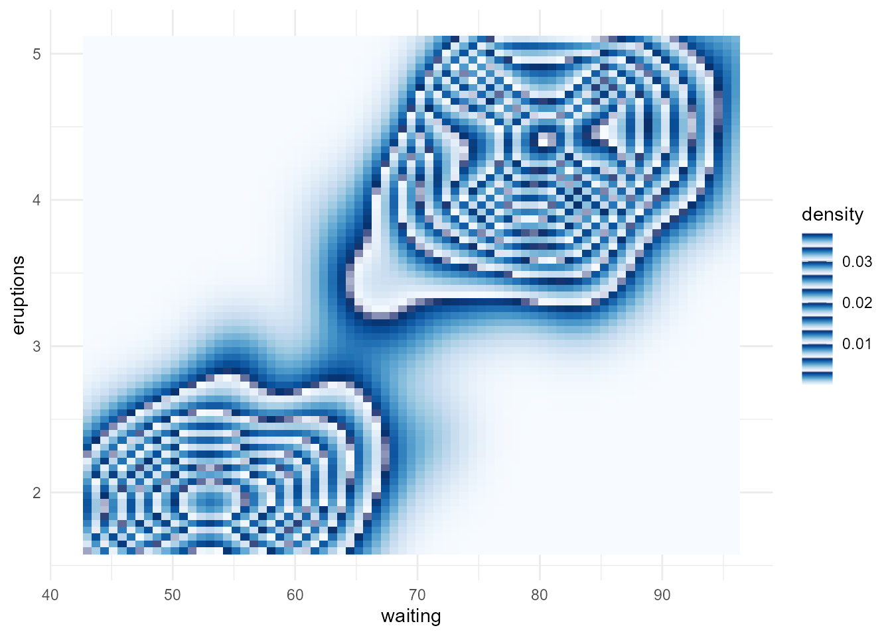

### Reversing and Alpha

``` r

# Reverse a palette
ggplot(iris, aes(Sepal.Length, Petal.Length, color = Species)) +
  geom_point(size = 3) +
  palette_scale("jco", "color", reverse = TRUE) +
  theme_bw() +
  labs(title = "JCO palette — reversed")
```

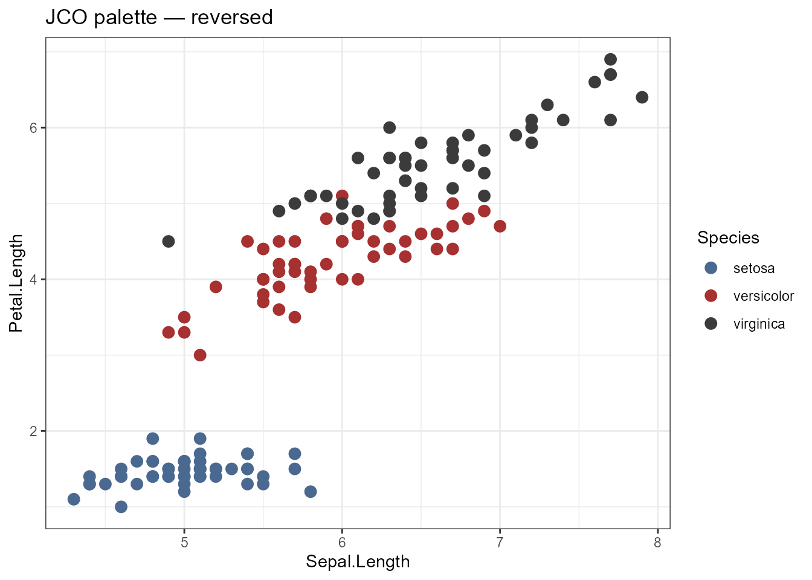

``` r


# Apply transparency
ggplot(iris, aes(Sepal.Length, Petal.Length, color = Species)) +
  geom_point(size = 3) +
  palette_scale("cosmic", "color", alpha = 0.5) +
  theme_bw() +
  labs(title = "COSMIC palette — 50% alpha")
```

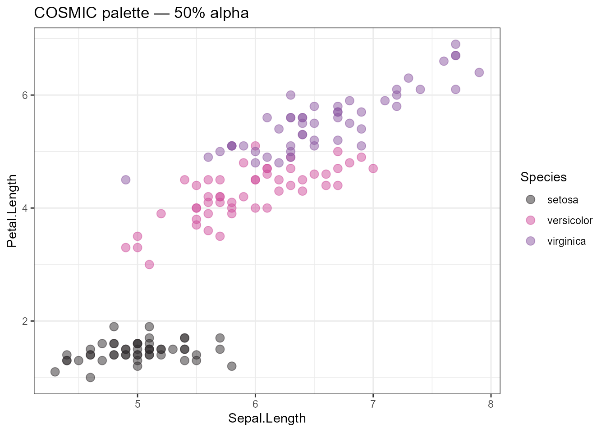

------------------------------------------------------------------------

## Part 3: Combining Themes and Palettes

The most powerful aspect of cliomicplot is how themes and palettes work
together. Here are some tested combinations for common use cases:

| Scenario               | Theme        | Palette               |
|------------------------|--------------|-----------------------|
| Nature submission      | `nature`     | `npg`                 |
| NEJM oncology paper    | `nejm`       | `nejm`                |
| Lancet clinical trial  | `lancet`     | `lancet`              |
| Cell genomics paper    | `cell`       | `cosmic` or `ucscgb`  |
| Conference slides      | `dark`       | `neon` or `cyberpunk` |
| Preprint / bioRxiv     | `broadsheet` | `jco`                 |
| General-purpose (safe) | `cli_bw`     | `okabe_ito`           |

``` r

# Example: NEJM oncology paper
clitheme("nejm")
#> Theme set to: nejm
cliplot(Sepal.Length ~ Petal.Length | Species, data = iris,
        palette = "nejm",
        title = "NEJM Theme + NEJM Palette")
```

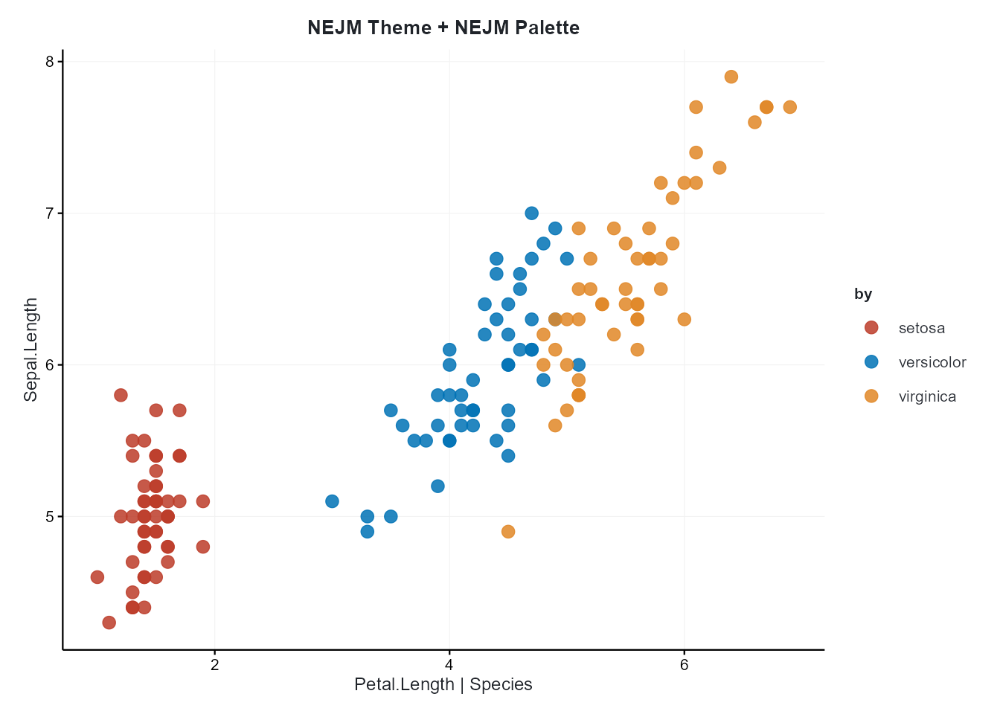

``` r

clitheme()
```

``` r

# Example: Genomics paper with COSMIC
clitheme("cell")
#> Theme set to: cell
cliplot(Sepal.Length ~ Petal.Length | Species, data = iris,
        palette = "cosmic",
        title = "Cell Theme + COSMIC Palette")
```

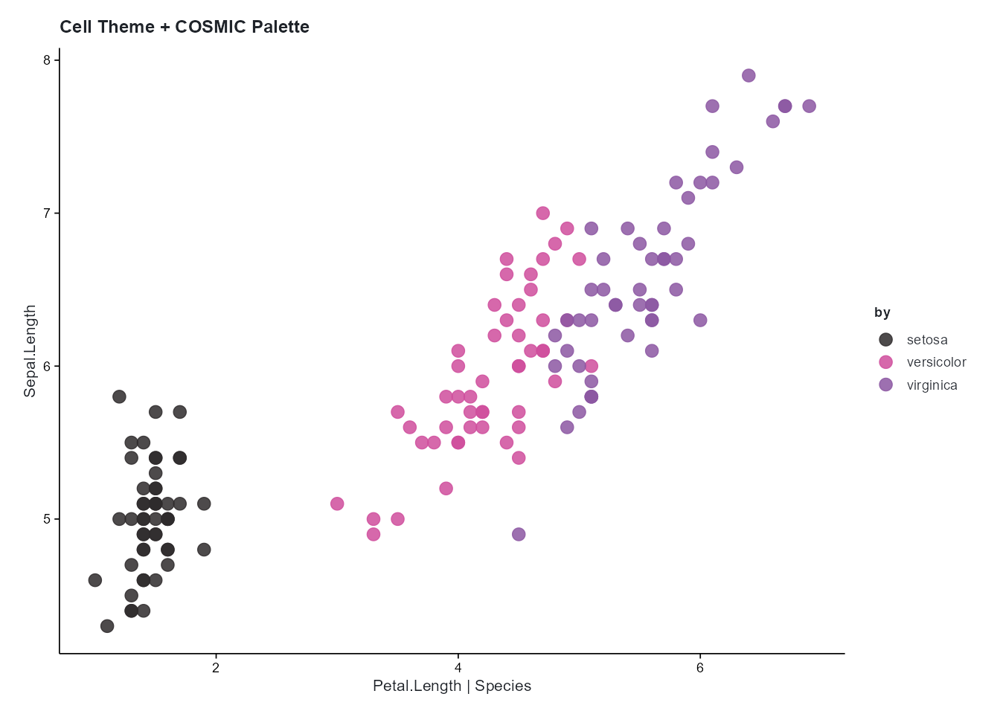

``` r

clitheme()
```

------------------------------------------------------------------------

## Summary

- **10 themes** — from journal-specific to presentation-ready
- **55+ palettes** — journal, genomics, accessibility, design, and pop
  culture
- Themes can be **persistent** (`clitheme("nature")`) or **ephemeral**
  (`theme = "nature"`)
- Register custom themes with
  [`clitheme_register()`](https://vanhungtran.github.io/cliomicplot/reference/clitheme_register.md)
- All palettes work as standalone
  [`palette_scale()`](https://vanhungtran.github.io/cliomicplot/reference/palette_scale.md)
  for any ggplot2 plot
- Combine themes and palettes freely for the perfect publication look

``` r

# Reset to defaults
clitheme()
```
