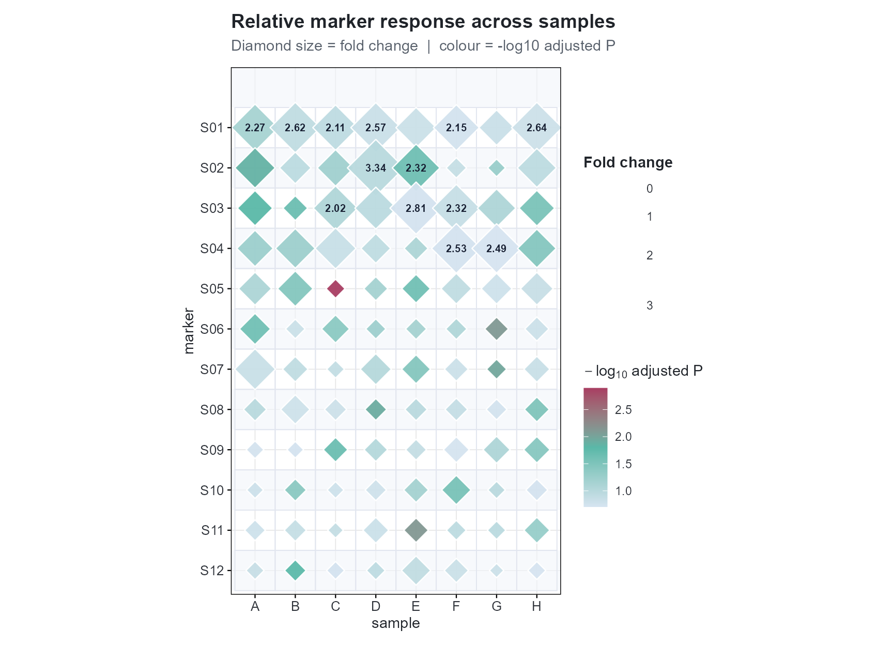

# Diamond Bubble Heatmap

\+

−

⊙

×

‹

›


100 %

Scroll to zoom · Drag to pan · ← → to navigate

``` r
library(cliomicplot)
```

## Overview

Diamond bubble heatmap: marker x sample matrix with **size** =
fold-change, **colour** = significance, alternating row bands, and
selective labels.

## Simulated data

``` r
set.seed(99)
bh <- expand.grid(marker=LETTERS[1:8], sample=paste0("S",sprintf("%02d",1:12)), stringsAsFactors=FALSE)
bh$fold_change <- exp(rnorm(96, mean=rep(seq(0.7,-1.2,length.out=8),each=12), sd=0.55))
bh$padj <- runif(96, 0.001, 0.2)
bh$neg_log_p <- -log10(bh$padj)
head(bh)
#>   marker sample fold_change       padj neg_log_p
#> 1      A    S01    2.265237 0.07133154 1.1467184
#> 2      B    S01    2.621671 0.12163721 0.9149335
#> 3      C    S01    2.113416 0.11702590 0.9317180
#> 4      D    S01    2.570556 0.14843865 0.8284530
#> 5      E    S01    1.649445 0.15218777 0.8176202
#> 6      F    S01    2.154310 0.18568274 0.7312285
```

## Quick plot

``` r
cliplot(marker ~ sample, data=bh, by=bh$fold_change,
  extra_data=list(fill=bh$neg_log_p), type="bubble_heatmap",
  title="Relative marker response across samples",
  subtitle="Diamond size = fold change  |  colour = -log10 adjusted P")
```



## Using your own data

``` r
real <- read.csv("results.csv")
cliplot(marker ~ sample, data=real, by=real$fold_change,
  extra_data=list(fill=-log10(real$adjusted_p)),
  type="bubble_heatmap", file="fig_bubble_heatmap.pdf", width=11, height=7)
```
