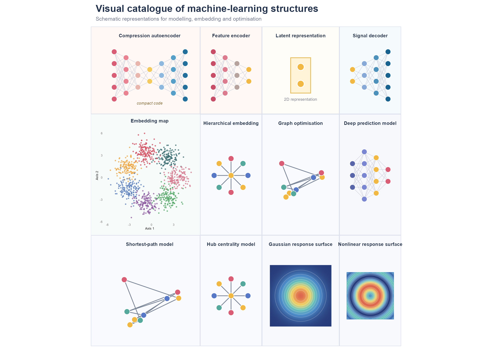

# ML Structures Catalogue Panel

\+

−

⊙

×

‹

›


100 %

Scroll to zoom · Drag to pan · ← → to navigate

``` r
library(cliomicplot)
library(ggplot2)
library(patchwork)
library(dplyr)
library(tidyr)
library(purrr)
```

## Overview

A multi-panel catalogue of schematic ML visualisations assembled with
`cliomicplot` + `patchwork`.

## Card theme

``` r
theme_card <- function(bg = "#F7F8FC") {
  theme_void() + theme(
    plot.background = element_rect(fill = bg, colour = "#D9DEEA", linewidth = 0.8),
    plot.margin = margin(10, 10, 10, 10),
    plot.title = element_text(hjust = 0.5, face = "bold", size = 10, colour = "#24324A", margin = margin(t = 5, b = 7)))
}
```

## Network card

``` r
network_card <- function(title, layers = c(4, 3, 2, 3),
  colors = c("#4958A6","#7A86D1","#F3B84B","#46A6A1"), bg = "#F7F8FC") {
  node_data <- map2_dfr(seq_along(layers), layers, function(layer_id, n_nodes) {
    tibble(layer = layer_id, node = seq_len(n_nodes), x = layer_id,
      y = seq(-(n_nodes-1)/2, (n_nodes-1)/2, length.out = n_nodes), colour_group = layer_id)
  })
  edge_data <- map_dfr(seq_len(length(layers)-1), function(i) {
    left <- filter(node_data, layer == i); right <- filter(node_data, layer == i + 1)
    crossing(left_id = seq_len(nrow(left)), right_id = seq_len(nrow(right))) |>
      transmute(x = left$x[left_id], y = left$y[left_id], xend = right$x[right_id], yend = right$y[right_id])
  })
  ggplot() +
    geom_segment(data = edge_data, aes(x, y, xend = xend, yend = yend), linewidth = 0.35, colour = "#C5CAD8", alpha = 0.8) +
    geom_point(data = node_data, aes(x, y, fill = factor(colour_group)), shape = 21, size = 4.8, stroke = 0.5, colour = "white") +
    scale_fill_manual(values = colors) + coord_equal(xlim = c(0.5, length(layers)+0.5), ylim = c(-2.6, 2.6), clip = "off") +
    guides(fill = "none") + labs(title = title) + theme_card(bg)
}
```

## Cards

``` r
autoencoder_card <- function() {
  p <- network_card("Compression autoencoder", layers = c(5,4,3,2,3,4,5),
    colors = c("#D95D75","#E98291","#E9B6AE","#F4C95D","#8FB8DE","#559FC8","#226F9C"), bg = "#FFF8F5")
  p + annotate("text", x = 4, y = -2.35, label = "compact code", size = 3, colour = "#7A5D22", fontface = "italic")
}

latent_card <- function() {
  ggplot(tibble(x = c(0,0), y = c(-0.55, 0.55)), aes(x, y)) +
    annotate("rect", xmin = -0.65, xmax = 0.65, ymin = -1.15, ymax = 1.15, fill = "#FFF3D8", colour = "#E7C063", linewidth = 0.8) +
    geom_point(size = 6, shape = 21, fill = "#F2B844", colour = "white", stroke = 1) +
    annotate("text", x = 0, y = -1.55, label = "2D representation", size = 3, colour = "#6B6F80") +
    coord_equal(xlim = c(-2, 2), ylim = c(-2, 2)) + labs(title = "Latent representation") + theme_card("#FFFDF7")
}

set.seed(42)
umap_data <- bind_rows(lapply(1:7, function(g) {
  a <- 2*pi*g/7; tibble(x = rnorm(140, cos(a)*3.5, 0.8), y = rnorm(140, sin(a)*3.5, 0.8), group = factor(g))
}))
umap_card <- ggplot(umap_data, aes(x, y, colour = group)) + geom_point(size = 0.9, alpha = 0.72) +
  scale_colour_manual(values = c("#3C6E71","#D1495B","#EDA846","#5C80BC","#8F5DA2","#55A868","#D4778C")) +
  coord_equal() + labs(title = "Embedding map", x = "Axis 1", y = "Axis 2") + guides(colour = "none") +
  theme_minimal(base_size = 8) + theme(plot.background = element_rect(fill = "#F7FBFA", colour = "#D9DEEA"),
    panel.grid = element_blank(), plot.title = element_text(hjust = 0.5, face = "bold", size = 10, colour = "#24324A"),
    axis.title = element_text(size = 7), axis.text = element_text(size = 6))

graph_card <- function(title, radial = FALSE) {
  if (radial) {
    nodes <- tibble(id = 1:9, angle = seq(0, 2*pi, length.out = 10)[1:9],
      x = c(0, cos(seq(0, 2*pi, length.out = 9)[1:8])), y = c(0, sin(seq(0, 2*pi, length.out = 9)[1:8])))
    edges <- tibble(x = 0, y = 0, xend = nodes$x[-1], yend = nodes$y[-1])
  } else {
    set.seed(7); nodes <- tibble(id = 1:9, x = runif(9, -1, 1), y = runif(9, -1, 1))
    edges <- tibble(from = c(1,1,2,2,3,4,5,6,7,8), to = c(2,4,3,5,6,7,8,9,9,3)) |>
      mutate(x = nodes$x[from], y = nodes$y[from], xend = nodes$x[to], yend = nodes$y[to])
  }
  ggplot() + geom_segment(data = edges, aes(x, y, xend = xend, yend = yend), colour = "#788395", linewidth = 0.7) +
    geom_point(data = nodes, aes(x, y, fill = factor(id %% 4)), shape = 21, size = 5, stroke = 0.7, colour = "white") +
    scale_fill_manual(values = c("#D95D75","#F2B844","#5778C7","#54A89C")) +
    coord_equal(xlim = c(-1.4, 1.4), ylim = c(-1.4, 1.4)) + guides(fill = "none") + labs(title = title) + theme_card("#F9FAFD")
}

surface_card <- function(title, variant = 1) {
  grid <- expand_grid(x = seq(-2.5, 2.5, length.out = 35), y = seq(-2.5, 2.5, length.out = 35)) |>
    mutate(z = if (variant == 1) exp(-(x^2 + y^2)/2) else sin(x^2 + y^2)/(1 + x^2 + y^2))
  ggplot(grid, aes(x, y, fill = z)) + geom_raster(interpolate = TRUE) +
    geom_contour(aes(z = z), colour = "white", alpha = 0.35, linewidth = 0.3) +
    scale_fill_gradientn(colours = c("#273B79","#4C8CCB","#68C6B7","#F2D35E","#DC654F")) +
    coord_equal() + guides(fill = "none") + labs(title = title) + theme_card("#F7F9FD")
}
```

## Assemble

``` r
autoencoder_card() + network_card("Feature encoder", c(5,4,3,2), c("#C84E68","#DC7B8D","#B6A39D","#F2B844"), "#FFF8F5") +
  latent_card() + network_card("Signal decoder", c(2,3,4,5), c("#F2B844","#86A9D7","#4C90BC","#17628F"), "#F5FAFD") +
  umap_card + graph_card("Hierarchical embedding", TRUE) + graph_card("Graph optimisation", FALSE) +
  network_card("Deep prediction model", c(3,5,4,2), c("#5865A9","#7A86D1","#F2B844","#D95D75")) +
  graph_card("Shortest-path model", FALSE) + graph_card("Hub centrality model", TRUE) +
  surface_card("Gaussian response surface", 1) + surface_card("Nonlinear response surface", 2) +
  plot_layout(ncol = 4) + plot_annotation(
    title = "Visual catalogue of machine-learning structures",
    subtitle = "Schematic representations for modelling, embedding and optimisation",
    theme = theme(plot.title = element_text(face = "bold", size = 20, colour = "#21304B"),
      plot.subtitle = element_text(size = 11, colour = "#687087"),
      plot.background = element_rect(fill = "white", colour = NA)))
```


