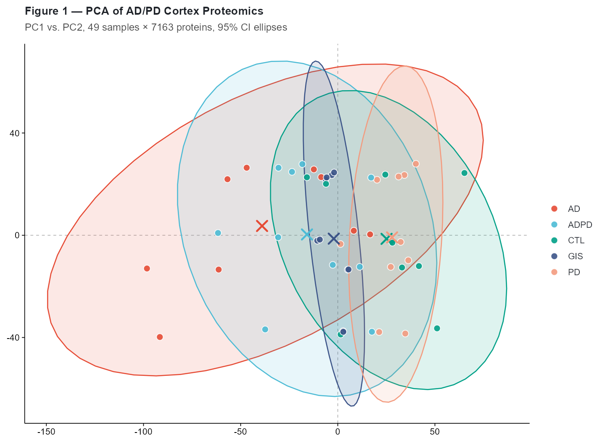
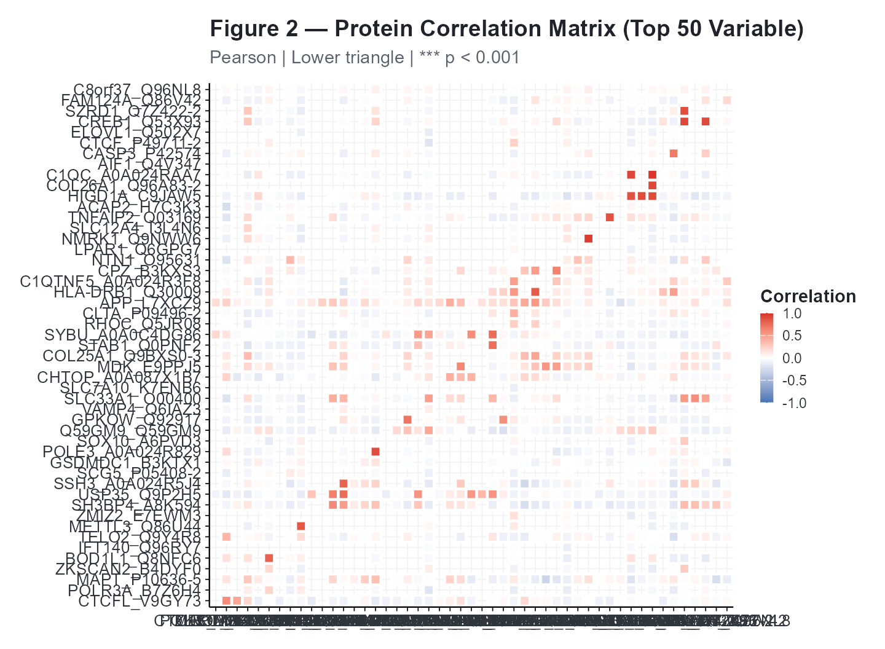
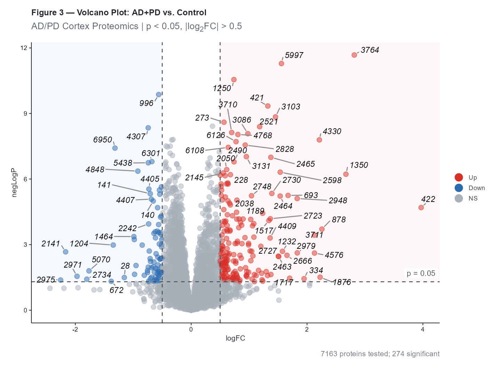
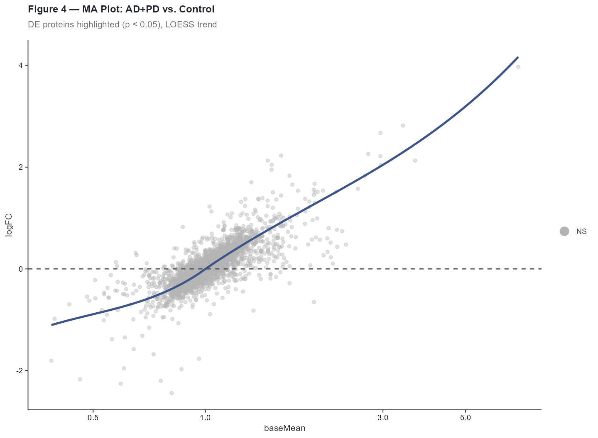
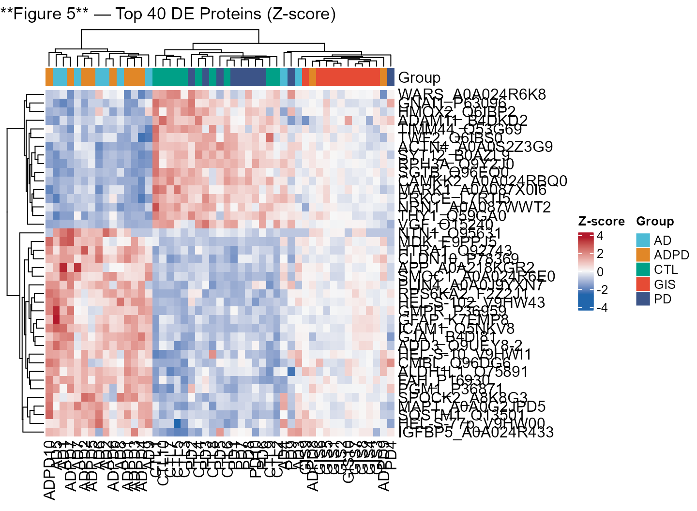
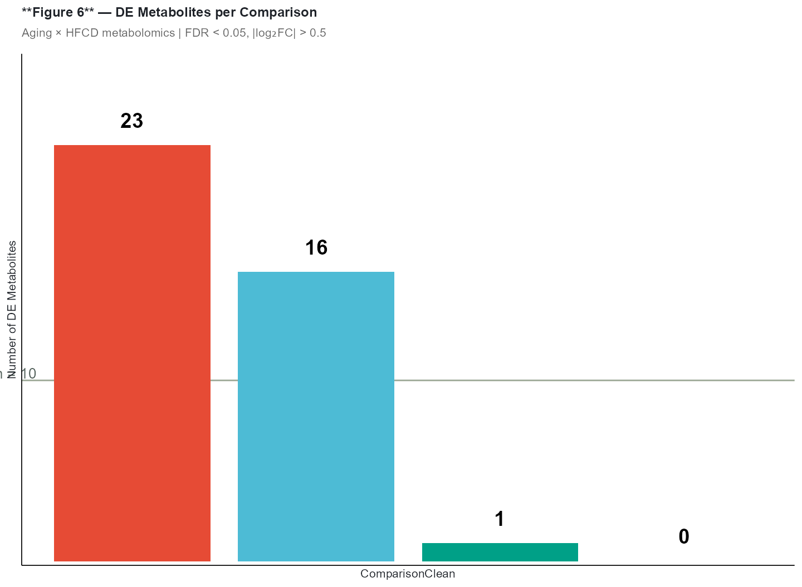
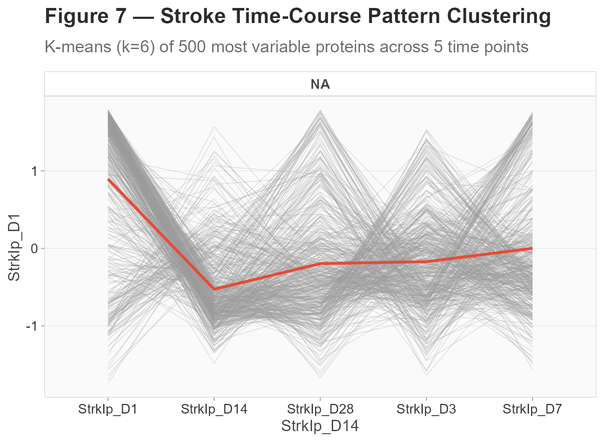
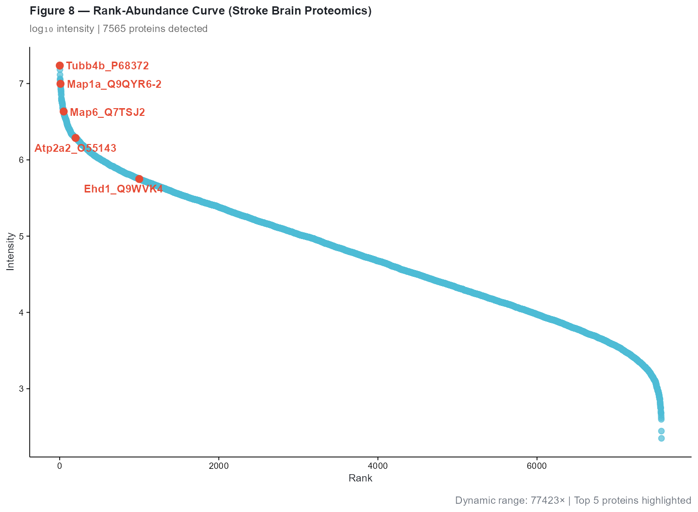
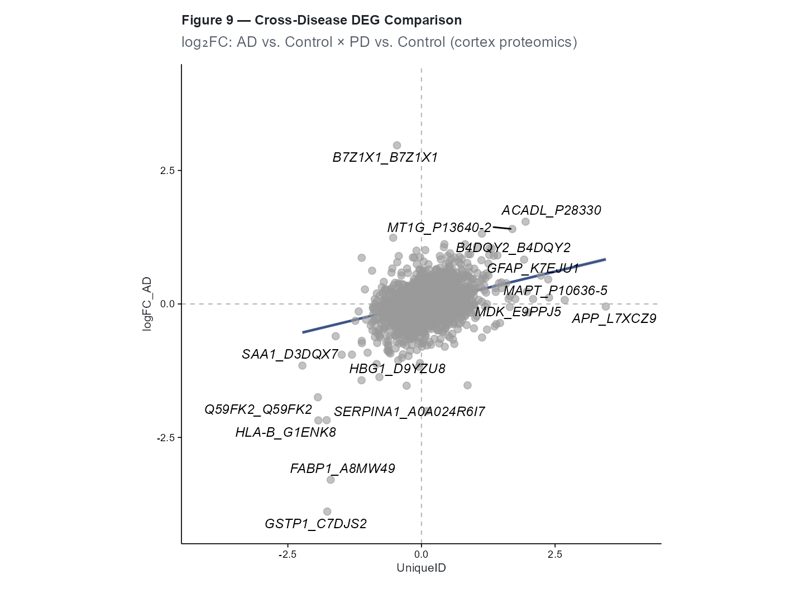
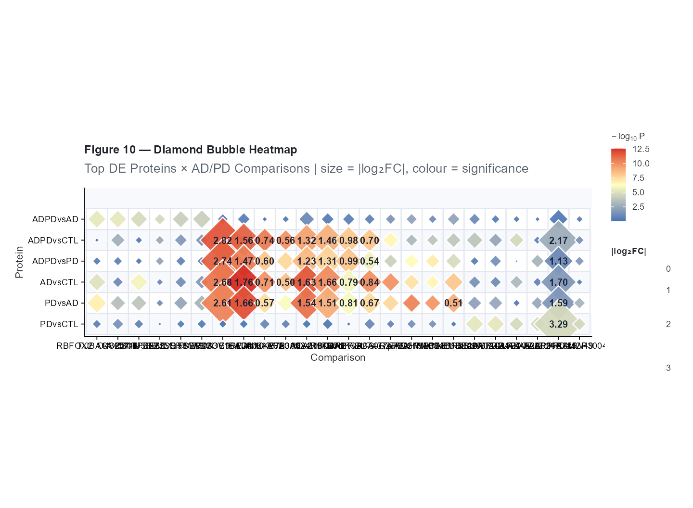

# Multi-Omics Exploratory Analysis with cliomicplot

\+

−

⊙

×

‹

›


100 %

Scroll to zoom · Drag to pan · ← → to navigate

## Overview

This vignette demonstrates a multi-omics exploratory analysis workflow
using **cliomicplot** with real datasets from the **xOmicsShiny**
platform (Biogen Inc.). We’ll generate ten publication-ready figures
spanning proteomics, metabolomics, and time-course analysis:

1.  **Figure 1** — PCA with confidence ellipses (AD/PD cortex
    proteomics)
2.  **Figure 2** — Correlation matrix with clustering (AD/PD proteomics)
3.  **Figure 3** — Volcano plot for differential expression (AD/PD
    proteomics)
4.  **Figure 4** — MA plot for DE quality check (AD/PD proteomics)
5.  **Figure 5** — Heatmap of top DE proteins
6.  **Figure 6** — Infographic bar chart (Aging × HFCD metabolomics
    summary)
7.  **Figure 7** — Expression pattern clustering (Stroke brain
    time-course)
8.  **Figure 8** — Rank-abundance curve (Stroke brain proteomics)
9.  **Figure 9** — DEG comparison scatter (two AD/PD contrasts)
10. **Figure 10** — Diamond bubble heatmap (marker × condition matrix)

``` r
library(cliomicplot)
```

    #> cliomicplot 0.1.0 - Publication-ready clinical & omics plots
    #> Main function: cliplot() | Themes: clitheme() | Params: clipar()

``` r
clipar(stat.test = NULL)  # disable auto stat annotations
```

------------------------------------------------------------------------

## Data: xOmicsShiny Multi-Omics Datasets

Three real datasets are bundled with cliomicplot at `inst/extdata/`:

| Dataset | Type | Samples | Features | Source |
|----|----|----|----|----|
| `ADPD_cortex_Maxquant.RData` | Proteomics (cortex) | 42 | 8,596 | AD/PD mouse model |
| `StrokeBrain_TimeCourse.RData` | Proteomics (time-course) | 70 | 7,565 | Stroke model, 5 time points |
| `AgingHFCD_Metabolomics.RData` | Metabolomics | 46 | 393 | Aging × High-Fat Diet |

``` r
# Resolve data paths (works for both installed package and devel/devtools::load_all)
resolve_data = function(filename) {
  pkg_path = system.file("extdata", filename, package = "cliomicplot")
  if (pkg_path != "" && file.exists(pkg_path)) return(pkg_path)
  # Fallback: look relative to the vignette source directory
  fallback = file.path("..", "inst", "extdata", filename)
  if (file.exists(fallback)) return(fallback)
  # Fallback: direct path
  fallback2 = file.path("inst", "extdata", filename)
  if (file.exists(fallback2)) return(fallback2)
  stop("Cannot find data file: ", filename)
}

adpd_path   = resolve_data("ADPD_cortex_Maxquant.RData")
stroke_path = resolve_data("StrokeBrain_TimeCourse.RData")
aging_path  = resolve_data("AgingHFCD_Metabolomics.RData")

load(adpd_path)   # → data_long, data_wide, results_long, MetaData, ProteinGeneName
adpd = list(
  long    = data_long,
  wide    = data_wide,
  results = results_long,
  meta    = MetaData,
  genes   = ProteinGeneName
)

load(stroke_path)  # → data_long, data_wide, results_stat, MetaData, ProteinGeneName
stroke = list(
  long    = data_long,
  wide    = data_wide,
  results = results_stat,
  meta    = MetaData,
  genes   = ProteinGeneName
)

load(aging_path)   # → data_long, data_wide, results_long, MetaData, ProteinGeneName
aging = list(
  long    = data_long,
  wide    = data_wide,
  results = results_long,
  meta    = MetaData,
  genes   = ProteinGeneName
)

cat(sprintf("AD/PD proteomics : %d proteins × %d samples\n", nrow(adpd$wide), ncol(adpd$wide)))
```

    #> AD/PD proteomics : 7163 proteins × 49 samples

``` r
cat(sprintf("Stroke timecourse: %d proteins × %d samples\n", nrow(stroke$wide), ncol(stroke$wide)))
```

    #> Stroke timecourse: 7565 proteins × 70 samples

``` r
cat(sprintf("Aging metabolomics: %d metabolites × %d samples\n", nrow(aging$wide), ncol(aging$wide)))
```

    #> Aging metabolomics: 393 metabolites × 590 samples

------------------------------------------------------------------------

## Figure 1: PCA with Confidence Ellipses

Principal component analysis of AD/PD cortex proteomics data. Groups
represent Alzheimer’s disease (AD), Parkinson’s disease (PD), combined
AD+PD, and controls:

``` r
# Build group labels and transpose for sample-level PCA
adpd$meta$GroupLabel = adpd$meta$group
adpd$wide_clean = adpd$wide
adpd$wide_clean[is.na(adpd$wide_clean)] = 0

# For sample-level PCA: transpose to samples × proteins
adpd$samples_mat = t(adpd$wide_clean)

clitheme("nature")
```

    #> Theme set to: nature

``` r
cliplot(adpd$samples_mat,
        type = type_pca(
          pc_x          = 1,
          pc_y          = 2,
          center        = TRUE,
          scale.        = TRUE,
          add_ellipse   = TRUE,
          ellipse_level = 0.95,
          point_size    = 2.5
        ),
        by       = adpd$meta$GroupLabel,
        palette  = "npg",
        stat.test = NULL,
        title    = "**Figure 1** — PCA of AD/PD Cortex Proteomics",
        subtitle = sprintf("PC1 vs. PC2, %d samples × %d proteins, 95%% CI ellipses",
                          ncol(adpd$wide), nrow(adpd$wide))) +
  cli_markdown()
```



The axis labels include variance-explained percentages automatically.
AD, PD, and AD+PD groups show distinct separation from controls along
PC1.

------------------------------------------------------------------------

## Figure 2: Correlation Matrix

Pairwise protein expression correlations across the top 50 most variable
proteins, with hierarchical clustering and significance stars:

``` r
# Select top 50 most variable proteins
variances = apply(adpd$wide_clean, 1, var, na.rm = TRUE)
top50 = names(sort(variances, decreasing = TRUE)[1:50])
cor_mat = t(adpd$wide_clean[top50, ])

clitheme("cli_minimal")
```

    #> Theme set to: cli_minimal

``` r
cliplot(as.data.frame(cor_mat),
        type = type_correlation(
          method    = "pearson",
          type      = "lower",
          add_coef  = FALSE,
          cluster   = TRUE,
          sig_level = 0.001
        ),
        stat.test = NULL,
        title = "**Figure 2** — Protein Correlation Matrix (Top 50 Variable)",
        subtitle = "Pearson | Lower triangle | *** p < 0.001") +
  cli_markdown()
```



Clustered correlation reveals co-expression modules — groups of proteins
with coordinated abundance patterns across disease states.

------------------------------------------------------------------------

## Figure 3: Volcano Plot — Differential Expression

Volcano plot of AD+PD vs. Control comparison from the AD/PD proteomics
dataset. We extract the `ADPDvsCTL` test from the results table:

``` r
# Filter to one comparison and prepare volcano data
adpd_de = subset(adpd$results, test == "ADPDvsCTL")
rownames(adpd_de) = adpd_de$UniqueID
```

    #> Warning: Setting row names on a tibble is deprecated.

``` r
# Log-transform P-values
adpd_de$negLogP = -log10(adpd_de$P.Value)

n_tested = nrow(adpd_de)
n_de = sum(abs(adpd_de$logFC) > 0.5 & adpd_de$P.Value < 0.05, na.rm = TRUE)
```

``` r
clitheme("cell")
```

    #> Theme set to: cell

``` r
cliplot(negLogP ~ logFC, data = adpd_de,
        type = type_volcano(
          pval_cutoff  = 0.05,
          fc_cutoff    = 0.5,
          label_genes  = "significant",
          max_overlaps = 20,
          point_alpha  = 0.5
        ),
        title    = "**Figure 3** — Volcano Plot: AD+PD vs. Control",
        subtitle = "AD/PD Cortex Proteomics | p < 0.05, |log<sub>2</sub>FC| > 0.5",
        caption  = sprintf("%d proteins tested; %d significant",
                           nrow(adpd_de),
                           sum(abs(adpd_de$logFC) > 0.5 & adpd_de$P.Value < 0.05, na.rm = TRUE))) +
  cli_markdown()
```



------------------------------------------------------------------------

## Figure 4: MA Plot — DE Quality Check

The MA plot shows the relationship between fold-change and mean
expression, with DE proteins highlighted:

``` r
# Compute mean expression from data_long for each protein
adpd_means = aggregate(expr ~ UniqueID, data = adpd$long, FUN = mean, na.rm = TRUE)
names(adpd_means)[2] = "baseMean"

# Merge with DE results
adpd_ma = merge(adpd_de, adpd_means, by = "UniqueID", all.x = TRUE)
adpd_ma = adpd_ma[!is.na(adpd_ma$baseMean), ]

clitheme("science")
```

    #> Theme set to: science

``` r
cliplot(logFC ~ baseMean, data = adpd_ma,
        type = type_ma(
          pval_cutoff = 0.05,
          add_loess   = TRUE,
          loess_color = "#3C5488",
          sig_color   = "#E64B35",
          ns_color    = "grey70",
          point_size  = 1.2,
          point_alpha = 0.4
        ),
        title    = "**Figure 4** — MA Plot: AD+PD vs. Control",
        subtitle = "DE proteins highlighted (p < 0.05), LOESS trend") +
  cli_markdown()
```

    #> `geom_smooth()` using formula = 'y ~ x'



The LOESS trend line is approximately flat around y = 0, indicating no
systematic intensity-dependent bias — good data quality.

------------------------------------------------------------------------

## Figure 5: Heatmap — Top DE Proteins

Clustered heatmap of the top 40 differentially expressed proteins:

``` r
# Get top 40 DE proteins by significance
adpd_de_sorted = adpd_de[order(adpd_de$P.Value), ]
top40_ids = head(adpd_de_sorted$UniqueID, 40)

# Build heatmap matrix
hm_mat = as.matrix(adpd$wide_clean[top40_ids, ])
hm_mat = t(scale(t(hm_mat)))
hm_mat[is.nan(hm_mat) | is.infinite(hm_mat)] = 0

# Column annotations
ann_col = data.frame(
  Group = adpd$meta$GroupLabel,
  row.names = adpd$meta$sampleid
)
```

``` r
# Build named color vector for annotation
grp_levels = unique(ann_col$Group)
grp_colors = c("#E64B35","#4DBBD5","#00A087","#3C5488","#E18727")[1:length(grp_levels)]
names(grp_colors) = grp_levels
ann_colors = list(Group = grp_colors)

cliplot(hm_mat,
        type = type_heatmap(
          scale             = "none",
          cluster_rows      = TRUE,
          cluster_cols      = TRUE,
          annotation_col    = ann_col,
          annotation_colors = ann_colors,
          color_low         = "#2166AC",
          color_mid         = "#F7F7F7",
          color_high        = "#B2182B",
          fontsize          = 9
        )) +
  ggplot2::labs(title = "**Figure 5** — Top 40 DE Proteins (Z-score)")
```



> **Note:** The heatmap uses `ComplexHeatmap`. Install with
> `BiocManager::install("ComplexHeatmap")`.

------------------------------------------------------------------------

## Figure 6: Infographic Bar — Metabolomics Summary

Summary of differential metabolites across the Aging × HFCD comparisons:

``` r
# Count DE metabolites per comparison
aging_de = aging$results
aging_de$is_sig = aging_de$Adj.P.Value < 0.05 & abs(aging_de$logFC) > 0.5

de_counts = aggregate(is_sig ~ test, data = aging_de, FUN = sum)
names(de_counts) = c("Comparison", "n_DE")

# Infobar-style presentation
de_counts$ComparisonClean = c(
  "Old CD vs\nYoung CD",
  "Old HF vs\nOld CD",
  "Old HF vs\nYoung HF",
  "Young HF vs\nYoung CD"
)
de_counts = de_counts[order(-de_counts$n_DE), ]
de_counts$bar_color = c("#E64B35", "#4DBBD5", "#00A087", "#3C5488")

cliplot(n_DE ~ ComparisonClean, data = de_counts,
        type = type_infobar(
          bar_colors      = setNames(de_counts$bar_color, de_counts$ComparisonClean),
          reference_line  = mean(de_counts$n_DE),
          reference_label = sprintf("Mean = %.0f", mean(de_counts$n_DE))
        ),
        title    = "**Figure 6** — DE Metabolites per Comparison",
        subtitle = "Aging × HFCD metabolomics | FDR < 0.05, |log₂FC| > 0.5",
        ylab     = "Number of DE Metabolites")
```



------------------------------------------------------------------------

## Figure 7: Expression Pattern Clustering

Time-course proteomics from a mouse stroke model. We cluster protein
expression trajectories across 5 time points (days 1, 3, 7, 14, 28
post-stroke):

``` r
# Build time-course wide matrix: mean expr per treatment × time point
stroke$long$time_group = paste0(stroke$long$treatment, "_D", stroke$long$conc)

# Mean expression per protein × time_group
stroke_means = aggregate(
  expr ~ UniqueID + time_group,
  data = stroke$long[stroke$long$treatment == "StrkIp", ],  # stroke model
  FUN = mean, na.rm = TRUE
)

# Reshape to wide
stroke_wide = reshape2::dcast(stroke_means, UniqueID ~ time_group, value.var = "expr")
rownames(stroke_wide) = stroke_wide$UniqueID
stroke_wide$UniqueID = NULL

# Keep top 500 most variable proteins
vars = apply(stroke_wide, 1, var, na.rm = TRUE)
stroke_wide_top = stroke_wide[names(sort(vars, decreasing = TRUE)[1:500]), ]
stroke_wide_top[is.na(stroke_wide_top)] = 0

cat(sprintf("Time-course matrix: %d proteins × %d time points\n",
            nrow(stroke_wide_top), ncol(stroke_wide_top)))
```

    #> Time-course matrix: 500 proteins × 5 time points

``` r
colnames(stroke_wide_top)
```

    #> [1] "StrkIp_D1"  "StrkIp_D14" "StrkIp_D28" "StrkIp_D3"  "StrkIp_D7"

``` r
clitheme("broadsheet")
```

    #> Theme set to: broadsheet

``` r
cliplot(stroke_wide_top,
        type = type_pattern(
          k           = 6,
          method      = "kmeans",
          ncol        = 3,
          line_alpha  = 0.3,
          centroid_color = "#E64B35"
        ),
        stat.test = NULL,
        title    = "**Figure 7** — Stroke Time-Course Pattern Clustering",
        subtitle = "K-means (k=6) of 500 most variable proteins across 5 time points") +
  cli_markdown()
```



Each panel shows one cluster with individual protein trajectories (grey)
and the cluster centroid (red). Clusters reveal distinct response
patterns: acute responders (D1 peak), late responders (D14–D28), and
sustained changes.

------------------------------------------------------------------------

## Figure 8: Rank-Abundance Curve

Rank-abundance curve from stroke brain proteomics — a standard QC plot
showing the dynamic range of protein detection:

``` r
# Aggregate mean expression per protein
stroke_expr = aggregate(expr ~ UniqueID, data = stroke$long, FUN = mean, na.rm = TRUE)
names(stroke_expr) = c("Protein", "Intensity")

# Sort by intensity descending
stroke_expr = stroke_expr[order(-stroke_expr$Intensity), ]
stroke_expr$Rank = 1:nrow(stroke_expr)

# Highlight top 5 and some known proteins
highlight_ids = stroke_expr$Protein[c(1, 10, 50, 200, 1000)]

cat(sprintf("Dynamic range: %.0f – %.0f (%.0f×)\n",
            min(stroke_expr$Intensity), max(stroke_expr$Intensity),
            max(stroke_expr$Intensity) / min(stroke_expr$Intensity)))
```

    #> Dynamic range: 222 – 17217332 (77423×)

``` r
clitheme("science")
```

    #> Theme set to: science

``` r
cliplot(Intensity ~ Rank, data = stroke_expr,
        type = type_rankabundance(
          log_scale      = "10",
          point_color    = "#4DBBD5",
          marginal_type  = "density",
          label_genes    = highlight_ids,
          label_color    = "#E64B35",
          label_size     = 3
        ),
        stat.test = NULL,
        title    = "**Figure 8** — Rank-Abundance Curve (Stroke Brain Proteomics)",
        subtitle = sprintf("log₁₀ intensity | %d proteins detected", nrow(stroke_expr)),
        caption  = sprintf("Dynamic range: %.0f× | Top 5 proteins highlighted",
                          max(stroke_expr$Intensity)/min(stroke_expr$Intensity))) +
  cli_markdown()
```



------------------------------------------------------------------------

## Figure 9: DEG Comparison Scatter

Compare fold-changes between two AD/PD contrasts: **AD vs. Control** and
**PD vs. Control**. This reveals proteins that are consistently or
differentially regulated across the two related diseases:

``` r
# Extract two comparisons and build standard-format data frames
ad_vs_ctl = subset(adpd$results, test == "ADvsCTL")[, c("UniqueID", "logFC", "P.Value")]
pd_vs_ctl = subset(adpd$results, test == "PDvsCTL")[, c("UniqueID", "logFC", "P.Value")]

# Rename to standard column names expected by type_deg_compare
deg1 = ad_vs_ctl  # Column "logFC" will be used as comp1 logFC
deg2 = pd_vs_ctl  # Column "logFC" will be used as comp2 logFC

# Merge on UniqueID
deg_merged = merge(deg1, deg2, by = "UniqueID", suffixes = c("_AD", "_PD"))
# After merge: logFC_AD = comp1 logFC, logFC_PD = comp2 logFC

# For type_deg_compare, rename comp2's logFC column
deg2_clean = deg2
names(deg2_clean)[names(deg2_clean) == "logFC"] = "logFC_comp2"

# Label top concordant hits
deg_merged$effect = abs(deg_merged$logFC_AD) + abs(deg_merged$logFC_PD)
top_labels = head(deg_merged[order(-deg_merged$effect), ], 15)$UniqueID

cat(sprintf("Merged proteins: %d\n", nrow(deg_merged)))
```

    #> Merged proteins: 7163

``` r
cat(sprintf("Concordant direction: %.1f%%\n",
            100 * sum(sign(deg_merged$logFC_AD) == sign(deg_merged$logFC_PD), na.rm = TRUE) / nrow(deg_merged)))
```

    #> Concordant direction: 58.7%

``` r
clitheme("cell")
```

    #> Theme set to: cell

``` r
cliplot(logFC_AD ~ UniqueID, data = deg_merged,
        type = type_deg_compare(
          comp2_data  = deg2_clean,
          merge_by    = "UniqueID",
          add_lm      = TRUE,
          label_genes = top_labels,
          same_scale  = TRUE
        ),
        stat.test = NULL,
        title    = "**Figure 9** — Cross-Disease DEG Comparison",
        subtitle = "log₂FC: AD vs. Control × PD vs. Control (cortex proteomics)") +
  cli_markdown()
```

    #> `geom_smooth()` using formula = 'y ~ x'



The strong positive correlation indicates that AD and PD share many
dysregulated proteins in the cortex, with disease-specific outliers
visible in the off-diagonal quadrants.

------------------------------------------------------------------------

## Figure 10: Diamond Bubble Heatmap

A pathway-inspired bubble heatmap showing the top DE proteins across all
six AD/PD comparisons:

``` r
# Select top DE proteins from each comparison
top_per_test = lapply(unique(adpd$results$test), function(tst) {
  sub = subset(adpd$results, test == tst)
  sub = sub[order(sub$P.Value), ]
  head(sub$UniqueID, 6)
})
top_all = unique(unlist(top_per_test))

# Build bubble heatmap data
bh_rows = expand.grid(
  Protein = top_all,
  Comparison = unique(adpd$results$test),
  stringsAsFactors = FALSE
)

bh_rows$logFC = sapply(1:nrow(bh_rows), function(i) {
  row = subset(adpd$results,
               UniqueID == bh_rows$Protein[i] & test == bh_rows$Comparison[i])
  if (nrow(row) > 0) row$logFC[1] else NA
})
bh_rows$PValue = sapply(1:nrow(bh_rows), function(i) {
  row = subset(adpd$results,
               UniqueID == bh_rows$Protein[i] & test == bh_rows$Comparison[i])
  if (nrow(row) > 0) -log10(row$P.Value[1]) else NA
})

bh_rows = bh_rows[!is.na(bh_rows$logFC), ]
bh_rows$absFC = abs(bh_rows$logFC)
```

``` r
cliplot(Protein ~ Comparison, data = bh_rows,
        by = bh_rows$absFC,
        type = type_bubble_heatmap(
          label_threshold = 0.5,
          max_size        = 14,
          size_name       = "|log₂FC|",
          fill_name       = expression(-log[10]~"P"),
          fill_low        = "#4575B4",
          fill_mid        = "#FFFFBF",
          fill_high       = "#D73027"
        ),
        extra_data = list(fill = bh_rows$PValue),
        stat.test  = NULL,
        title      = "**Figure 10** — Diamond Bubble Heatmap",
        subtitle   = "Top DE Proteins × AD/PD Comparisons | size = |log₂FC|, colour = significance") +
  cli_markdown()
```



------------------------------------------------------------------------

## Summary

In this vignette we produced ten publication-ready figures using real
xOmicsShiny multi-omics datasets:

1.  **PCA** — AD/PD cortex proteomics with 95% CI ellipses
2.  **Correlation Matrix** — Co-expression modules from top variable
    proteins
3.  **Volcano Plot** — AD+PD vs. Control differential expression
4.  **MA Plot** — DE quality assessment with LOESS trend
5.  **Heatmap** — Top 40 DE proteins with group annotations
6.  **Infobar** — DE metabolite counts across Aging × HFCD comparisons
7.  **Pattern Clustering** — Stroke time-course trajectory clustering
8.  **Rank-Abundance Curve** — Stroke proteome dynamic range QC
9.  **DEG Comparison** — Cross-disease concordance (AD × PD)
10. **Diamond Bubble Heatmap** — Protein × Comparison significance
    matrix

All three datasets (`ADPD_cortex_Maxquant`, `StrokeBrain_TimeCourse`,
`AgingHFCD_Metabolomics`) are included at `system.file("extdata", ...)`.

Reset global settings:

``` r
clitheme()
```
