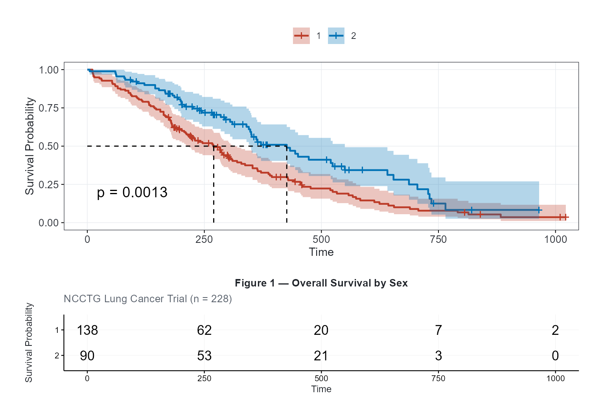
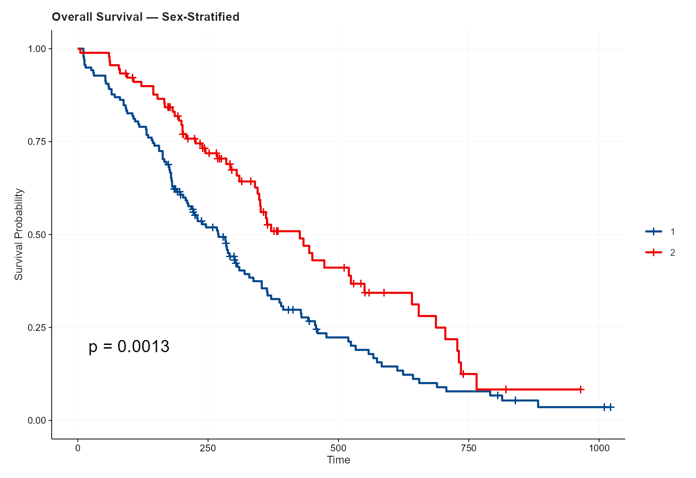
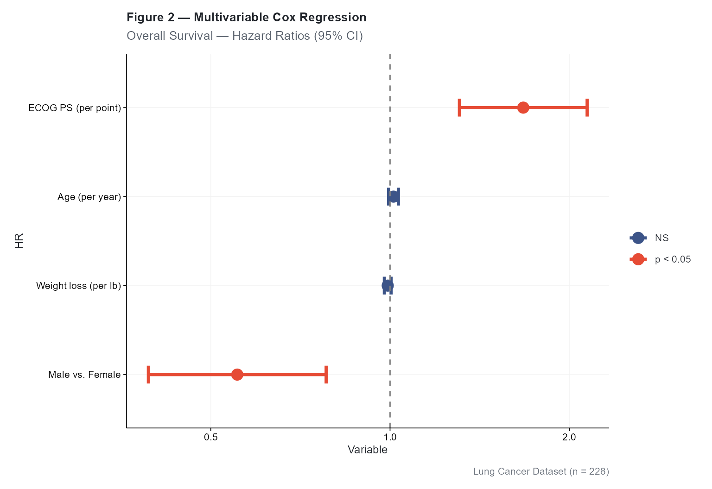
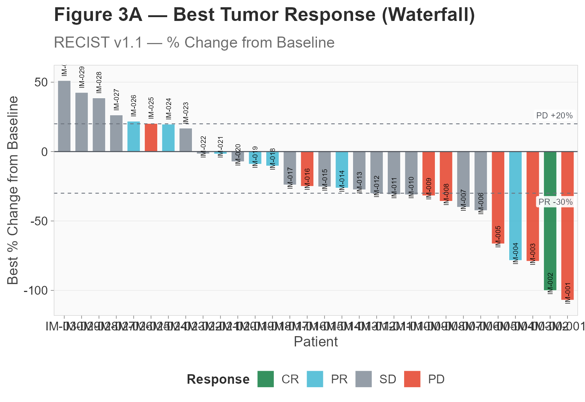
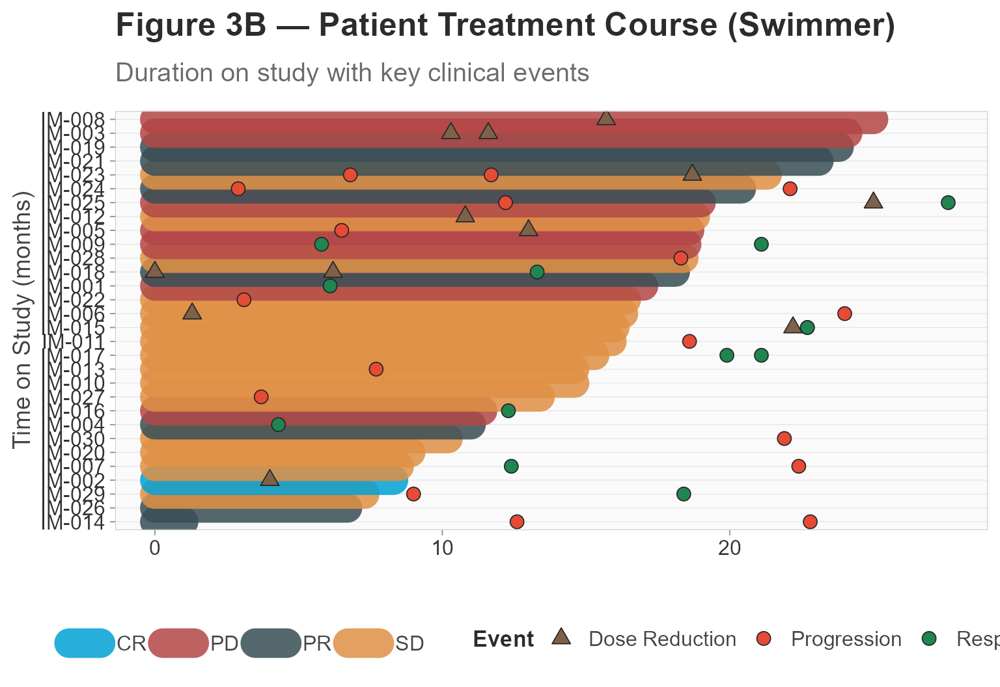
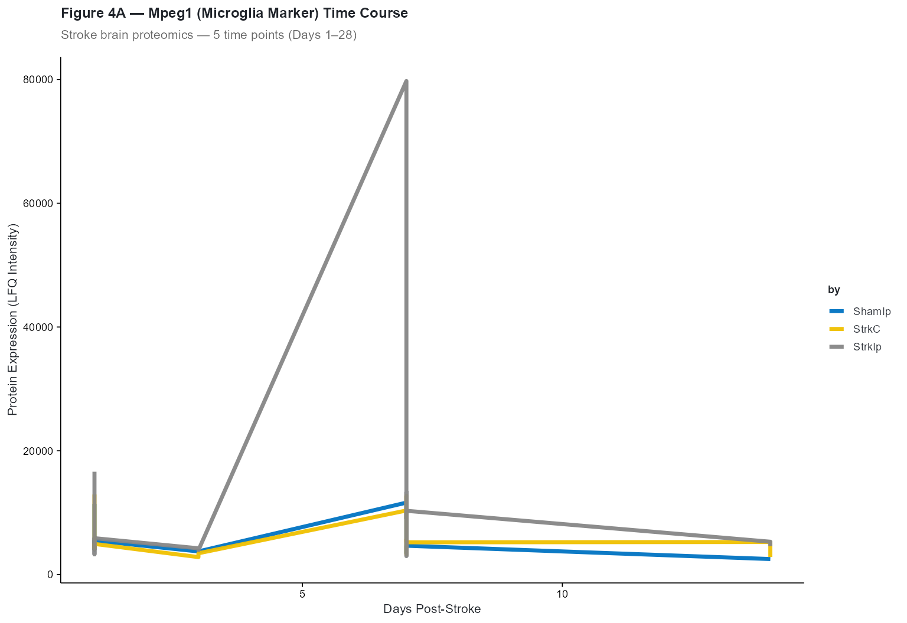
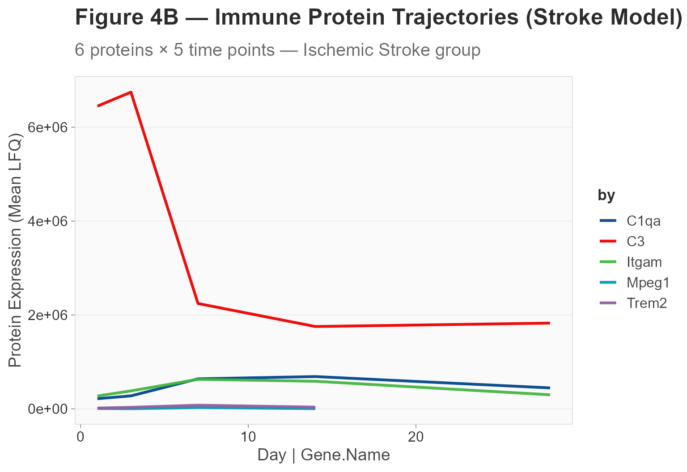
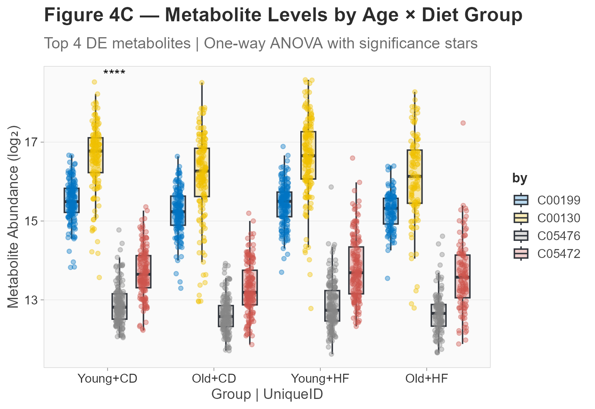
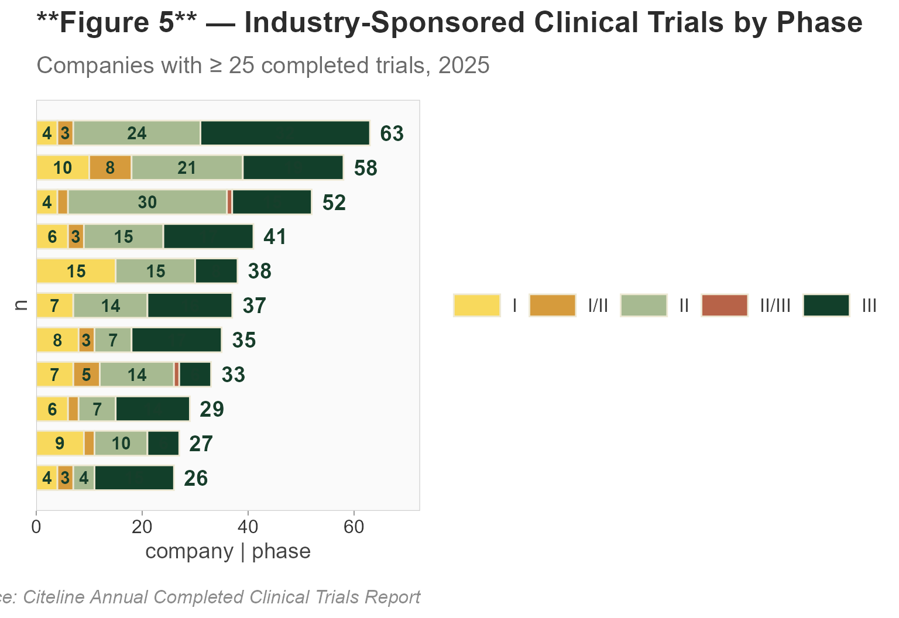
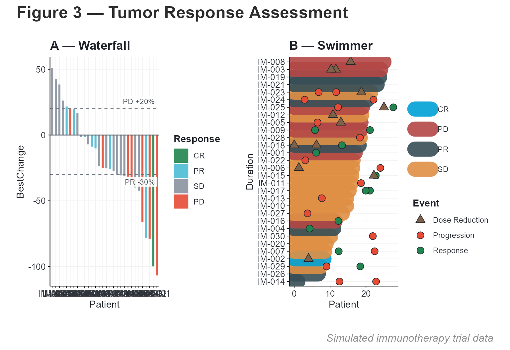

# End-to-End Oncology Analysis with cliomicplot

\+

−

⊙

×

‹

›


100 %

Scroll to zoom · Drag to pan · ← → to navigate

## Overview

This vignette demonstrates a complete oncology clinical & translational
data analysis workflow using **cliomicplot** with both clinical trial
data and real multi-omics datasets from **xOmicsShiny** (Biogen Inc.):

1.  **Figure 1** — Kaplan-Meier overall survival curves
2.  **Figure 2** — Forest plot from multivariable Cox regression
3.  **Figure 3A** — Waterfall plot of best tumor response
4.  **Figure 3B** — Swimmer plot of patient treatment courses
5.  **Figure 4A** — Dose-response / time-course proteomics (Stroke
    model)
6.  **Figure 4B** — Longitudinal protein trajectories
7.  **Figure 4C** — Prism-style boxplot with ANOVA (Aging × HFCD
    metabolomics)
8.  **Figure 5** — Clinical trials pipeline (industry portfolio)

``` r
library(cliomicplot)
#> cliomicplot 0.1.0 - Publication-ready clinical & omics plots
#> Main function: cliplot() | Themes: clitheme() | Params: clipar()
library(survival)

# Set global defaults for this analysis
clipar(
  palette.qualitative = "nejm",
  stat.test           = NULL,
  file.res            = 600
)
```

------------------------------------------------------------------------

## Figure 1: Kaplan-Meier Survival Curves

We use the `lung` dataset from the **survival** package to visualize
overall survival stratified by sex:

``` r
clitheme("nejm")
#> Theme set to: nejm

cliplot(Surv(time, status) ~ sex, data = lung,
        type = type_km(
          risk_table  = TRUE,
          pval        = TRUE,
          conf_int    = TRUE,
          median_line = TRUE
        ),
        palette  = "nejm",
        title    = "**Figure 1** — Overall Survival by Sex",
        subtitle = "NCCTG Lung Cancer Trial (n = 228)",
        xlab     = "Time (days)",
        ylab     = "Survival Probability",
        legend   = "top") +
  cli_markdown()
#> Warning: Using `size` aesthetic for lines was deprecated in ggplot2 3.4.0.
#> ℹ Please use `linewidth` instead.
#> ℹ The deprecated feature was likely used in the ggpubr package.
#>   Please report the issue at <https://github.com/kassambara/ggpubr/issues>.
#> This warning is displayed once per session.
#> Call `lifecycle::last_lifecycle_warnings()` to see where this warning was
#> generated.
#> Scale for colour is already present.
#> Adding another scale for colour, which will replace the existing scale.
#> Scale for fill is already present.
#> Adding another scale for fill, which will replace the existing scale.
#> Ignoring unknown labels:
#> • colour : ""
```



### Key features demonstrated:

- [`type_km()`](https://vanhungtran.github.io/cliomicplot/reference/type_km.md)
  with risk table, p-value, confidence intervals, and median survival
  line
- `clitheme("nejm")` for NEJM-style typography
- [`cli_markdown()`](https://vanhungtran.github.io/cliomicplot/reference/cli_markdown.md)
  for bold formatting in the title

### Customizing KM plots

``` r
# Without risk table, cleaner look
cliplot(Surv(time, status) ~ sex, data = lung,
        type = type_km(risk_table = FALSE, conf_int = FALSE),
        palette = "lancet",
        theme   = "lancet",
        title   = "**Overall Survival** — Sex-Stratified") +
  cli_markdown()
#> Scale for colour is already present.
#> Adding another scale for colour, which will replace the existing scale.
#> Scale for fill is already present.
#> Adding another scale for fill, which will replace the existing scale.
```



------------------------------------------------------------------------

## Figure 2: Forest Plot — Multivariable Cox Regression

Fit a Cox proportional hazards model and visualize the hazard ratios:

``` r
# Fit Cox model
cox_fit <- coxph(Surv(time, status) ~ age + sex + ph.ecog + wt.loss, data = lung)
cox_sum <- summary(cox_fit)

# Extract results into a forest-plot-ready data frame
forest_df <- data.frame(
  Variable = c("Age (per year)", "Male vs. Female",
               "ECOG PS (per point)", "Weight loss (per lb)"),
  HR       = cox_sum$conf.int[, "exp(coef)"],
  CI_low   = cox_sum$conf.int[, "lower .95"],
  CI_high  = cox_sum$conf.int[, "upper .95"],
  P        = cox_sum$coefficients[, "Pr(>|z|)"]
)

forest_df
#>                     Variable        HR    CI_low   CI_high            P
#> age           Age (per year) 1.0134589 0.9945143 1.0327643 1.649509e-01
#> sex          Male vs. Female 0.5538981 0.3928084 0.7810504 7.535384e-04
#> ph.ecog  ECOG PS (per point) 1.6738244 1.3075807 2.1426504 4.340524e-05
#> wt.loss Weight loss (per lb) 0.9910344 0.9781867 1.0040508 1.761353e-01
```

``` r
clitheme("lancet")
#> Theme set to: lancet

cliplot(HR ~ Variable, data = forest_df,
        type = type_forest(
          ref_line   = TRUE,
          sort       = TRUE,
          point_size = 4,
          ci_width   = 1.2,
          sig_color  = "#E64B35",
          ns_color   = "#3C5488"
        ),
        title    = "**Figure 2** — Multivariable Cox Regression",
        subtitle = "Overall Survival — Hazard Ratios (95% CI)",
        caption  = "Lung Cancer Dataset (n = 228)") +
  cli_markdown()
#> `height` was translated to `width`.
```



### Interpreting the forest plot

- **Red points** = p \< 0.05 (statistically significant)
- **Blue points** = p \>= 0.05 (not significant)
- **Vertical dashed line** at HR = 1 (null effect)
- HR \> 1 = increased risk; HR \< 1 = protective effect

------------------------------------------------------------------------

## Figure 3A: Waterfall Plot — Tumor Response

Generate a simulated immunotherapy trial dataset and visualize best
tumor response:

``` r
set.seed(42)
n_pts <- 30

imtrial <- data.frame(
  Patient    = paste0("IM-", sprintf("%03d", 1:n_pts)),
  BestChange = sort(rnorm(n_pts, mean = -22, sd = 32)),
  BestResp   = sample(c("CR", "PR", "SD", "PD"), n_pts,
                      replace = TRUE,
                      prob = c(0.07, 0.30, 0.36, 0.27)),
  Duration   = pmax(1, round(rnorm(n_pts, mean = 14, sd = 7), 1)),
  Arm        = sample(c("Anti-PD1", "Chemotherapy"), n_pts, replace = TRUE)
)

head(imtrial)
#>   Patient BestChange BestResp Duration          Arm
#> 1  IM-001 -107.00657       PD     17.0 Chemotherapy
#> 2  IM-002 -100.09494       CR      8.3 Chemotherapy
#> 3  IM-003  -79.00187       PD     24.1     Anti-PD1
#> 4  IM-004  -78.42122       PR     11.0     Anti-PD1
#> 5  IM-005  -66.44354       PD     18.6     Anti-PD1
#> 6  IM-006  -42.47984       SD     16.3     Anti-PD1
```

``` r
clitheme("broadsheet")
#> Theme set to: broadsheet

cliplot(BestChange ~ Patient, data = imtrial,
        type = type_waterfall(
          show_labels = TRUE,
          label_size  = 2.5,
          bar_width   = 0.75,
          response_thresholds = c("PD" = 20, "SD" = -30)
        ),
        title    = "**Figure 3A** — Best Tumor Response (Waterfall)",
        subtitle = "RECIST v1.1 — % Change from Baseline",
        ylab     = "Best % Change from Baseline",
        legend   = "bottom") +
  cli_markdown()
```



------------------------------------------------------------------------

## Figure 3B: Swimmer Plot — Patient Timelines

``` r
set.seed(123)
n_events_per_pt <- sample(1:3, n_pts, replace = TRUE)
n_total_events  <- sum(n_events_per_pt)

events_df <- data.frame(
  ID    = rep(imtrial$Patient, times = n_events_per_pt),
  Time  = round(runif(n_total_events, 0, 28), 1),
  Event = sample(c("Progression", "AE Gr≥3", "Dose Reduction", "Response"),
                 n_total_events,
                 replace = TRUE, prob = c(0.3, 0.25, 0.2, 0.25))
)

head(events_df)
#>       ID Time          Event
#> 1 IM-001 13.4        AE Gr≥3
#> 2 IM-001 21.2        AE Gr≥3
#> 3 IM-001  6.1       Response
#> 4 IM-002  8.9        AE Gr≥3
#> 5 IM-002  6.5        AE Gr≥3
#> 6 IM-002  4.0 Dose Reduction
```

``` r
cliplot(Duration ~ Patient, data = imtrial,
        type = type_swimmer(
          bar_fill    = "BestResp",
          event_times = events_df,
          bar_alpha   = 0.85
        ),
        palette = "jco",
        title   = "**Figure 3B** — Patient Treatment Course (Swimmer)",
        subtitle = "Duration on study with key clinical events",
        xlab    = "",
        ylab    = "Time on Study (months)",
        legend  = "bottom") +
  cli_markdown()
#> Warning: Removed 21 rows containing missing values or values outside the scale range
#> (`geom_point()`).
```



------------------------------------------------------------------------

## Figure 4A: Time-Course Proteomics — Stroke Model

Using real **xOmicsShiny StrokeBrain_TimeCourse** data to visualize
protein expression trajectories across 5 time points in a mouse stroke
model. Three treatment groups: ischemic stroke (StrkIp), sham surgery
(ShamIp), and naive control (StrkC):

``` r
# Resolve data paths (works for both installed package and devel/devtools::load_all)
resolve_data = function(filename) {
  pkg_path = system.file("extdata", filename, package = "cliomicplot")
  if (pkg_path != "" && file.exists(pkg_path)) return(pkg_path)
  fallback = file.path("..", "inst", "extdata", filename)
  if (file.exists(fallback)) return(fallback)
  fallback2 = file.path("inst", "extdata", filename)
  if (file.exists(fallback2)) return(fallback2)
  stop("Cannot find data file: ", filename)
}

# Load stroke time-course data
stroke_path = resolve_data("StrokeBrain_TimeCourse.RData")
load(stroke_path)  # → data_long, data_wide, results_stat, MetaData, ProteinGeneName

# Merge gene names
stroke_long = merge(data_long, ProteinGeneName[, c("UniqueID", "Gene.Name")],
                     by = "UniqueID", all.x = TRUE)

# Select an example gene: Mpeg1 (microglia/macrophage marker)
mpeg1 = subset(stroke_long, Gene.Name == "Mpeg1")
mpeg1$Day = as.numeric(mpeg1$conc)
mpeg1$Treatment = mpeg1$treatment

cat(sprintf("Mpeg1: %d observations across %d time points\n",
            nrow(mpeg1), length(unique(mpeg1$Day))))
#> Mpeg1: 40 observations across 4 time points
```

``` r
clitheme("science")
#> Theme set to: science

cliplot(expr ~ Day | Treatment, data = mpeg1,
        type = type_lines(linewidth = 1.2),
        palette = "jco",
        title   = "**Figure 4A** — Mpeg1 (Microglia Marker) Time Course",
        subtitle = "Stroke brain proteomics — 5 time points (Days 1–28)",
        xlab    = "Days Post-Stroke",
        ylab    = "Protein Expression (LFQ Intensity)") +
  cli_markdown()
```



The ischemic stroke group shows elevated Mpeg1 expression peaking at day
7–14, consistent with microglial activation post-stroke.

------------------------------------------------------------------------

## Figure 4B: Multi-Protein Longitudinal Trajectories

Extending to 6 immune-related proteins across the stroke time course:

``` r
immune_genes = c("Mpeg1", "C1qa", "C3", "Trem2", "Tyrobp", "Itgam")
immune_data = subset(stroke_long, Gene.Name %in% immune_genes & treatment == "StrkIp")
immune_data$Day = as.numeric(immune_data$conc)

# Mean per gene per day
immune_means = aggregate(expr ~ Gene.Name + Day, data = immune_data, FUN = mean, na.rm = TRUE)

clitheme("broadsheet")
#> Theme set to: broadsheet

cliplot(expr ~ Day | Gene.Name, data = immune_means,
        type = type_lines(linewidth = 1.1),
        palette = "lancet",
        title   = "**Figure 4B** — Immune Protein Trajectories (Stroke Model)",
        subtitle = "6 proteins × 5 time points — Ischemic Stroke group",
        ylab    = "Protein Expression (Mean LFQ)",
        legend  = "right") +
  cli_markdown()
```



------------------------------------------------------------------------

## Figure 4C: Prism-Style Boxplot with ANOVA

Using **xOmicsShiny AgingHFCD_Metabolomics** data to compare metabolite
levels across four experimental groups with statistical annotations:

``` r
# Load metabolomics data
aging_path = resolve_data("AgingHFCD_Metabolomics.RData")
load(aging_path)  # → data_long, data_wide, results_long, MetaData, ProteinGeneName
aging = list(long = data_long, wide = data_wide, results = results_long,
              meta = MetaData, genes = ProteinGeneName)

# Select top 4 DE metabolites and merge with metadata
top_mets = head(unique(aging$results$UniqueID[aging$results$Adj.P.Value < 0.01]), 4)
met_data = subset(aging$long, UniqueID %in% top_mets)
met_data$Group = factor(met_data$group,
                         levels = c("Young_CD", "Old_CD", "Young_HF", "Old_HF"),
                         labels = c("Young+CD", "Old+CD", "Young+HF", "Old+HF"))

head(met_data, 6)
#>     UniqueID sampleid   expr    group    Group
#> 142   C00199  FAC1205 15.794 Young_CD Young+CD
#> 219   C00130  FAC1205 17.434 Young_CD Young+CD
#> 222   C05476  FAC1205 12.377 Young_CD Young+CD
#> 232   C05472  FAC1205 12.353 Young_CD Young+CD
#> 535   C00199  FAC1414 15.311 Young_CD Young+CD
#> 612   C00130  FAC1414 16.841 Young_CD Young+CD
```

``` r
cliplot(expr ~ Group | UniqueID, data = met_data,
        type = type_boxplot(
          add_jitter   = TRUE,
          jitter_width = 0.22
        ),
        stat.test = "anova",
        stat.label = "p.signif",
        palette = "jco",
        title   = "**Figure 4C** — Metabolite Levels by Age × Diet Group",
        subtitle = "Top 4 DE metabolites | One-way ANOVA with significance stars",
        ylab    = "Metabolite Abundance (log₂)") +
  cli_markdown()
```



------------------------------------------------------------------------

## Figure 5: Clinical Trials Pipeline — Stacked Bar Chart

[`type_trials()`](https://vanhungtran.github.io/cliomicplot/reference/type_trials.md)
creates horizontal stacked bar charts for trial pipelines:

``` r
pipeline <- data.frame(
  company = rep(c("AstraZeneca", "Roche", "MSD", "Lilly", "Hengrui",
                  "Sanofi", "Novartis", "BMS", "J&J", "Pfizer", "AbbVie"),
                each = 5),
  phase   = rep(c("I", "I/II", "II", "II/III", "III"), 11),
  n       = c(4,3,24,0,32, 10,8,21,0,19, 4,2,30,1,15, 6,3,15,0,17,
              15,0,15,0,8, 7,0,14,0,16, 8,3,7,0,17, 7,5,14,1,6,
              6,2,7,0,14, 9,2,10,0,6, 4,3,4,0,15)
)

phase_colors <- c(
  "I"      = "#F8D95C", "I/II"   = "#D69B3C", "II"     = "#A7BA91",
  "II/III" = "#B76348", "III"    = "#123F2A"
)

cliplot(n ~ company | phase, data = pipeline,
        type = type_trials(
          segment_colors      = phase_colors,
          label_threshold     = 3
        ),
        title    = "**Figure 5** — Industry-Sponsored Clinical Trials by Phase",
        subtitle = "Companies with ≥ 25 completed trials, 2025",
        caption  = "Source: Citeline Annual Completed Clinical Trials Report")
```



------------------------------------------------------------------------

## Combined Multi-Panel Figure

Use **patchwork** to combine the waterfall and swimmer plots:

``` r
library(patchwork)
#> Warning: package 'patchwork' was built under R version 4.5.3

p1 <- cliplot(BestChange ~ Patient, data = imtrial,
              type = type_waterfall(show_labels = FALSE, bar_width = 0.7),
              theme = "cli_minimal",
              title = "**A** — Waterfall") + cli_markdown()

p2 <- cliplot(Duration ~ Patient, data = imtrial,
              type = type_swimmer(bar_fill = "BestResp", event_times = events_df),
              theme = "cli_minimal",
              title = "**B** — Swimmer") + cli_markdown()

p1 + p2 +
  plot_annotation(
    title   = "**Figure 3** — Tumor Response Assessment",
    caption = "Simulated immunotherapy trial data",
    theme   = ggplot2::theme(plot.title = ggtext::element_markdown())
  )
#> Warning: Removed 21 rows containing missing values or values outside the scale range
#> (`geom_point()`).
```



------------------------------------------------------------------------

## Saving Figures for Publication

``` r
# Save individual figures as high-resolution files
cliplot(Surv(time, status) ~ sex, data = lung,
        type = type_km(risk_table = TRUE),
        theme = "nejm", palette = "nejm",
        file = "fig1_km.pdf", width = 8, height = 6)

cliplot(HR ~ Variable, data = forest_df,
        type = type_forest(),
        theme = "lancet",
        file = "fig2_forest.pdf", width = 7, height = 4.5)

cliplot(BestChange ~ Patient, data = imtrial,
        type = type_waterfall(),
        theme = "broadsheet",
        file = "fig3_waterfall.pdf", width = 10, height = 5.5)
```

------------------------------------------------------------------------

## Summary

In this vignette we produced eight publication-ready oncology figures:

1.  **[`type_km()`](https://vanhungtran.github.io/cliomicplot/reference/type_km.md)**
    — survival curves with risk tables, p-values, and CI
2.  **[`type_forest()`](https://vanhungtran.github.io/cliomicplot/reference/type_forest.md)**
    — Cox regression hazard ratios
3.  **[`type_waterfall()`](https://vanhungtran.github.io/cliomicplot/reference/type_waterfall.md)**
    — tumor response visualization
4.  **[`type_swimmer()`](https://vanhungtran.github.io/cliomicplot/reference/type_swimmer.md)**
    — patient-level treatment timelines
5.  **Time-course proteomics** — real stroke brain data from xOmicsShiny
6.  **Multi-protein trajectories** — 6 immune markers across 5 time
    points
7.  **Prism-style ANOVA** — metabolomics group comparisons with P-value
    bars
8.  **[`type_trials()`](https://vanhungtran.github.io/cliomicplot/reference/type_trials.md)**
    — industry clinical trial pipeline overview

Reset global settings when done:

``` r
clitheme()
clipar(palette.qualitative = "jco", stat.test = NULL)
```
